# 旅游预订系统需求规格说明书 (PRD)

## 1. 引言

## 1.1 编写目的

### 1.1.1 文档目标

本文档为旅游预订系统提供完整的功能性需求与非功能性需求定义，覆盖系统开发、测试、验收全生命周期。文档以可执行为核心原则，面向大模型辅助的开发团队设计，力求每一项需求均可直接映射为代码实现、测试用例或验收检查点。

本文档承担三项职能：**需求基准**，作为开发团队与业务方之间的契约性文件，所有功能设计、接口定义与架构决策均以本文档所述需求为最终依据；**技术规范载体**，在需求描述中融入技术约束（Windows 部署环境[^681^]、Go 1.26+ 语言版本、PostgreSQL 18+ 数据库版本），减少需求到实现的转换损耗；**测试与验收依据**，每个需求条目具备可验证性，测试团队可直接基于需求编写测试用例。

### 1.1.2 目标读者

本文档面向三类角色。**开发人员**：通过 Claude Code 等 AI 编程助手调用本文档作为上下文输入，文档中的术语定义、业务流程描述和接口规格均以机器可解析的清晰度为编写标准。**测试人员**：依赖文档中的需求条目设计测试矩阵，特别关注边界条件（库存预扣超时释放、退改阶梯费率计算）和异常场景（支付回调重复通知、并发库存扣减）。**项目管理与运维人员**：关注系统容量指标（日均 1{,}000 单、峰值并发 10{,}000 用户[^349^]）、部署约束（Windows Server 平台、等保三级合规[^895^]）及供应商入驻流程等业务运营相关需求。

## 1.2 项目背景

### 1.2.1 系统定位

本系统定位为面向 C 端消费者的在线旅游预订 OTA（Online Travel Agency，在线旅游代理）开放平台，业务覆盖**境内跟团游**、**出境跟团游**与**邮轮游**三大产品线，直接面向终端旅游者提供产品搜索、浏览、预订、支付及售后服务全流程闭环。

三条业务线的核心差异体现在产品模型与预订流程。境内跟团游以"目的地 + 出发城市 + 日期"构成产品检索体系，预订核心在于团期日历与余位管理[^64^]。出境跟团游在境内游基础上叠加签证服务交易闭环，需处理护照信息收集与签证材料审核等特殊流程[^136^]。邮轮游的产品模型最为复杂，以"航次 × 舱房类型"矩阵构成库存单元[^504^]，涉及在线值船等独有业务环节[^54^]。系统首期聚焦境内跟团游 MVP，出境游与邮轮游作为二期扩展，该决策基于业务复杂度梯度与资源投入回报的综合考量。

### 1.2.2 商业模式

系统采用**开放平台**模式，第三方旅游供应商入驻后自主发布产品，平台提供流量入口、交易基础设施与履约保障，按成交金额抽取佣金[^392^]。核心参与者包括：**平台运营方**，负责制定规则、提供技术与流量基础设施、处理消费者客诉与纠纷仲裁；**供应商**（旅行社、邮轮代理等），提交资质文件通过审核后入驻，自主维护产品信息与库存；**消费者**，通过 Web 网站、微信小程序、抖音小程序、支付宝小程序浏览与预订产品。

开放平台模式对系统设计提出三项关键约束。**多租户数据隔离**，各供应商的产品、订单、财务数据严格隔离，采用混合隔离架构——大客户使用独立数据库实例，中小客户采用共享数据库 + `tenant_id` 字段隔离 + PostgreSQL 行级安全策略（RLS）[^923^][^929^]。**产品审核机制**，供应商发布的产品需经平台审核方可上架，已上架产品的关键字段变更需重新审核[^230^][^232^]。**佣金与结算体系**，系统支撑按供应商/按产品品类灵活配置佣金比例，自动生成结算单并对账[^387^][^393^]。

技术层面，系统底层基于 Go 1.26+ 构建后端服务[^681^]，前端采用 Vue 3 全家桶（Nuxt.js 3 实现 Web 端 SSR、Uni-App 跨端小程序），数据库选用 PostgreSQL 18+[^697^]，部署目标为 Windows Server 平台，安全体系以满足等保三级为底线要求[^895^][^925^]。

## 1.3 术语与缩略语

本节定义本文档中使用的业务术语与技术缩略语。业务术语涵盖旅游行业特有概念，技术术语覆盖系统架构、安全与合规领域，后续章节不再重复解释。

### 1.3.1 业务术语

| 序号 | 术语 | 英文/缩写 | 定义 |
|:---:|:---|:---|:---|
| 1 | **团期** | Departure Date | 跟团游产品的具体出发日期。一个产品可设置多个团期，每个团期具有独立的价格与库存[^64^]。系统以日历视图展示近 3–6 个月团期及其每日价格/库存状态（充足/紧张/售罄）[^130^]。 |
| 2 | **余位** | Available Seats | 某一团期仍可售的名额数量，余位为零时该团期自动标记为"满员"[^58^][^64^]。 |
| 3 | **单房差** | Single Room Supplement | 旅游者单独入住一间客房时需额外补交的差价，当成人数为奇数或用户选择单住时系统自动附加[^64^]。 |
| 4 | **成团人数** | Minimum Group Size | 产品成团所需的最低报名人数，未达到则存在取消风险，平台须提前 7 日（境内）/ 30 日（出境）通知旅游者[^63^]。 |
| 5 | **航次** | Sailing | 邮轮在特定日期沿特定航线执行的完整航程，是邮轮产品库存管理的基本单元[^501^]。 |
| 6 | **舱房** | Cabin | 邮轮上供旅客居住的房间单元，按类型划分为内舱房、海景房、阳台房、套房四种，按人计价[^142^][^143^][^144^][^504^]。 |
| 7 | **岸上观光** | Shore Excursion | 邮轮停靠港口期间旅客可选择参加的陆地游览活动[^159^]。 |
| 8 | **包价旅游** | Package Tour | 旅行社预先安排行程并以总价形式提供的组合服务，通常含交通、住宿、餐饮、游览、导游等。本系统跟团游产品均属此类[^58^]。 |
| 9 | **退改阶梯费率** | Cancellation Tier | 按距出发日期的时间区间设置递减的退款比例，每个产品独立配置[^341^][^347^][^86^][^90^]。 |
| 10 | **定金 + 尾款** | Deposit & Balance | 预订支付模式，用户先付定金锁定库存，在约定截止日前付尾款完成全款，邮轮游中尤为常见[^396^]。 |
| 11 | **开放平台** | Open Platform | 平台提供技术基础设施与流量入口，第三方供应商入驻后自主发布和管理产品，平台按交易额抽取佣金[^230^][^232^]。 |
| 12 | **多租户** | Multi-Tenancy | 单一系统实例为多个独立品牌提供服务，各租户数据与配置严格隔离[^923^][^929^]。 |

### 1.3.2 技术术语

| 序号 | 术语 | 英文/缩写 | 定义 |
|:---:|:---|:---|:---|
| 13 | **OTA** | Online Travel Agency | 在线旅游代理，通过互联网平台聚合旅游服务资源，为消费者提供产品搜索、比较、预订一站式服务[^25^]。 |
| 14 | **RBAC** | Role-Based Access Control | 基于角色的访问控制，本系统采用 RBAC + 数据权限混合模型，支持角色层级、字段级权限与敏感操作二次授权[^478^][^497^]。 |
| 15 | **SSR** | Server-Side Rendering | 服务端渲染，页面在服务器端生成完整 HTML 后返回，具有首屏加载快、SEO 友好等优势。本系统 Web 端采用 Nuxt.js 3 实现 SSR[^830^][^833^]。 |
| 16 | **MVCC** | Multi-Version Concurrency Control | 多版本并发控制，通过保存数据多个版本避免读写冲突，PostgreSQL 采用此机制实现事务隔离[^697^]。 |
| 17 | **PCI DSS** | Payment Card Industry Data Security Standard | 支付卡行业数据安全标准，接入银联支付须遵循此规范[^603^]。 |
| 18 | **MFA** | Multi-Factor Authentication | 多因素认证，要求用户提供两种或以上不同类型身份凭证。本系统运营后台敏感操作须 MFA 验证[^895^][^925^]。 |
| 19 | **JWT** | JSON Web Token | 开放标准令牌格式，用于各方之间安全传输信息。本系统采用 RS256 非对称签名，Access Token 有效期 15 分钟[^944^][^952^]。 |
| 20 | **TLS** | Transport Layer Security | 传输层安全协议，用于通信加密和完整性保护。本系统要求全站 TLS 1.3，API 采用 HMAC-SHA256 请求签名[^940^][^947^]。 |
| 21 | **RTO / RPO** | Recovery Time Objective / Recovery Point Objective | 恢复时间目标与恢复点目标。本系统核心服务 RTO < 5 分钟，RPO < 1 分钟[^845^][^849^]。 |
| 22 | **DDD** | Domain-Driven Design | 领域驱动设计，以业务领域为核心组织代码结构，通过限界上下文划分系统模块[^909^][^965^]。 |
| 23 | **SaaS** | Software as a Service | 软件即服务，本系统多租户架构使其具备为多个旅行社品牌提供 SaaS 化部署的能力[^930^]。 |
| 24 | **等保三级** | MLPS Level 3 | 网络安全等级保护第三级，国家对涉及大量用户敏感信息系统的安全保护等级要求[^895^][^925^][^927^]。 |

术语表涵盖四类核心概念。**旅游产品类**（团期、余位、单房差、成团人数、航次、舱房、岸上观光、包价旅游、退改阶梯费率、定金+尾款）定义了三大业务线的核心实体与规则。**商业模式类**（开放平台、多租户）明确了系统的商业定位与技术隔离策略。**系统架构类**（OTA、RBAC、SSR、MVCC、DDD、SaaS）覆盖从用户交互层到数据库层的核心技术概念。**安全合规类**（PCI DSS、MFA、JWT、TLS、RTO/RPO、等保三级）定义了系统安全体系的技术规范与合规基准。

## 1.4 参考资料

### 1.4.1 法律法规

**《中华人民共和国旅游法》（2018 修正）**[^984^][^985^]。本系统业务逻辑的根本法律依据。第 28 条要求经营旅行社业务须取得许可；第 48 条要求网络经营须在主页显著位置标明许可证信息；第 52 条规定旅游者个人信息保密义务；第 58 条明确包价旅游合同应包含的九项内容，系统电子合同模块须据此设计。

**《中华人民共和国个人信息保护法》（2021）**[^886^][^887^]。第 13 条要求处理个人信息取得同意；第 28 条要求敏感个人信息（身份证号、护照号）单独同意；第 51 条要求采取加密、去标识化等安全措施；第 54 条要求定期合规审计。

**《中华人民共和国网络安全法》（2017）**[^888^][^893^][^894^]。第 21 条要求实行网络安全等级保护制度，本系统以满足等保三级为安全底线；第 23 条要求网络日志留存不少于六个月；第 40 条要求每年至少一次安全检测评估。

**《中华人民共和国电子签名法》（2019 修正）**[^902^][^905^][^906^]。第 13 条规定可靠电子签名的四项条件，第 14 条明确其与手写签名具有同等法律效力。本系统电子合同上传功能须确保 PDF 经 CA 机构数字证书签名并附加时间戳。

**《非银行支付机构监督管理条例》（2024）**[^943^][^959^]。规范系统对接支付渠道的合规要求，包括客户备付金 100% 集中存管、交易记录保存不少于 5 年、反洗钱义务等。

### 1.4.2 国家标准与行业规范

**GB/T 22239-2019《信息安全技术 网络安全等级保护基本要求》（等保 2.0）**[^895^][^925^][^927^]。本系统作为部署在 Windows Server 平台上的 Web 应用系统，需满足等保第三级在安全物理环境、安全通信网络、安全区域边界、安全计算环境、安全管理中心五个层面的全部控制点。第 11 章"非功能性需求"将逐项映射等保三级要求到系统功能设计。

**GB/T 25070-2019《信息安全技术 网络安全等级保护安全设计技术要求》**。提供等保三级系统的安全架构设计指导，涵盖网络分区（DMZ/内网/管理网）、身份鉴别、安全审计、数据备份恢复等技术实施方案。

**GB/T 28448-2019《信息安全技术 网络安全等级保护测评要求》**。定义等保测评的具体测试方法和判定准则，是系统验收阶段通过等保测评的参照基准。

**JR/T 0171-2020《个人金融信息保护技术规范》**。对个人金融信息的收集、存储、使用、共享、删除提出分级保护要求，系统支付模块处理银行卡号等 C3 类别信息时须遵循该规范。

## 2. 总体描述

### 2.1 系统视角

#### 2.1.1 系统边界

本系统为面向旅游行业的多租户在线预订平台（Online Travel Agency，OTA），系统边界涵盖三大前端入口与后端服务体系。

**前端子系统**：**Web销售平台**基于Nuxt.js（Vue 3 + SSR）构建[^830^][^833^]，提供产品搜索、浏览、预订、支付等完整交易闭环，覆盖PC端与移动端浏览器。**小程序销售平台**基于Uni-App（Vue 3）跨端框架开发[^830^][^833^]，面向微信、支付宝、抖音三大超级App生态，通过原生能力（一键获取手机号、原生支付、社交分享）提供移动端体验。**后台管理系统**采用Vue 3 + Element Plus技术栈[^864^]，面向运营人员、供应商、财务人员及管理员，覆盖产品管理、订单处理、财务结算、权限控制、数据分析等场景。

**后端服务体系**：采用Go 1.26+语言生态，以Gin Web框架为核心[^685^][^680^]，按领域驱动设计（DDD）原则划分为产品服务、库存服务、订单服务、支付服务、用户服务、搜索推荐服务、通知服务等。数据持久层以PostgreSQL 18+为主数据库[^697^]，Redis 7.2+作为缓存与会话存储[^813^][^872^]，Meilisearch承担产品搜索索引[^693^][^700^]。系统边界外的支付渠道、短信服务商、地图服务商、小程序平台通过标准化API与系统交互。

#### 2.1.2 系统与外部实体的关系

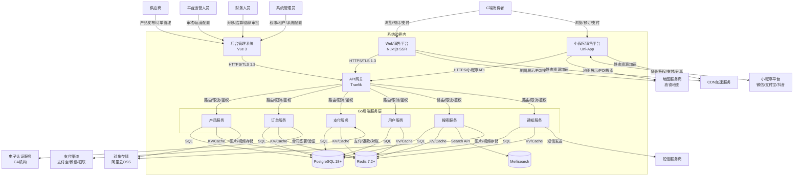

外部实体按交互性质分为四类。**用户类实体**包括C端消费者、供应商、平台运营人员、财务人员和系统管理员，通过三大前端入口与系统交互。**基础设施类实体**包括CDN加速服务（静态资源分发）、对象存储（多媒体文件持久化）、监控告警体系（Prometheus + Grafana四层监控[^728^][^737^][^809^]）。**业务服务类实体**包括支付渠道（支付宝、微信支付、银联，提供收单、退款、分账能力[^535^][^517^][^553^]）、短信服务商（验证码、订单通知、营销推送）、地图服务商（高德地图JS API 2.0，提供线路展示与POI搜索[^952^][^940^]）、电子认证服务（CA机构，支撑电子合同数字签名与时间戳[^902^][^905^][^906^]）。**平台监管类实体**包括微信小程序、支付宝、抖音开放平台，提供用户身份鉴权、支付通道、分享能力和内容审核[^829^][^834^]。

### 2.2 用户角色与特征

**表2-1 用户角色定义表**

| 角色 | 定义 | 核心功能域 | 技术接入方式 | 预估用户数 | 安全要求 |
|------|------|-----------|-------------|-----------|---------|
| C端消费者 | 通过Web或小程序浏览、预订、支付旅游产品并完成评价的个人用户 | 产品搜索/浏览、预订下单、在线支付、订单管理、售后服务、评价分享 | Web浏览器/微信小程序/支付宝小程序/抖音小程序 | 10{,}000+（峰值并发50{,}000）[^895^] | 密码+短信验证码登录；实名认证需人脸识别；敏感信息AES-256-GCM加密存储[^940^][^953^] |
| 供应商 | 经资质审核入驻平台，发布和管理自有旅游产品的第三方服务商 | 产品发布/编辑、团期/价格/库存管理、订单处理、结算对账 | 后台管理系统（供应商子账号） | 50-500家（首期） | RBAC功能权限+数据权限（仅可见自有产品/订单）；敏感操作二次确认[^478^][^497^] |
| 平台运营人员 | 负责产品审核、内容管理、营销活动配置及用户服务的内部员工 | 产品审核/上下架、Banner/推荐位管理、营销活动配置、订单客服处理 | 后台管理系统 | 20-100人 | RBAC角色层级权限；操作留痕审计日志留存>=6个月[^966^][^967^][^981^] |
| 财务人员 | 负责资金核对、供应商结算、退款审批及财务报表编制的专业岗位 | 支付渠道对账、供应商结算管理、退款审批流、财务报表/毛利分析 | 后台管理系统（财务模块） | 5-20人 | 退款审批需多级授权；财务数据字段级加密；审计日志永久保留[^966^][^967^] |
| 系统管理员 | 负责系统架构配置、租户管理、权限体系维护的技术管理人员 | 角色/权限/菜单管理、租户生命周期管理、系统参数配置、操作日志审计 | 后台管理系统（系统管理模块） | 2-10人 | 最高权限角色；需MFA多因素认证；所有操作完整审计日志[^895^][^925^] |

**C端消费者**的行为贯穿"搜索—浏览—预订—支付—出行—评价"完整生命周期，使用时段呈鲜明特征：工作日晚间和周末为浏览高峰，节假日大促前为预订高峰。消费者通过手机号+验证码完成注册登录[^430^]，下单时填写出游人身份信息（境内游需姓名、身份证号、手机号；出境游额外需护照信息[^136^]）。系统提供15-30分钟支付倒计时，超时未支付自动释放库存[^42^]。退款申请受阶梯费率规则约束（出发前N天以上退X%，临近递减[^86^][^90^]），退款原路退回[^593^][^559^]。

**供应商**入驻需经历"提交申请—资质审核（营业执照、旅行社业务经营许可证）—签订合同—开通账号"流程。供应商在后台管理系统中拥有独立子账号，仅可查看管理自有产品及订单——该数据隔离通过RBAC（Role-Based Access Control）模型的数据权限维度实现[^478^][^497^]。供应商发布的产品须经平台运营人员审核通过方可上架，关键字段变更需重新触发审核[^230^][^232^][^143^]。

**平台运营人员**承担内容质量和用户体验把关职责。产品审核需校验信息完整性、价格合理性、行程逻辑一致性、图文合规性（广告法敏感词过滤），结论为"通过"或"驳回"。运营人员管理首页Banner、热门目的地推荐位、营销活动页面等运营资产[^502^][^516^]，并通过数据模块监控转化率漏斗、RFM模型等核心指标[^431^][^433^][^499^]。客服运营处理退款/改签申请、投诉反馈，系统对其操作实施完整留痕审计[^966^][^967^]。

**财务人员**的工作聚焦资金流准确性与合规性，核心流程包括三方面：支付渠道对账，将系统支付记录与三渠道对账单比对处理差异[^387^][^393^]；供应商结算，按约定周期（通常T+7或T+15）生成结算单并扣除平台佣金；退款审批，按金额分级审批（1{,}000元以下运营审批、1{,}000-5{,}000元财务主管审批、5{,}000元以上总监审批）[^341^][^347^]。还需编制收入日报月报、毛利分析、现金流报表等[^392^]。

**系统管理员**是唯一具备跨租户管理权限的角色，负责租户创建、配置、暂停、恢复和销毁全生命周期管理[^923^]。权限管理方面维护角色定义、功能权限（菜单/按钮/API）和数据权限（本人/部门/全量）映射[^478^][^497^]，管理系统数据字典（产品类目、出发城市、证件类型、订单状态枚举值）。管理员操作具有最高风险等级，所有权限变更须记录完整审计日志（含前后值对比）并触发实时安全告警[^966^][^981^]。

### 2.3 运行环境

#### 2.3.1 服务端运行环境

服务端部署于Windows Server环境，所有技术组件须满足Windows平台原生运行或可稳定运行要求。

**表2-2 运行环境配置表**

| 层级 | 组件 | 版本要求 | Windows部署方式 | 关键配置说明 |
|------|------|---------|----------------|-------------|
| 操作系统 | Windows Server | 2022 / 2025 | EDB官方安装程序 | 推荐2025以获得PostgreSQL 18+最佳兼容性[^697^][^703^] |
| 开发语言 | Go | 1.26+ | MSI安装包 | Web吞吐量较1.25提升8-12%，内存使用降低10-15%[^681^][^686^] |
| Web框架 | Gin | 基于Go 1.26+编译 | 交叉编译为.exe | ~88K Stars，社区最大，Windows零兼容问题[^685^][^680^] |
| 主数据库 | PostgreSQL | 18+ | EDB Windows安装包 | JSONB/窗口函数/CTE支持[^697^] |
| 缓存/会话 | Redis兼容（Memurai） | 7.2+ | MSI安装包（商业软件） | 生产推荐Memurai；开发可用WSL/Docker Redis[^813^][^872^] |
| 搜索引擎 | Meilisearch | 1.19+ | 原生二进制 | 默认端口7700，零配置开箱即用[^693^][^700^] |
| 消息队列 | NATS Server | 2.11+ | ZIP/Scoop，原生二进制 | 单可执行文件，支持Pub/Sub/Queue/Stream[^714^] |
| API网关 | Traefik | 3.x+ | 原生二进制 | 自动服务发现、动态配置、自动HTTPS[^870^][^770^] |
| 服务发现 | Consul | 1.22+ | ZIP/Chocolatey | HashiCorp官方Windows支持[^715^][^716^] |
| 任务调度 | Asynq | 依赖Redis | Go原生库编译入二进制 | 内置Web UI监控[^882^] |
| 链路追踪 | Jaeger | 1.48+ | ZIP包，需WinSW包装为服务 | OpenTelemetry标准[^729^][^734^] |
| 监控告警 | Prometheus + Grafana | 3.x+ / 11.x+ | Prometheus ZIP+NSSM；Grafana MSI | 完整Windows生态[^728^][^737^][^809^] |
| 服务管理 | WinSW | - | 开源二进制，XML配置 | 支持自动重启、日志捕获[^732^][^748^] |
| CI/CD | GitHub Actions | - | 官方Windows Runner | 内置Go支持，完整PowerShell环境[^778^][^779^][^785^] |

服务端遵循"API网关—业务服务—数据层"三层结构。Traefik处理SSL终结、请求路由、负载均衡和限流熔断[^870^][^770^]；下游Go服务通过Consul完成服务注册与健康检查[^715^][^716^]，结构化日志由lumberjack自动轮转[^794^][^780^]，指标由Prometheus抓取存储[^728^]。数据库层采用PostgreSQL主从架构，复制延迟阈值<1秒，超过5秒触发告警[^963^][^977^]。

#### 2.3.2 客户端运行环境

**Web销售平台**面向现代浏览器，最低支持Chrome 90+、Firefox 88+、Safari 14+、Edge 90+。Nuxt.js SSR架构要求TTFB控制在200ms以内。地图功能依赖高德地图JavaScript API 2.0[^952^][^940^]。**小程序销售平台**运行环境由宿主App决定，微信小程序基础库要求2.20+，三端通过Uni-App条件编译适配[^833^]，首期聚焦微信小程序[^829^]，支付宝和抖音小程序作为P1/P2扩展。**后台管理系统**面向内部用户，采用纯CSR的Vue 3 SPA架构，通常部署于内网或VPN环境。

### 2.4 设计约束

#### 2.4.1 Windows平台兼容性约束

系统首要技术约束为所有服务端组件必须能在Windows Server上原生或可稳定运行。经超过15次独立搜索验证[^681^]，Go 1.26+（MSI原生）、Gin（纯Go编译）、PostgreSQL 18+（EDB安装包[^697^]）、Meilisearch（原生二进制[^693^]）、NATS（原生二进制[^714^]）、Consul（官方Windows支持[^715^]）、Traefik（原生[^870^]）、Prometheus+Grafana（完整生态[^728^][^737^][^809^]）均满足要求。该约束同时排除了APISIX（不支持原生Windows[^759^][^765^]）、Apache Pulsar服务端（仅Linux[^713^]）等组件。核心业务服务须保持Go纯原生编译，非核心组件允许以Docker Desktop补充部署。

#### 2.4.2 等保三级合规约束

系统须遵循网络安全等级保护第三级（监督保护级）要求[^895^][^925^][^927^]。身份鉴别约束：密码8位以上含大小写+数字+特殊字符，90天有效期，5次失败后锁定15分钟，敏感操作双因素认证[^895^][^925^]。访问控制约束：RBAC模型支持功能权限、数据权限和字段权限三维度授权[^478^][^497^]。安全审计约束：所有操作覆盖审计日志，留存>=6个月，防篡改[^966^][^967^][^981^]。数据安全约束：传输层TLS 1.3，存储层AES-256-GCM字段级加密[^940^][^947^]，展示层动态脱敏[^953^]。备份恢复约束：全量+增量+Binlog备份，可用区级故障RTO<15分钟、RPO<1分钟[^845^][^849^]。基础设施约束：网络划分为DMZ/内网/管理网三区，部署WAF和HIDS[^941^][^945^][^946^]。

#### 2.4.3 多租户架构约束

系统采用多租户（Multi-Tenancy）架构[^923^][^929^][^930^]。数据隔离采用混合模式：大型租户（数据量>200GB或TPS>500）分配独立数据库实例（一主两从），中小租户共享数据库集群并通过`tenant_id`字段+PostgreSQL行级安全策略（RLS）隔离[^923^][^929^]。缓存隔离通过Redis Key前缀`tenant:{id}:{entity}:{pk}`实现[^932^]；搜索隔离通过Meilisearch多索引`products_tenant_{id}`实现。该约束要求每条业务查询携带`tenant_id`过滤，数据库索引以`tenant_id`为前缀，文件存储按租户隔离目录，消息推送按租户独立配置，报表严禁跨租户聚合。

### 2.5 假设与依赖

#### 2.5.1 支付渠道API可用性假设

系统核心交易流程依赖支付渠道API的持续可用性。假设支付宝、微信支付、银联三大渠道商业API可用性达99.9%以上，接口契约保持稳定。系统依赖支付宝OpenAPI v3（RSA2签名、分账[^542^]）、微信支付APIv3（自动证书管理、分账[^536^][^537^]）、银联网关支付5.1.0（[^603^]）。子假设包括：各渠道沙箱环境在开发联调期可用且行为与生产一致；商户进件流程在5-15个工作日内完成；费率政策和结算周期（T+1）不发生重大影响变化。系统通过go-pay/gopay聚合SDK抽象支付网关层[^544^][^547^]以降低渠道API变更影响，但渠道级故障仍会导致对应支付方式暂时不可用。

#### 2.5.2 小程序平台审核与发布通道正常假设

小程序业务连续性依赖微信、支付宝、抖音三大小程序平台生态正常运转。假设各平台的开发者注册、资质认证、代码审核（1-7个工作日）、版本发布流程保持开放可预期。系统依赖的原生API（`wx.login`、`wx.requestPayment`、`onShareAppMessage`、`wx.getPhoneNumber`、`wx.getLocation`[^829^][^834^]）在各平台基础库中保持稳定。子假设包括：旅游类目审核政策（通常需旅行社业务经营许可证）不发生颠覆性变化；用户数据授权机制调整时提供合理过渡期；支付接口费率维持稳定。若假设不成立，系统须具备降级至Web H5页面的能力以保证核心交易不受影响。

## 3. 系统架构

### 3.1 总体技术架构

#### 3.1.1 分层架构

本系统采用五层分层架构，自上而下依次为接入层、网关层、服务层、数据层和基础设施层。各层职责单一、边界清晰，层间通过标准化协议通信，以支持水平扩展与独立演进。

**接入层（Client Tier）** 承载三类前端客户端：面向消费者的 Web 销售平台（Nuxt.js 3 SSR）、面向内部运营的后台管理系统（Vue 3 SPA），以及面向移动场景的小程序三端（微信/抖音/支付宝）。接入层通过 HTTPS 统一接入网关层，所有客户端共享同一套 RESTful API 规范，以 OpenAPI 3.0 文档作为前后端契约。

**网关层（Gateway Tier）** 由 Traefik 反向代理与 API 网关构成，部署于边界网络，承担 SSL 终结、请求路由、负载均衡、限流熔断及日志追踪等职责[^870^]。Traefik 通过 Consul 实现后端服务的自动发现与动态配置重载，无需人工干预即可感知服务实例的上线与下线[^715^]。网关层对外暴露 80/443 端口，对内将请求按路径前缀路由至各微服务实例，同时执行基于令牌桶算法的速率限制，防止流量洪峰冲击后端服务。

**服务层（Service Tier）** 是系统的业务核心，基于 Go 1.26+ 与 Gin Web 框架构建，按领域驱动设计（DDD, Domain-Driven Design）原则划分为七个微服务：用户服务（User Service）、产品服务（Product Service）、订单服务（Order Service）、支付服务（Payment Service）、邮轮服务（Cruise Service）、营销服务（Marketing Service）与文件服务（File Service）。每个服务均为独立部署单元，拥有独立的数据库 Schema 与发布节奏。服务间通信优先采用同步 HTTP/gRPC 调用，异步场景（如订单状态变更通知、短信推送）则通过 NATS 消息队列解耦[^714^]。

**数据层（Data Tier）** 采用多模态存储策略：业务主数据由 PostgreSQL 18+ 主从架构承载，利用其 JSONB 类型存储产品动态属性，借助窗口函数与 CTE（Common Table Expression）支撑复杂订单查询[^697^]；热点数据与会话状态由 Redis 7.2+ 缓存层处理，以降低数据库查询压力；全文搜索与产品多维度筛选由 Meilisearch 搜索引擎负责，通过近实时索引同步实现亚秒级搜索响应[^693^]。

**基础设施层（Infrastructure Tier）** 为上层提供公共服务能力，涵盖 NATS 消息队列（Pub/Sub 与 JetStream 持久化流）、Consul 服务发现与键值配置中心、Asynq 任务调度框架（基于 Redis 的 Go 原生任务队列），以及 Prometheus + Grafana + Jaeger 构成的可观测性平台。


#### 3.1.2 微服务划分

微服务的划分遵循"高内聚、低耦合"原则，以业务领域边界为依据。各服务的职责范围与核心功能点定义如下：

**用户服务（user-service）** 负责用户注册/登录、实名认证、会员等级体系、成长值管理、常用联系人及权限角色（RBAC）管理。该服务直接支撑等保三级要求的身份鉴别与访问控制功能点[^895^]。

**产品服务（product-service）** 管理境内游、出境游及邮轮三大产品线的全生命周期：基础信息维护、行程模板编辑、价格日历配置、团期/航次库存管理、产品审核流程及标签主题体系。产品数据的搜索索引通过异步任务同步至 Meilisearch。

**订单服务（order-service）** 作为交易核心，承载订单状态机流转（待付款 → 待确认 → 已确认 → 出行中 → 已完成）、出游人信息收集、退改申请处理及库存预扣/超时释放逻辑。境内游与出境游订单共享统一状态机模型，邮轮订单因舱房计价模式差异（按人计价而非按间计价）独立建表[^504^]，但通过子订单机制与主订单系统联动[^349^]。

**支付服务（payment-service）** 封装统一支付网关层，底层对接支付宝（电脑网站/手机网站/小程序/扫码）、微信支付（Native/JSAPI/H5/小程序）及银联三大渠道[^535^][^517^]。支持全额支付与定金+尾款两种模式，实现退款（全额/部分/多次部分）的原路退回[^593^]，并承担每日自动对账与差异处理职责。

**邮轮服务（cruise-service）** 专注邮轮业务特有的复杂数据模型：邮轮公司与船只档案管理、航次日历与航线停靠港口维护、舱房类型体系（内舱/海景/阳台/套房）及库存管理、在线值船流程（Check-in）与电子登船证生成[^54^]。邮轮库存按舱房类型 × 航次的二维矩阵建模，库存扣减逻辑比传统跟团游产品更为复杂[^501^]。

**营销服务（marketing-service）** 涵盖优惠券管理（代金券/满减券/折扣券）、Banner 与推荐位运营配置、促销活动规则引擎、消息通知模板管理及站内信/短信/小程序推送的统一下发。

**文件服务（file-service）** 负责文件上传凭证签发（STS 临时授权）、多媒体资源元数据管理及文件格式转换（图片压缩、WebP 生成）。实际存储采用阿里云 OSS + CDN 加速方案，文件服务不存储实际文件内容，仅管理 URL 与元数据映射关系。

服务间的调用关系以"订单服务"为中心向外辐射：产品服务提供库存查询与扣减接口，用户服务提供认证鉴权与用户信息，支付服务处理资金流转，邮轮服务在邮轮场景下替代产品服务的部分职责，营销服务在关键节点触发通知推送，文件服务为产品图片、合同 PDF 等提供存储能力。

### 3.2 后端技术栈

#### 3.2.1 开发语言与框架

**Go 1.26+** 作为系统唯一的后端开发语言。Go 1.26 于 2025 年 2 月发布，Web 服务器吞吐量较 1.25 提升 8-12%，内存使用降低 10-15%，小对象分配延迟最高降低 30%[^681^][^686^]。新引入的 Green Tea GC 默认启用，可显著降低垃圾回收暂停时间，对 API 响应延迟敏感的旅游预订场景具有直接价值。版本约束：最低 Go 1.26.0，推荐最新 patch 版本。

**Gin Web 框架** 承担 HTTP 服务层职责。Gin 拥有约 88K GitHub Stars，是 Go 生态中最成熟的 Web 框架[^685^]；在独立基准测试中，Gin 的吞吐量约为 76K req/s，内存占用较低[^680^]。选择 Gin 的核心考量在于其基于 `net/http` 的中间件生态最丰富、Windows 平台零兼容问题（纯 Go 编译），且路由分组、JSON 验证、错误管理等开箱即用功能已覆盖旅游系统 90% 以上的 API 场景。备选框架 Echo（~72K req/s，内置功能更丰富）与 Fiber（~89K req/s，基于 fasthttp 性能更高但 HTTP/2 支持缺失）在特定场景下可作为补充[^680^][^688^]。

**GORM + pgx** 构成 ORM 与数据库驱动层组合。GORM v2 负责 CRUD 操作、自动迁移（Auto Migration）与关联预加载[^684^]；pgx 作为底层 PostgreSQL 驱动，提供对 PostgreSQL 专有特性（JSONB、数组类型、Listen/Notify）的完整支持，在批量插入与复杂查询场景下性能优于标准库驱动。对于超出 ORM 能力范围的复杂报表查询，直接使用 sqlx 或原生 SQL 配合 `database/sql` 接口执行。配置管理采用 Viper 1.21+，支持 YAML/TOML/JSON 多格式、环境变量自动绑定及配置文件热重载[^735^][^727^]。

#### 3.2.2 数据存储

**PostgreSQL 18+** 作为主数据库。EDB 提供官方 Windows 安装包，支持 Windows Server 2025/2022，包含 pgAdmin 图形管理工具与 StackBuilder 扩展管理器[^697^]。选型 PostgreSQL 而非 MySQL 的关键依据在于 JSONB 数据类型（产品动态属性、标签体系天然适配）、窗口函数与 CTE 对复杂订单查询的支撑能力、强 ACID 保证，以及开源协议下无商业授权风险。主从架构采用流复制（Streaming Replication）实现一主一从的读写分离：主库处理写入事务，从库承载报表查询与搜索索引同步等只读负载。等保三级要求的数据库审计通过 `pgaudit` 扩展实现，审计日志独立留存不少于 6 个月[^966^][^967^]。

**Redis 7.2+** 作为分布式缓存与会话存储。生产环境采用 Memurai（Redis 的 Windows 原生兼容实现，兼容 Redis 7.2.6 协议）[^813^]，开发环境通过 WSL 或 Docker 运行原生 Redis[^810^][^812^]。缓存策略覆盖三个层次：热点产品列表（TTL 5 分钟）、用户会话状态（TTL 30 分钟）及分布式锁（基于 Redlock 算法）。近期 Valkey 作为 Redis 7.2.4 分支项目由 Linux 基金会维护，Memurai 已推出 Valkey 兼容的 Windows 企业版，为未来 Redis 协议演进提供迁移路径[^819^][^872^]。

**Meilisearch 1.19+** 承担全文搜索职责。Meilisearch 提供 Windows 原生二进制文件，部署方式极为轻量（单可执行文件，默认端口 7700）[^693^][^700^]。旅游产品搜索涉及多关键词容错匹配、多维度过滤（目的地/出发日期/价格区间/行程天数/主题标签）及排序规则自定义，Meilisearch 的零配置开箱即用特性可显著降低搜索功能的上手门槛。产品数据变更通过异步任务（Asynq）近实时同步至搜索索引，同步延迟控制在 5 秒以内。

#### 3.2.3 中间件

**NATS 2.11+** 作为消息队列与事件总线。NATS 是少数提供原生 Windows 稳定支持的消息中间件之一，通过 ZIP 包或 Scoop 安装即可运行，单个可执行文件部署[^714^]。系统采用 NATS Core 处理即时消息（Pub/Sub），JetStream 提供持久化消息流与至少一次投递保证，应用于订单状态变更通知、支付回调异步处理、短信/推送批量下发等场景。相较于 RabbitMQ（需先安装 Erlang，路径不支持中文或空格）[^710^]，NATS 的极简部署特性与 Go 生态的深度契合使其成为 Windows 环境下的首选。

**Asynq** 作为 Go 原生任务调度框架，依赖 Redis 实现任务队列，支持任务延迟执行、自动重试（指数退避）、优先级队列与死信队列[^882^]。内置 Web UI 提供任务状态监控与手动重试能力。典型应用场景包括：搜索索引同步、对账文件生成、定时尾款提醒推送、合同 PDF 生成等。

**Consul 1.22+** 提供服务发现、健康检查与分布式键值配置中心三重能力[^715^][^716^]。HashiCorp 官方提供 Windows 二进制 ZIP 包与 Chocolatey 安装方式。Traefik 通过 Consul Catalog 自动发现后端服务实例，实现零停机配置更新。配置中心功能用于管理各环境的动态参数（如首页 Banner 配置、退改规则参数、支付超时时间），支持运行时热刷新。

**Traefik 3.x+** 作为 API 网关与反向代理。Traefik 以 Go 语言编写，提供原生 Windows 二进制文件，具备自动 HTTPS（Let's Encrypt）、HTTP/2 支持、内置熔断器与自动重试、Prometheus 指标暴露等特性[^870^][^770^]。相较于 IIS + ARR 方案[^798^][^801^]，Traefik 的微服务原生设计使其更适合多服务路由场景；相较于 Kong（仅支持 Docker 方式部署于 Windows）[^763^] 与 APISIX（完全不支持原生 Windows）[^759^][^765^]，Traefik 在 Windows 生态中的兼容性优势明确。

| 组件类别 | 技术选型 | 版本要求 | Windows 兼容性 | 核心职责 | 选型依据 |
|---------|---------|---------|--------------|---------|---------|
| 开发语言 | Go | 1.26+ | 原生支持 | 编译型后端语言 | 吞吐量提升 8-12%，内存降低 10-15%[^681^][^686^] |
| Web 框架 | Gin | 最新稳定版 | 纯 Go 编译 | HTTP 服务层 | ~88K Stars，生态最丰富，零兼容问题[^685^][^680^] |
| ORM | GORM v2 | v2.x | 纯 Go | CRUD 与迁移 | 功能全面，社区最大[^684^] |
| DB 驱动 | pgx | v5.x | 纯 Go | PostgreSQL 高性能驱动 | PG 特性全支持 |
| 主数据库 | PostgreSQL | 18+ | EDB 安装包 | 业务主数据存储 | JSONB/窗口函数/CTE[^697^] |
| 缓存 | Redis / Memurai | 7.2+ | 原生（Memurai） | 分布式缓存/会话/锁 | 生产 Memurai，开发 WSL[^813^][^810^] |
| 搜索引擎 | Meilisearch | 1.19+ | 原生二进制 | 全文搜索与筛选 | 轻量快速，Windows 原生[^693^] |
| 消息队列 | NATS | 2.11+ | 原生支持 | 异步消息/事件总线 | 极简部署，JetStream 持久化[^714^] |
| 任务调度 | Asynq | 最新版 | 依赖 Redis | 延迟任务/定时任务 | Go 原生，内置 Web UI[^882^] |
| 服务发现 | Consul | 1.22+ | 原生支持 | 服务注册/健康检查/KV 配置 | HashiCorp 官方 Windows 支持[^715^] |
| API 网关 | Traefik | 3.x+ | 原生支持 | 反向代理/路由/限流/SSL | Go 编写，自动 HTTPS[^870^] |
| 配置管理 | Viper | 1.21+ | 纯 Go | 多格式配置/热重载 | 多种格式支持[^735^] |

上表所列技术栈的共性特征是均具备原生 Windows 支持或纯 Go 编译能力，无需依赖 WSL/Docker 即可在生产环境稳定运行。这一选型策略直接回应了系统在 Windows Server 平台部署的硬性约束，同时 Go 1.26+ 的并发模型（goroutine + channel）为高并发场景（10,000 并发在线用户）提供了语言级别的性能保障。

#### 3.2.4 可观测性

**监控体系** 采用 Prometheus + Grafana 组合。Prometheus 通过轮询方式抓取各 Go 服务的 `/metrics` 端点（基于 `github.com/prometheus/client_golang` 客户端库），Windows 系统级指标通过 Windows Exporter（MSI 安装，自动注册为服务，监听 9182 端口）采集[^728^][^809^]。Grafana 提供官方 MSI Windows 安装包[^737^]，预配置系统资源（CPU/内存/磁盘/网络）、应用 QPS/延迟/错误率、业务指标（订单量/支付成功率/退款率）三类仪表盘。告警规则通过 Alertmanager 推送至企业微信/钉钉。

**链路追踪** 基于 Jaeger 1.48+ 实现，兼容 OpenTelemetry 标准。各服务通过 `go.opentelemetry.io/otel` SDK 自动注入追踪标识，Jaeger 以 all-in-one 模式部署于 Windows 环境，UI 访问端口 16686[^729^][^734^]。 traces 采样率在生产环境设为 1%（头部采样），在排查故障时可动态提升至 100%。

**日志系统** 采用 Uber zap 结构化日志库配合 lumberjack 日志轮转插件。zap 在性能基准测试中较标准库 `log` 包快 4-10 倍，支持 JSON 格式输出便于机器解析[^794^]；lumberjack 负责按文件大小（单个日志 100MB）与保留周期（7 天）自动轮转与压缩[^780^]。日志级别按环境区分：生产环境为 `info` 及以上，开发环境为 `debug` 及以上。安全审计日志（等保三级要求留存 ≥6 个月[^966^]）独立输出至 `audit.log` 文件，通过 Loki 或独立归档策略长期保存。

#### 3.2.5 服务治理

**限流熔断策略** 采用自研中间件实现。限流基于 `golang.org/x/time/rate` 令牌桶算法，按 IP 与用户 ID 双维度限流：普通 API 限流 100 次/分钟，登录接口限流 5 次/分钟（配合登录失败 5 次锁定 15 分钟的等保要求[^895^]）。熔断器参考微软 Circuit Breaker 模式实现滑动窗口统计，连续错误率超过 50% 时自动开启熔断，10 秒后进入半开状态试探恢复。

**健康检查** 每个服务暴露 `/health` 与 `/ready` 两个探针端点：`/health` 返回服务进程存活状态（HTTP 200），`/ready` 校验数据库连接、Redis 连接等依赖可用性。Consul 通过定时调用 `/ready` 判定服务实例健康状态，不健康实例自动从 Traefik 路由池中剔除。

**Windows 服务注册** 采用 WinSW（Windows Service Wrapper）将 Go 可执行程序注册为 Windows 服务[^732^][^748^]。WinSW 通过 XML 配置文件定义服务参数（可执行文件路径、启动参数、日志路径、自动重启策略），支持 `install` / `start` / `stop` / `restart` / `status` 全套服务生命周期管理命令。相较于 NSSM（更成熟但配置通过 GUI 或命令行）[^868^][^871^]，WinSW 的 XML 配置更易于版本控制与 CI/CD 集成，且专为 .NET/Go 程序优化。

### 3.3 前端技术栈

#### 3.3.1 Web 销售平台

**Nuxt.js 3** 作为 Web 销售平台的 SSR（Server-Side Rendering，服务端渲染）框架，底层基于 Vue 3 与 Vite 构建工具。选择 Nuxt.js 3 的核心驱动力来自 SEO（Search Engine Optimization，搜索引擎优化）刚需：旅游产品详情页与目的地专题页需要被搜索引擎完整索引以获取自然搜索流量，SSR 可确保爬虫获取到渲染完整的 HTML 内容[^838^]。Nuxt.js 3 的 Nitro 服务端引擎支持混合渲染模式——产品列表页与详情页使用 SSR（服务端渲染），个人中心与订单管理等强交互页面使用 SPA（Single Page Application，单页应用）模式以提升响应速度，营销落地页使用 SSG（Static Site Generation，静态站点生成）以最大化缓存效率。

**Element Plus** 作为 UI 组件库，提供 70+ 组件覆盖表单、表格、日期选择、级联选择、图片预览等旅游预订场景的核心交互模式。相较于 Ant Design Vue，Element Plus 与 Vue 3 的整合更为深度，TypeScript 类型推导更完善[^800^][^803^]。

**Pinia** 作为状态管理方案，替代已停止维护的 Vuex。Pinia 是 Vue 官方推荐的状态管理库，TypeScript 支持极佳，语法简洁（比 Vuex 减少约 50% 代码量），且支持 Store 组合式 API 风格[^941^]。服务器状态管理（API 数据获取、缓存、自动刷新）通过 `@tanstack/vue-query` 实现，该库支持基于 Query Key 的自动缓存失效、窗口聚焦自动刷新及乐观更新[^942^][^949^]。

#### 3.3.2 后台管理系统

**Vue 3 + Element Plus + Vite** 构成后台管理系统的技术底座。与 Web 销售平台共享 Vue 3 与 Element Plus 技术栈，最大化代码复用率。后台系统采用 SPA 模式（无 SSR 需求），通过 `vue-router` 4.x 实现动态权限路由：登录后获取当前用户的 RBAC 权限列表，动态生成可访问菜单与路由表[^945^][^951^]。

核心功能组件选型如下：数据表格采用 `vxe-table` 或 Element Plus 的 `ElTable` 配合虚拟滚动处理大数据量渲染；表单生成采用基于 JSON Schema 的动态表单方案，降低重复表单开发成本；图表展示采用 ECharts 5（功能最全、定制化强）或 Vue-ECharts 封装组件，满足销售数据看板、转化率漏斗、订单趋势分析等可视化需求。Excel 导入导出采用 SheetJS（xlsx），核心包体积约 500KB，支持多 Sheet 读取与写入[^846^]。富文本编辑器采用 Tiptap 2.x，其 Headless 架构允许完全自定义 UI 以匹配 Element Plus 风格，核心包体积小且支持协作编辑扩展[^852^][^853^]。

#### 3.3.3 小程序平台

**Uni-App（Vue 3 版本）** 作为跨端框架，通过一套代码基编译发布至微信小程序、抖音小程序与支付宝小程序[^830^][^833^]。Uni-App 采用编译时方案将 Vue SFC 编译为各平台原生语法，首屏渲染时间约 320ms，包体积增量约 80-120KB，均优于 Taro 运行时方案（首屏 450ms，增量 150-200KB）[^830^]。`@dcloudio/uni-app` 版本要求 3.x+，使用 Vite 构建模式以获取更快的冷启动与 HMR（Hot Module Replacement，热模块替换）速度。

**uView UI 2.x** 作为小程序端 UI 组件库。uView 是 uni-app 生态中最流行的 UI 库，提供 60+ 组件与丰富工具函数，文档完善且专为 uni-app 设计。相较于 Vant Weapp（有赞出品，跨端支持好但电商导向）与 TDesign（腾讯官方设计体系，企业级导向），uView 的组件粒度与样式风格更贴合旅游场景的信息展示需求。

**微信小程序核心 API 集成** 覆盖以下能力：微信支付（`wx.requestPayment`）、模板消息/订阅消息（`wx.requestSubscribeMessage`）、获取手机号快捷登录（`wx.getPhoneNumber`）、地理位置（`wx.getLocation`）、图片预览（`wx.previewImage`）与客服会话（`wx.openCustomerServiceChat`）[^829^][^834^]。抖音小程序与支付宝小程序的对应能力通过 uni-app 的条件编译与统一 API 封装层适配。

#### 3.3.4 三端共享设计

三个前端平台（Web、后台、小程序）虽技术栈细节存在差异，但通过以下策略实现最大化复用：

**API 层统一**：后端通过 `swaggo/swag` 从 Go 代码注释自动生成 Swagger/OpenAPI 3.0 文档，前端基于此文档生成 TypeScript 类型定义与 API 客户端函数，确保三端的请求参数与响应类型严格一致。

**工具函数复用**：日期格式化、金额计算（含单房差自动计算）、证件号掩码处理、表单验证规则等纯逻辑函数封装于 `shared/utils/` 目录，以 ES Module 形式在三端间共享，预估复用率 80-90%[^831^]。

**主题色规范**：三端共享同一套设计 Token 体系，主色（品牌色）、辅色、功能色（成功/警告/错误/信息）、中性色（文字/边框/背景）四层色彩体系以 CSS 变量形式定义，确保品牌视觉一致性。

| 平台 | 框架 | 版本 | UI 库 | 状态管理 | 构建工具 | SSR 模式 | 核心特性 |
|------|------|------|-------|---------|---------|---------|---------|
| Web 销售平台 | Nuxt.js 3 (Vue 3) | 3.x+ | Element Plus | Pinia + Vue Query | Vite 6 | SSR/SSG/SPA 混合 | SEO 优化，Nitro 服务端引擎[^838^] |
| 后台管理系统 | Vue 3 SPA | 3.x+ | Element Plus | Pinia | Vite 6 | SPA 客户端渲染 | 动态权限路由，RBAC 支持[^945^] |
| 小程序平台 | Uni-App (Vue 3) | 3.x+ | uView UI 2.x | Pinia | Vite | 各平台原生渲染 | 编译时方案，三端复用 80%+[^830^][^833^] |

上表展示了三端技术栈的选型矩阵。三端以 Vue 3 为共同语言基础，配合 Vite 构建工具链与 Pinia 状态管理方案，形成了统一的技术家族[^830^]。这一选型策略的显著优势在于团队可在三个项目间灵活调配开发人员，降低跨项目协作的认知成本；API 层、工具函数库与设计 Token 的三层复用架构进一步压缩了重复开发工作量，使团队能够将更多精力投入业务逻辑实现而非跨平台适配。

### 3.4 部署架构

#### 3.4.1 Windows 生产环境部署方案

生产环境部署于 Windows Server 2025/2022，采用"Traefik 反向代理 + Go 服务多实例 + PostgreSQL 主从"的部署模式。

**Traefik 作为入口网关** 部署于边界服务器，监听 80（HTTP）与 443（HTTPS）端口，负责 SSL 证书管理（Let's Encrypt 自动签发与续期）、基于 Host/Path 前缀的请求路由、后端服务健康检查与负载均衡。Traefik 通过 Consul Catalog Provider 自动发现各 Go 服务实例，新实例上线时无需手动修改配置即可被纳入路由[^870^]。

**Go 服务多实例部署** 每个微服务以 2-3 个进程实例运行，通过 WinSW 注册为独立 Windows 服务。各服务监听不同端口（用户服务 8081、产品服务 8082、订单服务 8083、支付服务 8084、邮轮服务 8085、营销服务 8086、文件服务 8087），Traefik 按路径前缀将请求转发至对应实例。服务进程通过 `CGO_ENABLED=0` 静态编译为单文件可执行程序，无运行时依赖，部署时仅需复制二进制文件与配置文件[^814^][^823^]。

**PostgreSQL 主从部署** 主库部署于独立服务器或高配虚拟机，从库通过流复制实时同步 WAL（Write-Ahead Log）日志。日常运营中主库承载全部写入与大部分读取，从库承载报表查询与搜索索引同步等只读负载。故障切换采用手动提升从库为主库的策略，RTO（Recovery Time Objective，恢复时间目标）控制在 5 分钟以内[^845^]。每日凌晨执行全量备份（`pg_basebackup`），白天每 15 分钟执行增量备份（WAL 归档），备份文件加密后异地存储，RPO（Recovery Point Objective，恢复点目标）控制在 1 分钟以内[^849^]。

**Redis / Memurai** 部署于应用服务器或独立缓存节点，单实例模式配 `maxmemory` 策略为 `allkeys-lru`，确保热点数据始终驻留内存。如未来业务量扩展至 5,000 单/天，可升级为 Redis Sentinel 模式实现高可用。

**Meilisearch** 以单节点模式部署于独立服务器，监听 7700 端口，通过快照机制定期备份索引数据。产品数据量（预计 10,000-50,000 条产品）在 Meilisearch 单节点承载范围内。

#### 3.4.2 CI/CD 流程

**GitHub Actions** 作为持续集成/持续部署（CI/CD）平台，利用官方 Windows Runner（`windows-2022` 或 `windows-2025`）执行构建流水线[^778^][^779^][^785^]。流水线定义如下：

```yaml
  # .github/workflows/ci.yml 核心步骤
1. 触发条件：push 至 main 分支 或 pull request
2. 检出代码：actions/checkout@v4
3. 设置 Go 环境：actions/setup-go@v5，go-version: '1.26.x'
4. 执行单元测试：go test ./... -race -coverprofile=coverage.out
5. 交叉编译：GOOS=windows GOARCH=amd64 CGO_ENABLED=0 go build -ldflags="-s -w" -o dist/
6. 代码质量：golangci-lint 静态检查
7. 构建产物上传：actions/upload-artifact@v4
8. 部署阶段：通过 SSH 连接生产服务器，下载产物，重启对应服务
```

部署脚本采用 PowerShell 编写，执行流程为：下载最新二进制文件 → 停止对应服务的 Windows 服务（`travel-api-service.exe stop`）→ 替换二进制文件 → 启动服务（`travel-api-service.exe start`）→ 调用健康检查端点验证启动成功。整体部署过程在 30 秒内完成，配合 Traefik 的健康检查机制可实现零停机滚动更新。

**交叉编译** 在 CI 环境中使用 Go 原生交叉编译能力，从 Linux/macOS Runner 编译 Windows 可执行文件：`GOOS=windows GOARCH=amd64 CGO_ENABLED=0 go build -ldflags="-s -w"`[^814^][^816^]。`CGO_ENABLED=0` 关闭 C 语言绑定以确保纯静态链接，`-s -w` 去除调试信息与 DWARF 表，将二进制体积压缩 15-25%。

#### 3.4.3 日志与监控部署

**Prometheus** 部署于监控服务器，通过 NSSM 注册为 Windows 服务，监听 9090 端口[^728^]。抓取目标包括：各 Go 服务的 `/metrics` 端点（拉取周期 15 秒）、Windows Exporter 的 9182 端口（系统级 CPU/内存/磁盘/网络指标）[^809^]、Traefik 内置指标端点、PostgreSQL Exporter 的数据库性能指标。

**Grafana** 通过官方 MSI 安装包部署于同一监控服务器，监听 3000 端口[^737^]。预配置三类仪表盘：基础设施仪表盘（CPU/内存/磁盘/网络，节点级别）、应用性能仪表盘（QPS/P99 延迟/错误率/goroutine 数量/GC 暂停时间，服务级别）与业务指标仪表盘（订单量/支付成功率/退款率/活跃用户，业务级别）。告警规则覆盖：CPU 使用率 >80% 持续 5 分钟、内存使用率 >85% 持续 5 分钟、P99 延迟 >500ms 持续 3 分钟、错误率 >1% 持续 2 分钟、服务实例不健康超过 1 分钟。

**Loki** 作为日志聚合方案（可选，替代 ELK Stack），轻量级设计更适合 Windows 环境。各服务的 zap 日志以 JSON 格式输出至本地文件，通过 Promtail 代理（Windows 兼容）将日志流推送至 Loki，在 Grafana 中统一查询与关联分析。

| 组件类别 | 部署组件 | 版本 | 部署方式 | 端口 | Windows 兼容性 | 高可用策略 |
|---------|---------|------|---------|------|--------------|----------|
| API 网关 | Traefik | 3.x+ | 原生二进制 | 80, 443 | 原生支持[^870^] | 双实例 + Keepalived |
| 应用服务 | Go 微服务（7 个） | 1.26+ | WinSW 注册服务 | 8081-8087 | 纯 Go 编译[^732^] | 每服务 2-3 实例 |
| 主数据库 | PostgreSQL | 18+ | EDB 安装包 | 5432 | 原生支持[^697^] | 主从流复制 |
| 缓存 | Memurai (Redis) | 7.2+ | MSI 安装包 | 6379 | 原生支持[^813^] | 单实例 + 定期备份 |
| 搜索引擎 | Meilisearch | 1.19+ | 原生二进制 | 7700 | 原生支持[^693^] | 单节点 + 快照备份 |
| 消息队列 | NATS Server | 2.11+ | ZIP / Scoop | 4222, 8222 | 原生支持[^714^] | 单节点 + JetStream |
| 服务发现 | Consul | 1.22+ | ZIP / Chocolatey | 8300-8302, 8500 | 原生支持[^715^] | 开发模式单节点 |
| 监控 | Prometheus | 3.x+ | ZIP + NSSM | 9090 | 原生支持[^728^] | 单实例 + 远程存储 |
| 可视化 | Grafana | 11.x+ | MSI 安装包 | 3000 | 原生支持[^737^] | 单实例 |
| 链路追踪 | Jaeger | 1.48+ | ZIP + WinSW | 16686 | 二进制可用[^729^] | all-in-one 模式 |
| 任务调度 | Asynq (Web UI) | 最新版 | Go 二进制 | 8080 | 纯 Go | 单实例 |
| 日志收集 | Promtail + Loki | 最新版 | 原生二进制 | 3100, 9080 | 二进制可用 | 单实例 |

上表汇总了生产环境全部基础设施组件的部署规格。所有组件均通过官方 Windows 安装包、原生二进制或 NSSM/WinSW 服务包装器部署，无需依赖 Docker 或 WSL[^759^][^765^]。这一部署策略的运维复杂度显著低于容器化方案：系统管理员可通过标准 Windows 服务管理命令（`sc` 或 PowerShell `Get-Service` / `Start-Service` / `Stop-Service`）控制各组件生命周期，事件查看器（Event Viewer）统一收集服务启动/停止/崩溃日志，Windows 防火墙规则统一管理端口开放策略。当业务量从当前的 1,000 单/天扩展至 5,000 单/天时，水平扩展路径明确：增加 Go 服务实例数量（修改 WinSW 配置启动新进程）→ Traefik 自动感知并纳入负载均衡池；PostgreSQL 从主从架构升级为一主两从读写分离架构；Redis 升级为 Sentinel 高可用模式。整个扩展过程无需改动应用代码，仅需调整部署配置与基础设施拓扑。

## 4. 功能需求 — C端前台

### 4.1 通用功能（三端共用）

本节定义境内游跟团游、出境游跟团游、邮轮游三条业务线共用的C端前台基础功能模块，包括用户身份体系、个人信息管理、搜索发现能力及首页布局。这些功能作为全平台能力支撑，在后续各业务线章节中不再重复展开，仅标注业务差异点。

#### 4.1.1 用户注册与登录

平台采用手机号作为用户主标识，辅之以第三方社交账号快捷登录，形成双通道身份认证体系。手机号注册流程要求用户输入11位中国大陆手机号码，系统通过短信服务商（阿里云/腾讯云）发送6位数字验证码，验证码有效期为5分钟，同一手机号60秒内不可重复发送[^25^]。注册成功后系统自动分配用户ID（雪花算法），并初始化会员等级为LV1。密码找回流程沿用同一手机号验证链路，验证通过后允许用户重置登录密码，新密码需满足8位以上且包含大小写字母、数字、特殊字符中的至少三种组合，以符合等保三级对密码复杂度的要求。

微信授权登录基于OAuth 2.0协议，支持微信内浏览器（JSAPI授权）、微信小程序（wx.login接口）及PC端扫码三种模式。首次微信登录时，系统自动创建平台账号并绑定微信OpenID；若用户此前已通过手机号注册，则可在个人中心执行账号绑定操作，绑定后两种登录方式指向同一用户ID。对于微信登录的新用户，平台默认分配随机昵称与默认头像，引导用户在首次使用后完善资料。

实名认证作为下单前的前置条件，要求用户提供真实姓名与身份证号码，系统调用公安部实名认证接口进行"姓名+身份证号+人脸照片"的三要素核验[^77^]。实名认证状态分三级：未认证（仅浏览）、已实名（可下单境内游）、已实名人脸（可下单出境游与邮轮游）。护照信息不纳入实名认证环节，仅在出境游或邮轮游下单时作为出游人信息单独收集。

#### 4.1.2 个人中心

个人中心承载用户自主管理功能，采用"顶部用户卡片+功能菜单列表"的层级布局。顶部卡片展示用户头像、昵称、会员等级及成长值进度条；下方功能菜单分为四组：账号管理组（资料编辑、手机号/邮箱修改、密码修改、实名认证）、出行管理组（常用出游人、我的收藏、我的优惠券）、订单管理组（我的订单、售后/退款、发票管理）、服务组（消息中心、在线客服、关于我们）。

常用出游人（又称常用联系人）是旅游预订场景的高频功能模块。该模块支持用户预先录入多位出游人的完整证件信息，境内游场景下需收集姓名、身份证号、手机号、出生日期、性别[^188^]；出境游与邮轮游场景下增加护照号码、护照有效期、签发地、国籍字段[^136^]。系统对录入的身份证号执行校验码规则验证，对护照号码执行格式校验（中国护照为"E"或"G"开头的9位字母数字组合）。常用出游人数量上限设置为20人，支持添加、编辑、删除操作；编辑已关联历史订单的出游人信息时，系统保留历史快照，不影响已生成订单的证件信息一致性。用户可通过微信分享链接邀请同行好友自助填写出游人信息，被邀请人填写后自动同步至邀请人的常用出游人列表[^64^]。

消息通知中心聚合四类消息：系统通知（平台公告、功能更新）、订单通知（状态变更、支付提醒、出行提醒）、营销通知（优惠活动、会员权益）、客服消息（在线客服对话记录）。消息渠道覆盖站内信、短信、App推送（如有），其中订单状态变更类消息采用多渠道同时触达策略，确保关键信息不遗漏[^93^][^95^]。未读消息在消息中心入口以红点+数字角标提示，支持一键标记全部已读及按类型筛选。

#### 4.1.3 搜索与发现

搜索模块是C端用户触达产品的核心入口。搜索框支持关键词输入（目的地、景点名称、产品名称），输入时触发实时联想推荐，联想结果按"热门目的地→产品名称→景点"的优先级排序。搜索框下方展示热门搜索词（运营配置，按季节和节假日动态调整）和用户的个人搜索历史（保留最近10条，支持一键清除）[^25^]。未登录用户可使用搜索功能，但搜索历史仅在本地存储（浏览器localStorage或小程序缓存），更换设备后不可同步。

搜索结果页支持多维度筛选与排序。筛选条件包括目的地、出发城市、出发日期范围、行程天数、价格区间、产品类型、交通工具、住宿标准、主题标签（亲子/蜜月/摄影/美食/购物）[^125^][^127^]。筛选交互采用顶部标签+侧边抽屉组合模式，高频条件（目的地、日期、天数、价格）以标签形式常驻顶部，低频条件收纳于侧边抽屉。排序方式提供六种选项：综合推荐（默认，基于平台算法权重排序）、价格从低到高/从高到低、满意度从高到低、销量从高到低、行程天数从短到长[^125^][^127^]。价格日历以热力图形式展示未来30天的每日最低价格，深绿色标识全网低价日期，红色标识溢价峰值日期，点击日期可直接筛选该日出发的产品[^130^]。

#### 4.1.4 首页

首页采用"搜索框+金刚区导航+Banner轮播+内容推荐"的经典OTA布局结构，承担流量分发与内容引导双重职责。

金刚区导航位于搜索框下方，以图标+文字形式展示一级业务分类入口，分两行固定展示。首期包含以下入口：境内跟团游、出境跟团游、邮轮游、签证服务、热门目的地、当季推荐、特惠专区、亲子游[^34^][^40^]。金刚区入口支持运营后台配置排序与上下线，不同业务线（境内/出境/邮轮）进入对应频道后，金刚区展示该频道下的二级分类入口。

Banner轮播位位于金刚区下方，支持自动轮播（每张3-5秒）与手动滑动。Banner素材由运营后台配置，需支持跳转至产品详情页、活动专题页、分类列表页三种目标类型，并区分业务线展示不同Banner集合。每条Banner配置有效期，过期后自动下线。系统记录Banner曝光与点击数据，用于评估运营位效果[^25^]。

热门目的地推荐区以图文卡片形式展示，按境内热门、出境热门、邮轮航线三个Tab分类。每个目的地卡片展示代表性图片、目的地名称、参考起价、简要标签（如"纯玩""一价全含"）。推荐内容由运营人员手动配置与基于销量数据的自动推荐相结合，按季节动态调整——如夏季优先展示避暑目的地、冬季优先展示海岛与滑雪目的地[^25^]。

个性化推荐区位于首页中下部，标题为"猜你喜欢"。首期采用基于规则的推荐策略：新用户展示平台热销产品（冷启动策略），有浏览记录的用户展示同目的地/同主题产品，有预订记录的用户展示关联目的地产品[^189^][^190^]。推荐标签维度涵盖区域、时间、主题、类型四个因素[^189^]。推荐算法版本作为独立模块设计，预留协同过滤与深度学习模型的接口，后续迭代时可在不改动前端展示逻辑的前提下升级推荐引擎。

---

### 4.2 境内游跟团游

境内游跟团游是平台首期聚焦的核心业务线。本节从"发现产品→了解产品→预订产品→管理订单"的用户旅程出发，逐层定义功能需求。

#### 4.2.1 产品列表与筛选

产品列表页是搜索结果与分类入口的承载页面。列表模式与网格模式支持双模式切换：列表模式每屏展示2-3条产品，信息密度高，适合有明确偏好的对比型用户；网格模式每屏展示4-6条产品卡片，视觉冲击力强，适合浏览型用户。每条产品卡片展示以下核心字段：产品主图、产品名称（不超过24字）、起价（大字标注"起"字）、行程天数、出发城市集合（如"北京/上海/广州出发"）、满意度评分（百分比形式，如"98%满意"）、回访人次、产品标签（热销/新品/特价/纯玩无购物/一价全含）[^32^][^125^]。已售罄产品以灰色蒙层覆盖并标注"已售罄"，点击后引导查看相似产品。

**表 4-1 境内游产品列表筛选与排序功能点**

| 功能编号 | 功能点 | 说明 | 交互方式 | 优先级 |
|:---------|:-------|:-----|:---------|:-------|
| F-I-L01 | 目的地筛选 | 按省份/城市层级树选择，支持多选 | 顶部标签+弹层 | P0 |
| F-I-L02 | 出发城市筛选 | 按用户定位推荐最近出发城市，支持多选 | 顶部标签+弹层 | P0 |
| F-I-L03 | 行程天数筛选 | 1-3天、4-5天、6-7天、8-10天、10天以上分段 | 顶部标签 | P0 |
| F-I-L04 | 价格区间筛选 | 自定义最低价-最高价输入框，快捷标签（¥500以下/500-1000/1000-2000/2000-5000/5000以上） | 侧边抽屉 | P0 |
| F-I-L05 | 出发日期筛选 | 按月选择或时间段选择（未来7天/未来30天/节假日） | 侧边抽屉 | P0 |
| F-I-L06 | 住宿标准筛选 | 经济型/舒适型/豪华型/钻级（三星/四星/五星） | 侧边抽屉 | P1 |
| F-I-L07 | 主题标签筛选 | 亲子/蜜月/摄影/美食/购物/探险/红色旅游/康养 | 侧边抽屉 | P1 |
| F-I-L08 | 产品等级筛选 | 标准团/精品小团/私家团 | 侧边抽屉 | P1 |
| F-I-L09 | 交通工具筛选 | 飞机/高铁/大巴/自驾（领队随行） | 侧边抽屉 | P1 |
| F-I-L10 | 排序-综合推荐 | 默认排序，平台算法综合销量/评分/转化率/佣金率加权 | 顶部下拉 | P0 |
| F-I-L11 | 排序-价格升序/降序 | 按起价从低到高或从高到低排序 | 顶部下拉 | P0 |
| F-I-L12 | 排序-满意度 | 按回访满意度从高到低排序 | 顶部下拉 | P0 |
| F-I-L13 | 排序-销量 | 按销量/回访人次从高到低排序 | 顶部下拉 | P0 |
| F-I-L14 | 排序-天数 | 按行程天数从短到长或从长到短排序 | 顶部下拉 | P1 |
| F-I-L15 | 已选条件展示 | 已选筛选项以标签形式展示于筛选栏下方，可逐个移除或一键清除全部 | 标签栏 | P0 |
| F-I-L16 | 筛选结果计数 | 实时显示当前筛选条件下的产品数量 | 筛选面板底部 | P1 |

上表覆盖了境内游产品列表页的全部筛选与排序能力。筛选条件的设计遵循"高频前置、低频收纳"的交互原则：目的地、出发城市、天数、价格四项占据列表页顶部标签栏，用户可在1次点击内完成选择；其余条件收纳于侧边抽屉，需2次点击（打开抽屉+选择条件）触达。筛选结果实时更新，无需点击确认按钮，这一设计基于OTA行业的普遍实践——用户在筛选过程中的即时反馈可显著提升筛选完成率与后续转化率[^125^]。排序维度中，"综合推荐"作为默认排序，其算法权重需在运营后台可配置，以便根据季节和经营策略动态调整产品曝光优先级。

#### 4.2.2 产品详情页

产品详情页是用户决策的关键节点，采用模块化长页面设计，核心信息区+折叠详情区组合呈现。页面顶部为图片/视频轮播区，支持左右滑动与点击查看大图，首屏优先加载前3张高清图片，其余懒加载以优化性能[^32^]。

**表 4-2 境内游产品详情页功能点**

| 功能编号 | 功能点 | 说明 | 优先级 |
|:---------|:-------|:-----|:-------|
| F-I-D01 | 产品基础信息 | 产品名称、副标题、产品编号、起价（标注"起"字）、行程天数、出发城市、目的地、满意度评分、回访人次[^32^] | P0 |
| F-I-D02 | 产品标签 | 运营配置标签：热销/新品/特价/纯玩无购物/一价全含/无自费等 | P0 |
| F-I-D03 | 产品经理推荐语 | 运营人员编辑的卖点提炼（限120字以内）[^125^] | P0 |
| F-I-D04 | 图片轮播 | 支持左右滑动，图片分类标签：景点/酒店/餐饮/行程/实拍，首屏预加载前3张 | P0 |
| F-I-D05 | 视频展示 | 支持插入3-5分钟产品介绍短视频，点击播放，WiFi下自动静音播放 | P1 |
| F-I-D06 | 行程详情 | 按Day 1/Day 2时间轴展示每日安排：景点、用餐（早/午/晚）、住宿酒店、交通方式[^96^] | P0 |
| F-I-D07 | 行程概览/详细切换 | 支持"行程概要"（仅景点列表）与"行程详细"（含时间/用餐/住宿）两种视图切换 | P1 |
| F-I-D08 | 景点卡片 | 景点可点击跳转至景点详情页（介绍/门票/开放时间） | P1 |
| F-I-D09 | 费用说明-包含项 | 交通/住宿/餐饮/门票/导游/保险逐项列出[^96^] | P0 |
| F-I-D10 | 费用说明-不含项 | 单房差/个人消费/自费项目/小费等逐项列出 | P0 |
| F-I-D11 | 人群价格区分 | 成人价/儿童价（不占床）/婴儿价分别标注[^64^] | P0 |
| F-I-D12 | 单房差说明 | 成人数为单数时自动附加单房差，附文字说明 | P0 |
| F-I-D13 | 退改政策 | 按时间节点分阶段展示退订规则，不可折叠隐藏[^86^][^90^][^147^] | P0 |
| F-I-D14 | 用户评价 | 整体满意度（5星制）+各维度评分（导游/行程/住宿/交通/餐饮），支持好评/中评/差评/有图筛选[^97^] | P0 |
| F-I-D15 | 评价统计 | 各星级占比柱状图、关键词标签云 | P1 |
| F-I-D16 | 团期与价格日历 | 日历形式展示近3个月团期，每日标注成人价/儿童价/库存状态（充足/紧张/售罄）[^64^][^130^] | P0 |
| F-I-D17 | 预订截止提示 | 超过预订截止日期的团期自动停售并置灰显示[^64^] | P0 |
| F-I-D18 | 常见问题FAQ | 按预订须知/费用说明/退改政策/儿童政策分类，支持展开/收起[^140^] | P1 |
| F-I-D19 | 底部预订栏 | 固定底部栏展示起价+"立即预订"按钮，点击跳转预订流程 | P0 |

产品详情页的信息架构遵循"先吸引、后说服、再转化"的用户心理路径。首屏通过高清图片轮播和产品经理推荐语建立吸引力；中屏通过行程详情和费用说明打消顾虑、建立信任；底屏通过用户评价和FAQ消除疑虑，底部预订栏始终可见以随时承接转化意愿。退改政策需在产品详情页显著位置直接展示，不可折叠隐藏于冗长条款中——这一要求源于旅游消费维权领域的监管关注，明确的退改信息展示是降低消费纠纷的重要措施[^147^]。团期与价格日历采用日历热力图形式，每个日期单元格内标注成人价和库存状态，库存"紧张"时以橙色预警色标注，"售罄"时置灰不可选，充足的日期以正常黑色展示[^64^][^130^]。

#### 4.2.3 预订流程

境内游跟团游预订流程采用向导式设计，分四步引导用户完成下单。每步底部展示已选内容的实时价格汇总栏，用户可随时修改前序步骤的选择。

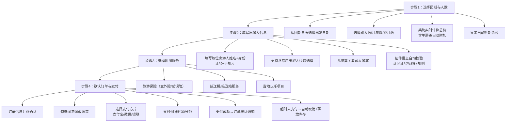

**图 4-1 境内游跟团游预订业务流程**

**步骤1：选择团期与人数。** 用户从产品详情页的团期日历中选择出发日期，已售罄日期置灰不可选。人数选择区分成人（≥12周岁）、儿童（2-12周岁，不占床）、婴儿（＜2周岁），每种类型设有最小/最大人数限制。系统根据所选日期和人数实时计算总价，其中单房差自动计算逻辑为：当成人人数为奇数时，自动附加1份单房差费用至总价[^64^]。成团人数提示功能在用户选择人数接近成团下限时给出友情提示（如"还差2人即可成团"）。

**步骤2：填写出游人信息。** 出游人信息字段包括：姓名（中文）、证件类型（默认身份证）、证件号码、出生日期、性别、手机号[^188^]。系统支持从常用出游人列表中一键填充，减少重复录入。每个出游人的身份证号码需通过校验码规则验证，验证不通过时即时提示"身份证号码格式有误"。儿童信息需关联至少一位成人游客，婴儿信息需关联至少一位成人游客且限制每成人最多携带1名婴儿。

**步骤3：选择附加服务。** 附加服务以勾选框形式展示，首期包含旅游保险（境内旅行意外险，按人计价）、接送机/接送站服务（按线路计价）。每项附加服务展示名称、原价、优惠价、适用日期。附加服务价格实时计入订单总价，取消勾选时自动扣减[^127^][^152^]。

**步骤4：确认订单与支付。** 订单确认页完整汇总产品信息（名称/日期/天数）、出游人信息列表、费用明细（产品总价+单房差+附加服务-优惠券抵扣=应付总额）、退改政策摘要。用户需勾选"已阅读并同意退改政策"后方可提交订单[^31^]。支付方式首期支持支付宝、微信支付、银联在线支付三种[^82^][^83^]。订单创建后启动30分钟支付倒计时，超时未支付自动取消订单并释放库存[^42^]。支付成功后，系统通过短信+站内信双通道发送订单确认通知。

**表 4-3 境内游预订流程功能点**

| 功能编号 | 功能点 | 说明 | 优先级 |
|:---------|:-------|:-----|:-------|
| F-I-B01 | 团期日历选择 | 日历形式选择出发日期，已售罄置灰 | P0 |
| F-I-B02 | 人数选择 | 成人/儿童/婴儿分别选择，设最小最大值限制 | P0 |
| F-I-B03 | 实时价格计算 | 根据日期×人数自动计算总价，含单房差 | P0 |
| F-I-B04 | 单房差自动附加 | 成人数为奇数时自动附加，展示明细 | P0 |
| F-I-B05 | 余位显示 | 展示当前班期剩余名额 | P0 |
| F-I-B06 | 出游人信息填写 | 姓名/身份证/手机号/出生日期/性别 | P0 |
| F-I-B07 | 常用出游人选择 | 从预录入列表中快速选择 | P0 |
| F-I-B08 | 证件自动校验 | 身份证号校验码实时验证 | P0 |
| F-I-B09 | 儿童关联成人 | 每位儿童需关联至少一位成人 | P0 |
| F-I-B10 | 联系人信息 | 姓名+手机号（可与出游人一致） | P0 |
| F-I-B11 | 附加服务选择 | 旅游保险/接送机/当地玩乐 | P1 |
| F-I-B12 | 优惠券使用 | 代金券/满减券/折扣券，智能推荐最优券[^126^][^137^] | P1 |
| F-I-B13 | 订单信息汇总 | 产品+出游人+费用明细完整确认 | P0 |
| F-I-B14 | 退改政策确认 | 需勾选同意方可提交 | P0 |
| F-I-B15 | 多支付方式 | 支付宝/微信/银联在线 | P0 |
| F-I-B16 | 支付倒计时 | 30分钟超时自动取消 | P0 |
| F-I-B17 | 超时自动取消 | 释放库存，发送取消通知 | P0 |

#### 4.2.4 订单管理

订单管理模块位于个人中心内，采用顶部状态Tab+订单卡片列表的布局。状态Tab包含全部、待付款、待出行、退款中、已完成、已取消六种状态，用户可快速切换筛选[^182^][^184^]。每条订单卡片展示产品主图、产品名称、出发日期、订单金额、当前状态标签及可操作按钮。订单支持按产品名称和订单号搜索。

订单详情页完整展示产品信息（含行程概要）、出游人信息列表、费用明细、支付记录、退改政策原文、合同下载链接（如有）。不同状态下的可操作按钮不同：待付款状态显示"立即支付"和"取消订单"；待出行状态显示"申请退款"和"申请改期"；已完成状态显示"去评价"；退款中状态显示"查看退款进度"。退改申请提交后，系统按产品配置的退改规则自动计算可退金额，进入后台审核流程，审核结果通过短信和站内信通知用户[^86^][^90^]。发票申请功能支持用户填写发票抬头、纳税人识别号、邮箱地址，选择发票类型（个人/企业），电子发票在后台审核后发送至用户邮箱[^141^][^145^]。

#### 4.2.5 业务规则

境内游跟团游业务线需遵循以下核心规则，这些规则直接影响系统功能实现与用户体验设计。

**单房差规则。** 当订单中成人人数为奇数时，系统自动附加1份单房差费用至订单总价。单房差金额在产品价格体系中按日期独立配置，因为淡旺季的房费差异会导致单房差金额波动。系统不提供自动拼房选项，用户如需免除单房差，需自行在出游前协调同行者调整人数[^64^]。

**儿童价规则。** 儿童价默认适用于2-12周岁（不含12周岁）且不占床位的出游人。儿童价不含床位费和景点门票费（部分景点儿童免票或半票）。如儿童需要占床位，用户需在附加服务中选择"儿童占床补差"，系统按该产品配置的占床差价额外计费。婴儿价适用于0-2周岁，仅含当地交通和导游服务，不含床位、餐饮和门票[^64^]。

**超时未支付规则。** 订单提交后启动30分钟支付倒计时，倒计时以分钟:秒格式在支付页面和订单详情页实时展示。超时后系统自动取消订单，将订单状态变更为"已取消-超时未付"，同步释放该订单预占的团期库存。超时取消后不可恢复，用户需重新下单[^42^]。

**退改规则。** 退改政策按产品单独配置（Q11决策），以阶梯费率形式呈现：出发前N天以上退订退还X%费用；出发前N天至N天退订退还Y%费用并扣除手续费；出发前N天内退订可能仅退还税费或不可退款[^86^][^90^]。特价产品可配置为"不可退改"，但需在预订流程中以醒目方式提示用户确认。退款执行原路退回策略，退回用户原支付账户，信用卡退款1-2个结算周期到账[^86^]。

---

### 4.3 出境游跟团游

出境游跟团游在境内游功能基座上叠加出境场景特有的功能模块，包括签证服务体系、护照信息管理、行前信息服务等。本节重点描述出境游与境内游的差异点，相同功能不再重复。

#### 4.3.1 产品列表与筛选

出境游产品列表页的整体布局与交互框架复用境内游设计，筛选条件在境内游基础上增加出境游特有维度。

**表 4-4 出境游产品列表与筛选功能点（与境内游差异项）**

| 功能编号 | 功能点 | 说明（出境游特有） | 优先级 |
|:---------|:-------|:-------------------|:-------|
| F-O-L01 | 国家/地区筛选 | 按大洲→国家/地区层级树选择，支持多选（如"东南亚"下含泰国/越南/新加坡等） | P0 |
| F-O-L02 | 签证类型筛选 | 免签/落地签/电子签/需提前办签/全部，筛选结果标注各产品所属签证类型[^329^][^332^] | P0 |
| F-O-L03 | 出发城市筛选 | 增加国际出发口岸（北京首都/上海浦东/广州白云等） | P0 |
| F-O-L04 | 行程天数筛选 | 出境游行程天数范围更长，增加"15天以上"选项 | P0 |
| F-O-L05 | 签证状态引导 | 用户首次访问出境游频道时，系统提示选择/查询目的地签证要求 | P1 |
| F-O-L06 | 护照有效期前置校验 | 搜索出境游产品前，如用户已录入护照信息，系统校验有效期是否满足目的地要求[^162^][^163^] | P1 |
| F-O-L07 | 产品标签-签证相关 | 额外标签：免签直飞/落地签/含签证代办/拒签全退 | P0 |

上表的核心差异在于签证维度的深度整合。签证类型筛选（F-O-L02）将签证要求转化为用户可感知的产品属性，使用户在筛选阶段即可根据自身的签证条件匹配合适产品。"免签"标签适用于阿联酋、卡塔尔、印度尼西亚等约26个免签国家/地区[^329^]；"落地签"标签适用于泰国、越南、柬埔寨等约39个落地签国家/地区[^335^]；"需提前办签"标签适用于美国、申根国家、日本等需预先办理签证的目的地[^296^]。护照有效期前置校验（F-O-L06）是一个用户体验优化点：对于已有护照信息的用户，系统在产品列表页即进行有效期初步校验，避免用户浏览了无法预订的产品后才在下单环节被拦截，减少无效操作。

#### 4.3.2 产品详情页

出境游产品详情页在境内游基础上增加签证信息展示模块和出境场景适配内容。签证信息模块以独立卡片形式插入于"费用说明"与"退改政策"之间，展示内容如下。

签证信息卡片包含：所需签证类型（如"日本旅游签证-单次"）、办理周期（如"收齐材料后7-9个工作日"）、建议最晚提交材料的日期（基于出发日期倒推）、材料清单预览（分在职人员/自由职业/退休人员/学生/儿童五类人群分别列出所需材料）、签证费用（含在订单总价中或作为附加服务项）。用户可点击"查看完整材料清单"展开详细说明[^296^]。如目的地为免签或落地签国家，卡片内容相应变更为免签说明或落地签办理流程提示[^329^]。

产品详情页的其他出境游适配包括：行程详情中增加国际航班信息展示（航班号、起降时间、经停信息）、住宿标准中标注境外酒店星级参考标准（因各国星级评定标准存在差异）、费用说明中明确标注是否包含签证费、国际段机票税费和小费。FAQ部分额外增加签证信息、外币兑换建议、通讯方式等出境专属问题[^140^]。

#### 4.3.3 预订流程

出境游预订流程与境内游的核心差异体现在出游人信息填写环节，以及签证代办服务的选择。

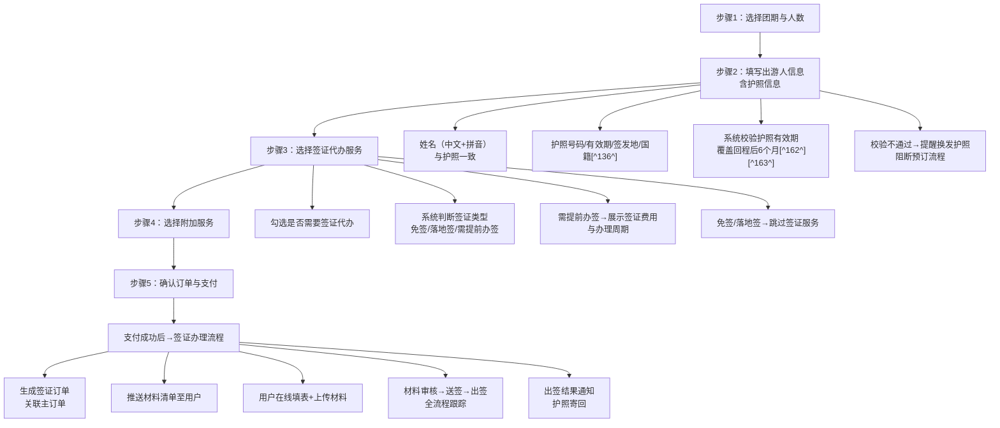

**图 4-2 出境游跟团游预订业务流程（含签证闭环）**

**出游人信息填写（出境差异）。** 出境游场景下，出游人信息字段在境内游基础上增加：姓名拼音（需与护照完全一致，用于机票和酒店预订）、护照号码、护照有效期、护照签发地、国籍[^136^]。系统对护照有效期执行严格校验：自动计算回程日期，校验护照有效期是否覆盖回程后至少6个月。如不满足，系统拦截预订流程并提示"您的护照有效期不足，建议换发后再预订"[^162^][^163^]。校验规则基于国际通行标准——绝大多数国家要求入境时护照至少有6个月有效期，部分航空公司可能在值机环节即拒绝护照有效期不足的旅客登机[^162^]。护照信息支持OCR识别自动填充：用户上传护照照片后，系统通过OCR识别姓名、护照号、有效期等信息并自动填入表单[^61^][^64^]。

**签证代办服务选择。** 如目的地需要提前办理签证，预订流程中增加签证代办服务选择步骤。用户勾选"需要签证代办"后，系统展示签证类型、费用和预计办理周期。签证费用作为子订单项计入总价。支付成功后，系统自动创建关联的签证服务订单并启动签证办理流程。

#### 4.3.4 签证服务交易闭环

签证服务交易闭环是出境游业务线的核心差异化能力，覆盖"信息展示→在线办理→材料审核→进度跟踪→结果通知"的全流程。

**表 4-5 出境游签证服务交易闭环功能点**

| 功能编号 | 功能点 | 说明 | 优先级 |
|:---------|:-------|:-----|:-------|
| F-V-001 | 签证信息展示 | 产品详情页展示签证类型、领区划分、办理周期、有效期/停留期、材料清单预览[^296^] | P0 |
| F-V-002 | 在线申请表填写 | 系统引导填写各国签证申请表，字段根据签证类型动态生成 | P0 |
| F-V-003 | 材料清单生成 | 根据用户职业（在职/自由职业/退休/学生）自动生成个性化材料清单[^66^][^67^] | P0 |
| F-V-004 | 材料上传 | 支持护照扫描件、照片、在职证明、银行流水等材料上传，单文件≤10MB | P0 |
| F-V-005 | 护照OCR识别 | 上传护照照片后自动识别姓名/号码/有效期/国籍[^61^][^64^] | P0 |
| F-V-006 | 材料预审 | 系统自动检查材料完整性（必填项是否齐全）+人工审核合规性 | P0 |
| F-V-007 | 审核意见反馈 | 材料不通过时逐条反馈修改意见，推送至用户 | P0 |
| F-V-008 | 办理进度跟踪 | 五节点状态机：待提交→审核中→已送签→已出签/已拒签[^54^] | P0 |
| F-V-009 | 进度实时查询 | 用户可随时查看当前办理阶段和预计完成时间 | P0 |
| F-V-010 | 状态变更通知 | 每个节点变更通过短信+站内信推送 | P0 |
| F-V-011 | 出签结果通知 | 出签/拒签结果第一时间通知，附签证页照片 | P0 |
| F-V-012 | 护照物流跟踪 | 签证完成后护照寄回，集成快递物流跟踪[^68^] | P0 |
| F-V-013 | 签证历史记录 | 用户可查看历史签证办理记录，含签证类型/办理时间/出签结果 | P1 |
| F-V-014 | 有效期到期提醒 | 签证即将过期时提前90天提醒用户 | P1 |
| F-V-015 | 拒签退款保障 | 标注拒签退款条件（如未送签可全额退） | P1 |

签证办理进度跟踪采用五节点状态机设计：待提交（用户尚未提交完整材料）→审核中（材料已提交，正在进行系统预审和人工审核）→已送签（材料已递交至使领馆）→已出签（签证已获批，护照准备寄回）/已拒签（签证申请被拒绝）。每个状态节点变更时，系统通过短信和站内信双通道通知用户，并更新订单详情页中的签证状态标签[^54^]。常规办理周期因目的地而异：日本5-7个工作日，韩国5-7个工作日，申根国家10-15个工作日[^50^]。电子签证（如土耳其e-Visa）最快可实现秒级出签[^61^]。

材料清单根据用户职业状态动态生成，五类人群的材料要求存在显著差异。在职人员需提供在职证明原件、营业执照副本复印件（加盖公章）、近6个月银行流水（余额不少于5万元）[^296^]；退休人员以退休证替代在职证明；学生需提供在校证明和出生证明；儿童需额外提供亲属关系公证书[^296^]。申根签证材料清单具有代表性：护照原件、身份证复印件、户口本复印件、在职证明、近6个月银行流水、2寸白底照片、往返机票预订单、已付酒店订单、行程计划单、旅行保险（医疗保额≥3万欧元）[^296^]。部分国家支持简化材料：韩国对特定户籍城市（如北京、上海、广州等）居民和本科及以上学历人群免除资产证明要求[^67^]。

#### 4.3.5 行前信息服务

行前信息服务覆盖用户支付成功到实际出发前的信息准备阶段，帮助用户完成出境所需的各项准备工作。

**表 4-6 出境游行前信息服务功能点**

| 功能编号 | 功能点 | 说明 | 优先级 |
|:---------|:-------|:-----|:-------|
| F-O-P01 | 目的地入境政策查询 | 按目的地查询最新入境政策，含免签/落地签/需提前办签标识[^329^] | P0 |
| F-O-P02 | 入境材料清单 | 入境需携带材料：返程机票/酒店订单/资金证明等[^164^] | P0 |
| F-O-P03 | 现金携带规定 | 目的地对携带现金金额的限制（如泰国10000泰铢/人）[^164^][^183^] | P1 |
| F-O-P04 | 违禁品清单 | 禁止携带入境物品列表 | P1 |
| F-O-P05 | 入境卡填写指引 | 各目的地入境卡中英文对照模板及逐项填写说明[^268^][^271^] | P0 |
| F-O-P06 | 海关申报指引 | 海关申报单填写指引，贵重物品/大额现金申报阈值[^268^][^270^] | P0 |
| F-O-P07 | 航班动态跟踪 | 输入航班号查询实时状态，关注后全程跟踪动态变化[^294^][^300^] | P0 |
| F-O-P08 | 延误/取消通知 | 航班异常时主动推送通知 | P0 |
| F-O-P09 | 目的地天气预报 | 实时天气和未来15天预报[^165^] | P1 |
| F-O-P10 | 时差显示 | 出发地与目的地时差，双城时间同时展示[^165^] | P1 |
| F-O-P11 | 行前准备清单 | 护照/签证/机票/酒店/保险/WiFi等逐项检查清单 | P0 |
| F-O-P12 | 紧急联系信息 | 中国驻外使领馆联系方式、当地报警电话[^326^] | P0 |

入境卡填写指引（F-O-P05）是出境游客高度依赖的功能。入境卡通常在航班上由空乘人员发放，需在抵达前填写完成。系统提供各目的地入境卡的中英文对照模板，逐项说明填写内容和注意事项[^268^]。海关申报单通常以家庭为单位填写，一个家庭填一张；贵重物品和大额现金（通常≥10{,}000美元等值）需主动申报[^268^][^270^][^274^]。航班动态跟踪（F-O-P07）数据源覆盖航司官方数据、空管数据、气象预警数据，航班状态变化实时同步，建议起飞前2-4小时再次确认状态[^294^][^300^]。

#### 4.3.6 业务规则

出境游业务线在境内游规则基础上增加以下出境专属规则。

**护照有效期规则。** 系统强制校验所有出境游订单中每位出游人的护照有效期，要求有效期覆盖回程日期后至少6个月。这一规则基于绝大多数国家/地区的入境要求制定：泰国要求护照有效期6个月以上且需携带10000泰铢/人或20000泰铢/家庭现金[^164^]；美国要求护照有效期超出预定停留期至少6个月[^160^][^177^]；新加坡要求护照有效期6个月以上[^170^]；欧盟国家要求非欧盟公民护照有效期至少3-6个月[^178^]。中国边检对护照有效期无特别要求，有效期内即可出入境，但目的地国和航司可能拒绝登机或入境[^173^][^174^]。

**申根保险规则。** 前往申根国家（法国、德国、意大利等29国）的订单，系统强制要求用户购买申根签证要求的旅行保险。保险要求为：医疗保额≥3万欧元（约35万人民币），覆盖整个行程期间，保险内容须包含紧急医疗、住院费用、遗体遣返[^112^]。出境游保险产品详情页中，如目的地包含申根国家，系统在产品详情页以醒目提示方式引导用户购买符合条件的保险产品。

**签证材料提交时效。** 为确保签证能在出发前办理完毕，系统根据出发日期和签证办理周期计算"最晚提交材料日期"，在产品详情页和订单详情页持续提醒。如用户未在最晚日期前提交完整材料，系统自动推送加急办理建议或改期提醒。

---

### 4.4 邮轮游

邮轮游是区别于境内游和出境游的独立业务线，具有"浮动度假村"式的产品特征。邮轮本身集交通、住宿、餐饮、娱乐于一体，库存管理以舱房（Cabin）为最小单元、按航次（Sailing）独立管理。本节定义邮轮游C端前台特有的功能需求，重点关注首期按舱房类型选择（不上交互式甲板图）的简化方案。

#### 4.4.1 邮轮搜索

邮轮搜索采用与境内游/出境游完全不同的搜索维度体系，核心搜索条件围绕航线、港口、邮轮公司展开。

**表 4-7 邮轮搜索与详情功能点**

| 功能编号 | 功能点 | 说明 | 优先级 |
|:---------|:-------|:-----|:-------|
| F-C-S01 | 航线区域筛选 | 按地理区域：东南亚航线/东北亚航线/地中海航线/加勒比海航线/北欧航线/阿拉斯加航线等[^47^] | P0 |
| F-C-S02 | 出发港口筛选 | 上海/天津/深圳/新加坡/巴塞罗那/迈阿密等母港城市 | P0 |
| F-C-S03 | 出发日期范围 | 日历选择出发日期范围，支持灵活日期（±3天） | P0 |
| F-C-S04 | 行程天数筛选 | 2-4天/5-7天/8-14天/15天以上[^52^][^57^] | P0 |
| F-C-S05 | 邮轮公司筛选 | 皇家加勒比/MSC地中海/歌诗达/爱达等[^47^][^58^] | P1 |
| F-C-S06 | 价格区间筛选 | 自定义最低价-最高价（按人均价格） | P0 |
| F-C-S07 | 航次列表卡片 | 每条航次一张卡片：航线静态地图图片/船只名称/出发日期/天数/起价/促销标签 | P0 |
| F-C-S08 | 排序功能 | 按价格（低到高/高到低）、出发日期（近到远）、航行天数排序 | P0 |
| F-C-S09 | 航次日历 | 日历视图展示某航线的所有可用出发日期及每日起价[^47^][^53^] | P0 |
| F-C-S10 | 邮轮详情页 | 船只基础参数/设施图文介绍/航次列表 | P0 |
| F-C-S11 | 船只参数展示 | 总吨位/载客量/首航年份/长度/宽度/航速/甲板层数[^47^] | P0 |
| F-C-S12 | 设施分类导航 | 餐厅/娱乐/运动健身/购物/儿童/水疗分类图文介绍[^56^] | P0 |

航次列表卡片（F-C-S07）中的航线静态地图图片由运营后台上传，展示邮轮航线及各停靠港口的相对位置，C 端以静态图片形式展示，支持点击放大查看。

邮轮搜索维度的设计反映了邮轮产品与传统旅游的本质差异：用户在搜索阶段关注的是"坐哪艘船、从哪里出发、去哪些港口"，而非传统旅游的"住哪家酒店、去哪些景点"。航线区域（F-C-S01）是邮轮搜索的首要维度，同一航线区域下可能有数十至上百个不同出发日期的航次。出发港口（F-C-S02）对应邮轮行业的"母港"概念，中国母港主要包括上海、天津、深圳（蛇口）、广州（南沙）等。邮轮公司（F-C-S05）是资深邮轮玩家重要的筛选维度，不同邮轮公司的定位差异显著——皇家加勒比主打科技创新与大吨位娱乐设施，MSC地中海强调欧式风格与Yacht Club高端体验，爱达邮轮（中国首艘国产大型邮轮）更贴近中国游客的消费习惯[^47^][^58^]。

航次日历（F-C-S09）是邮轮特有功能，以日历形式展示同一航线在未来数月内的所有可用出发日期，每个日期单元格标注当日起价（双人入住基准价）和库存状态。低价日期以视觉高亮方式突出，售罄航次灰度显示。用户选择某一日期后，整页信息联动更新为该航次的具体行程[^47^][^53^]。

邮轮详情页的核心信息是船只本身而非目的地。页面顶部展示邮轮高清大图/视频轮播，中部展示船只核心参数（总吨位、双人间载客量、满载载客量、首航年份、长度、宽度、服务航速、甲板层数、船员人数）[^47^]。下方以分类导航形式展示船上设施：餐厅（主餐厅/自助餐厅/特色收费餐厅及各餐厅菜系、着装要求、是否收费）、娱乐（剧院/赌场/酒吧/泳池/水上滑梯）、运动健身（健身房/攀岩墙/冲浪模拟器）、购物（免税店品牌）、儿童服务（分年龄段俱乐部及托管服务）[^56^]。航次列表以Tab或时间轴形式展示该邮轮未来所有可预订航次。

#### 4.4.2 航次选择与舱房预订

航次选择和舱房预订是邮轮游预订流程的核心环节。根据Q3决策，首期舱房选择仅支持按舱房类型选择，不上交互式甲板图，后台支持手动上传舱房房号。

**表 4-8 邮轮航次选择与舱房预订功能点**

| 功能编号 | 功能点 | 说明 | 优先级 |
|:---------|:-------|:-----|:-------|
| F-C-B01 | 航次确认 | 确认航线、出发日期、航行天数、船只名称 | P0 |
| F-C-B02 | 航次行程展示 | Day-by-Day行程安排，标注航行日/停靠日，停靠港口到港/离港时间[^47^] | P0 |
| F-C-B03 | 航线地图 | 静态地图图片展示各停靠港口位置及航行路线，由运营后台上传 | P0 |
| F-C-B04 | 舱房类型选择 | 四种主要类型选择：内舱房/海景房/阳台房/套房[^142^][^143^][^144^] | P0 |
| F-C-B05 | 舱房类型对比 | 并排对比：面积/窗户类型/床型配置/容纳人数/设施/价格差异 | P0 |
| F-C-B06 | 舱房实景展示 | 每种类型的高清图片/视频轮播 | P0 |
| F-C-B07 | 同舱第3/4人优惠 | 展示同舱第3人/第4人折扣价格[^504^] | P0 |
| F-C-B08 | 舱房价格明细 | 舱房费+税费+服务费分项列出 | P0 |
| F-C-B09 | 出游人信息填写 | 姓名/性别/出生日期/国籍/护照号码/护照有效期[^47^][^51^] | P0 |
| F-C-B10 | 主要预订人年龄校验 | 主要预订人必须年满21岁[^47^] | P0 |
| F-C-B11 | 紧急联系人 | 非同行的紧急联系人姓名和电话（邮轮安全要求） | P0 |
| F-C-B12 | 护照有效期校验 | 覆盖航次结束后6个月以上[^47^] | P0 |
| F-C-B13 | 附加服务选择 | 酒水包/WiFi套餐/岸上观光/特色餐饮[^149^][^193^] | P1 |
| F-C-B14 | 订单确认与支付 | 支持订金/全款选项，信用卡/支付宝/微信支付 | P0 |
| F-C-B15 | 值船指南与船票下载入口 | 展示值船流程说明文档（文本/PDF），支持船票下载（如后台已上传） | P0 |

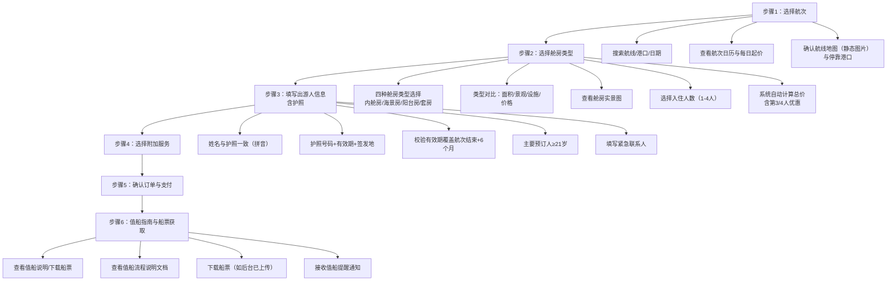

**图 4-3 邮轮游舱房预订业务流程**

**舱房类型选择。** 邮轮舱房分为四大类型，是预订流程中的核心决策点[^142^][^143^][^144^]：

- **内舱房（Interior）**：面积12-16m²，无窗户，为最经济选项，适合预算敏感型或对舱房仅作过夜使用的游客。
- **海景房（Oceanview）**：面积13-17m²，配有不可开启的景观舷窗，有自然光线但无法通风，适合希望有自然光但预算有限的用户。
- **阳台房（Balcony）**：面积16-22m²+阳台，配有可开启的私人阳台门，可在舱房内欣赏海景和呼吸海风，是综合性价比最高的类型。
- **套房（Suite）**：面积25-42m²+阳台，最宽敞，通常包含VIP礼遇（优先登船、专属餐厅、管家服务等），适合追求高品质体验的用户。

舱房选择界面采用类型卡片并排对比布局，每张卡片展示该类型的实景图、面积范围、窗户/阳台类型、床型配置、最大容纳人数、标配设施清单和起价。用户选择舱房类型后，进一步选择入住人数（1-4人），系统根据人数和舱房类型实时计算总价。邮轮舱房按人计价（不同于酒店按间计价），第一人和第二人按完整票价计费，第三人/第四人享受折扣价（通常为首价的30%-60%）[^504^]。

**出游人信息填写。** 邮轮出游人信息字段与出境游基本一致，但增加两项邮轮特有要求：主要预订人（Primary Guest）必须年满21岁[^47^][^51^]；需填写非同行的紧急联系人（邮轮公司的安全合规要求）。护照有效期校验规则与出境游一致，要求覆盖航次结束后6个月以上[^47^]。

**航线地图展示。** 邮轮航次的航线地图以静态地图图片形式展示，由运营人员在后台上传航线示意图，标注各停靠港口位置及航行路线。C 端用户在航次详情页查看该静态地图图片，支持点击放大全屏查看。此方案为零成本实现，不依赖第三方付费地图 API。

**值船流程说明与船票获取。** 鉴于本平台暂不与船方系统直接对接，不提供在线值船功能。取而代之，系统向游客提供值船流程说明文档（文本或PDF格式），由运营人员在后台上传并关联至对应邮轮/航次。支付成功后，订单详情页展示"值船指南"入口，用户可点击查看或下载值船流程说明文档，了解该邮轮的具体值船要求（如值船开放时间、所需材料、值船渠道等）。对于仅需后台手动上传船票的邮轮，运营人员在后台上传船票PDF文件后，用户可在订单详情页的"我的船票"入口下载船票[^54^][^258^][^261^]。

**值船提醒通知。** 当运营人员在后台为订单录入舱房号后，系统自动向游客发送值船提醒通知（短信+站内信），通知内容包括舱房号信息、值船截止时间提醒、值船指南文档链接和船票下载链接（如有）。提醒时间节点包括：舱房号分配后即时提醒、出发前30天提醒、出发前7天最后提醒。用户可在消息中心查看历史提醒记录。

#### 4.4.3 业务规则

邮轮游业务线需遵循以下核心规则。

**舱房按类型选择规则。** 根据Q3决策，C端前台仅支持按舱房类型（内舱/海景/阳台/套房）选择，不支持在交互式甲板图上选择具体舱房号。后台支持手动上传舱房房号Excel表，运营人员在订单确认后根据后台库存手动分配具体舱房。这一简化方案适用于首期阶段，后续可根据业务增长逐步引入交互式甲板图选舱功能。

**同舱第3/4人优惠定价规则。** 邮轮舱房定价采用"首价+次价+优惠三四价"的分层模式。第一人和第二人按该舱房类型的标准人均价格计费；第三人/第四人享受折扣定价，折扣幅度按航次和舱房类型独立配置（通常为正常价格的30%-60%）[^504^]。儿童作为第3/4人时如不占床，部分航次提供更低折扣甚至免费。系统在计算总价时自动识别同舱人数并应用对应价格档位。

**邮轮退改规则。** 邮轮退改规则与境内游/出境游采用独立的规则体系（Q11决策）。退改政策按阶梯式时间窗口配置：出发前91天以上取消仅损失定金；出发前90-61天取消扣除一定比例费用；出发前60-31天扣除更高比例；出发前30天以内可能不退款[^599^][^595^]。不同邮轮公司、不同航次的退改规则存在差异，需在后台按航次独立配置。由于邮轮产品的库存单元为舱房×航次，取消后释放的库存不可跨航次复用，这与传统旅游产品存在本质不同。

**船上消费体系规则。** 邮轮采用独特的无现金支付体系。每位游客登船后获得一张房卡（SeaPass），该卡既是舱房门卡也是船上消费的唯一支付介质[^159^][^160^]。游客在值船时或登船后绑定信用卡（Visa/Master/Amex/JCB/银联），系统对信用卡执行预授权（通常$100-300）[^168^][^180^]。航程期间所有消费（酒水、WiFi、特色餐厅、岸上观光、娱乐项目）均记账至房卡关联的消费账户。航程最后一晚或下船时，系统自动从绑定信用卡中扣除全部消费金额。中国母港邮轮（如爱达魔都号、皇家加勒比中国航线）额外支持支付宝和微信支付绑定[^160^]。

**值船流程说明文档规则。** 运营人员在后台上传邮轮基础信息时，需配置该邮轮"是否需要在线值船"和"是否需要手动上传船票"两个选项。对于"需要在线值船"的邮轮，后台需上传值船流程说明文档（PDF格式），文档内容应包含值船开放时间、值船网址/APP、所需材料清单、操作步骤说明。对于"需要手动上传船票"的邮轮，运营人员在舱房号分配后上传船票PDF文件，系统自动通知用户下载。值船流程说明文档和船票文件均支持按邮轮/航次维度独立配置和版本管理。若某邮轮同时标记为"不需要在线值船"且"不需要手动上传船票"，则C端订单详情页不展示值船相关入口。

## 5. 功能需求 — 支付系统

### 5.1 支付渠道接入

支付系统需对接支付宝、微信支付、银联三大主流渠道，覆盖PC浏览器、移动端浏览器、微信小程序等多终端场景。系统采用**渠道网关（Channel Gateway）**架构，通过适配器模式封装三方渠道差异，向上层提供统一支付抽象层 [^646^]。Go语言技术选型上，微信支付使用官方SDK `wechatpay-go`，支付宝使用社区SDK `smartwalle/alipay/v3`，银联使用 `smartwalle/unionpay`，三者覆盖签名、下单、回调验签、退款、对账等完整支付生命周期 [^536^][^542^][^603^]。

#### 5.1.1 支付宝接入

支付宝接入遵循开放平台标准流程：注册账号 → 创建应用并审核 → 配置RSA2密钥对 → 签约支付产品 → 沙箱联调 → 正式上线 [^532^][^535^]。系统配置三项核心参数：AppID（应用唯一标识）、应用私钥（商户自行生成的2048位RSA2密钥，用于请求签名）、支付宝公钥（从后台获取，用于响应验签）。网关地址方面，正式环境为 `https://openapi.alipay.com/gateway.do`，沙箱环境为 `https://openapi-sandbox.dl.alipaydev.com/research` [^542^]。

系统实现三种支付方式：**电脑网站支付**（`alipay.trade.page.pay`）面向PC端，跳转支付宝收银台完成支付；**手机网站支付**（`alipay.trade.wap.pay`）面向移动端浏览器，自动唤醒支付宝APP或跳转H5收银台；**当面付-扫码支付**（`alipay.trade.precreate`）适用于后台生成收款二维码的场景 [^633^][^631^]。所有接口统一采用RSA2（SHA256）签名。

Go语言层通过 `smartwalle/alipay/v3` SDK对接，该SDK支持公钥证书和普通公钥两种签名方式，覆盖网站支付、手机网站支付、当面付、退款、交易查询、分账等主要接口，并支持沙箱环境 [^542^]。回调通知以HTTP POST推送至 `notify_url`，系统使用支付宝公钥验签后根据 `out_trade_no` 和 `trade_status` 更新订单状态，成功处理后返回 `"success"`，否则支付宝在24小时内多次重试 [^608^][^610^]。

#### 5.1.2 微信支付接入

微信支付接入以APIv3为主版本，需准备五项关键信息：商户号（mchid）、APPID、32字节API v3密钥、商户API证书（含私钥 `apiclient_key.pem` 及证书序列号）、平台证书（用于回调验签，由SDK自动拉取缓存）[^520^][^537^][^607^]。接口基地址为 `https://api.mch.weixin.qq.com`，备域名 `api2.mch.weixin.qq.com` 提供跨城冗灾 [^611^]。

系统实现三种支付方式：**Native支付**（`POST /v3/pay/transactions/native`）面向PC扫码场景，获得 `code_url` 后生成二维码展示 [^517^][^531^]；**JSAPI支付**（`POST /v3/pay/transactions/jsapi`）面向微信内浏览器和小程序，下单传入openid，获得 `prepay_id` 后前端调起支付 [^520^][^523^]；**H5支付**（`POST /v3/pay/transactions/h5`）面向手机浏览器，跳转 `h5_url` 唤起微信收银台 [^518^]。

微信支付提供官方Go SDK `wechatpay-go`，核心组件包括HTTP客户端 `core.Client`（自动处理请求签名与应答验签）、回调处理器 `core/notify`（支持APIv3加密通知的解密与验签）、以及自动获取和缓存平台证书的证书管理器 [^536^][^537^]。回调通知采用JSON格式加密传输，商户处理完成后须返回HTTP 200，否则微信支付按固定间隔重复通知 [^542^][^610^]。系统通过数据库唯一索引（通知ID+交易号）和Redis缓存实现幂等性控制。

#### 5.1.3 银联支付接入

银联接入需完成开放平台注册、商户入网、配置测试环境（测试商户号77开头）、下载证书（5.1.0版本规范）等流程 [^553^][^601^]。系统配置商户号（merId）、pfx格式签名证书、cer格式验签证书三项核心参数。接入方式为前台跳转加后台通知双重机制 [^601^][^615^]。

系统实现三种支付方式：**网关支付**（txnType=01, channelType=07）面向PC端浏览器跳转银联页面；**手机WAP支付**（channelType=08）面向移动端浏览器；**云闪付APP支付**通过SDK集成方式在APP内调起云闪付 [^551^]。二维码支付覆盖主扫（txnSubType=03）和被扫（txnSubType=04）两种模式 [^552^]。请求统一使用5.1.0版本规范，关键参数包括 txnAmt（金额，单位为分）、currencyCode（156-人民币）、frontUrl/backUrl（前后台通知地址），采用RSA-SHA256签名 [^601^][^615^]。Go语言层通过 `smartwalle/unionpay` SDK实现，已覆盖消费、查询、撤销、退货等核心功能 [^603^]。银联双重通知机制中，后台通知（backUrl）是确认交易成功的依据，前台通知（frontUrl）仅作页面展示参考 [^601^][^603^]。

**表5-1 三大支付渠道技术参数对比**

| 对比维度 | 支付宝 | 微信支付 | 银联支付 |
|---|---|---|---|
| 开放平台 | open.alipay.com [^535^] | pay.weixin.qq.com [^517^] | open.unionpay.com [^553^] |
| API版本 | OpenAPI v3 | APIv3 | 5.1.0 |
| 签名算法 | RSA2 (SHA256) | RSA / HMAC-SHA256 | RSA-SHA256 (pfx证书) |
| PC网站支付 | alipay.trade.page.pay | Native支付（扫码） | 网关支付 (channelType=07) |
| 手机网站支付 | alipay.trade.wap.pay | H5支付 | WAP支付 (channelType=08) |
| 扫码支付 | 当面付precreate | Native支付 (code_url) | 二维码支付 (txnSubType=03/04) |
| Go SDK | smartwalle/alipay v3 [^542^] | wechatpay-go 官方 [^536^] | smartwalle/unionpay [^603^] |
| SDK Stars | 2{,}000+ | 1{,}000+ | 100+ |
| 退款接口 | alipay.trade.refund | /v3/refund/domestic/refunds | 消费撤销/退货 |
| 退款时效 | 默认3个月内 | 1年内（最多50次部分退款）[^614^] | 当日撤销/隔日退货 |
| 对账方式 | 账单下载地址查询 | /v3/bill/tradebill (CSV) | 文件接口下载 |
| 沙箱环境 | 有 | 有 | 有 [^549^] |
| 回调成功响应 | "success" 字符串 | HTTP 200 | HTTP 200 |

上表揭示的技术选型逻辑在于：微信支付拥有官方Go SDK，在证书管理和回调处理上集成度最高；支付宝社区SDK成熟度高（2{,}000+ Stars），接口覆盖完整；银联B端属性较强，Go生态相对薄弱，部分高级接口需自行封装。系统架构上建议在渠道网关层抽象统一接口，以适配器模式隔离三方差异，避免业务层直接依赖特定渠道SDK [^616^]。

### 5.2 支付模式

系统支持两种支付模式，在产品级别由运营人员配置。**全额支付模式**适用于即时确认、库存紧张的短线产品；**定金+尾款模式**适用于单价较高、需提前锁位的长线出境游和邮轮产品。

#### 5.2.1 全额支付模式

全额支付模式下，用户在订单确认页一次性支付订单全款。系统配置15至30分钟的支付倒计时（短线产品15分钟，长线产品30分钟），超时未完成支付则订单自动取消并释放库存 [^42^]。支付流程遵循通用模型：创建支付订单 → 调用渠道下单接口获取支付参数 → 用户完成支付 → 渠道异步通知 → 系统验签更新状态 → 触发库存锁定和订单确认 [^646^]。全额支付订单维护单一支付记录，支付成功后直接进入"待出行"状态。

#### 5.2.2 定金+尾款模式

定金+尾款模式是旅游行业高客单价产品的标准实践。运营人员在后台配置定金比例（10%-50%，默认30%）和尾款支付截止时间（如出行前30天）[^594^][^596^]。用户先支付定金锁定库存和价格，尾款需在截止时间前完成支付，逾期未付系统自动取消订单并按退改规则处理定金退还。

技术实现采用**两笔独立支付**方案：第一笔定金支付完成后系统记录状态并标记订单为"已付定金"；第二笔尾款支付，系统在开放前3天通过短信、站内信、小程序消息三通道提醒用户 [^602^][^610^]。尾款页面展示已付定金、应付尾款金额（总额减去定金）及逾期处理说明。超时未付尾款的，系统在截止日次日自动取消订单、释放库存，并按退改规则计算定金退还金额。两笔支付通过 `payment_order` 表的 `biz_order_no` 字段关联至同一业务订单，财务模块分别记录定金和尾款流水 [^594^][^596^]。

**表5-2 两种支付模式功能对比**

| 对比维度 | 全额支付模式 | 定金+尾款模式 |
|---|---|---|
| 适用产品 | 境内短线游、即时确认产品 | 出境长线游、邮轮、高客单价产品 |
| 支付次数 | 1次 | 2次（定金+尾款） |
| 支付时限 | 下单后15-30分钟 | 定金同全额时限；尾款按产品配置截止日 |
| 库存处理 | 支付成功即锁定 | 定金支付即锁定 |
| 订单状态流 | 待付款→已付款→待出行 | 待付款→已付定金→待付尾款→已付全款→待出行 |
| 退款复杂度 | 单一退款 | 可能涉及定金退、尾款退、多次部分退 |
| 对账复杂度 | 一对一（1订单:1支付） | 一对多（1订单:N笔支付） |
| 用户提醒 | 支付成功通知 | 定金成功+尾款到期前提醒+逾期警告 |

两种模式共享同一套渠道支付接口和回调处理机制，差异点集中在订单状态机定义、定时任务调度和财务流水记录三个层面。全额支付链路简洁、状态转换清晰；定金+尾款模式引入了"已付定金"和"待付尾款"两个中间状态，要求系统具备定时提醒和逾期自动取消的能力。

#### 5.2.3 支付流程设计

系统层面的统一支付流程如下：

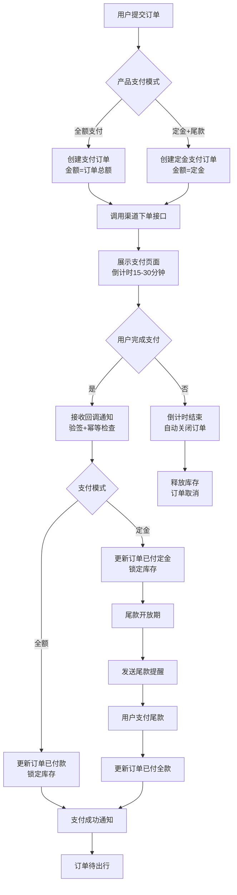

支付超时自动取消通过Redis键过期事件或Asynq定时任务实现：订单创建时写入Redis并设置TTL，过期后触发取消任务释放库存。渠道回调采用统一入口，验签通过后执行幂等检查（已处理订单直接返回成功），随后驱动订单状态机流转 [^608^][^610^][^611^]。

### 5.3 退款管理

退款管理支持全额退款、部分退款、多次部分退款三种类型，所有退款遵循**原路退回**原则 [^559^][^562^][^575^]。

#### 5.3.1 退款类型

**全额退款**适用于订单取消，退款金额等于实付金额，支付宝全额退款后订单状态变为 `TRADE_CLOSE`，微信变为 `SUCCESS` [^593^][^614^]。**部分退款**适用于退订部分出行人或部分服务，单次退款金额小于实付金额，订单保持部分有效。**多次部分退款**适用于复杂退改场景，系统累计追踪已退款金额确保总额不超过实付金额；微信最多支持50次部分退款，支付宝累计不超过订单金额 [^559^][^614^]。

三渠道原路退回实现存在差异：支付宝通过 `alipay.trade.refund` 实时到账；微信通过 `/v3/refund/domestic/refunds`，零钱20分钟内到账、银行卡3个工作日内到账 [^614^][^617^]；银联当日交易通过消费撤销实时到账，隔日交易通过退货接口3-7个工作日到账 [^603^]。

#### 5.3.2 退款流程

退款流程遵循**用户申请→系统计算→运营审核→执行退款→通知用户**路径。用户在C端提交退款申请并选择原因、填写说明、上传凭证。系统依据产品退改规则自动计算应退金额：根据距出发日期的天数匹配阶梯规则（如30天以上退90%、15-30天退70%、7-15天退50%、7天内不退），扣除已发生不可退费用（已送签签证费、已出票机票等），生成退款明细 [^341^][^347^]。运营人员在后台审核，可选择通过、驳回或调整金额。审核通过后系统自动调用渠道退款接口；驳回时需填写原因，用户可补充材料重新申请。退款完成后系统更新订单状态，触发短信/站内信/小程序通知，并处理库存回滚、优惠券返还、积分追回等后续业务 [^559^][^562^]。

#### 5.3.3 退款状态机

退款订单独立维护状态生命周期，与支付订单为一对多关系。

**表5-3 退款状态机定义与转换规则**

| 状态编码 | 状态名称 | 进入条件 | 可转换状态 | 转换触发条件 |
|---|---|---|---|---|
| PENDING | 申请中 | 用户提交退款申请 | AUDITING, CANCELLED | 系统推送审核队列 / 用户主动撤销 |
| AUDITING | 审核中 | 运营开始审核 | PROCESSING, REJECTED | 审核通过 / 审核驳回 |
| PROCESSING | 退款中 | 已调用渠道退款接口 | SUCCESS, FAILED | 渠道返回成功 / 失败 |
| SUCCESS | 已退款 | 渠道确认退款成功 | — | 终态 |
| REJECTED | 已拒绝 | 审核驳回或退款失败 | PENDING | 用户补充材料重新申请 |
| CANCELLED | 已取消 | 用户在审核前撤销 | — | 终态 |

状态机覆盖退款全生命周期。配置"免审退款"规则的产品（如出发前30天以上全额退），系统自动跳过人工审核直接进入"退款中"状态。"退款中"状态需考虑渠道异步延迟：调用退款接口后30分钟内未收到回调，系统主动调用退款查询接口获取最新状态 [^605^][^603^]。

退款完整业务流程如下：

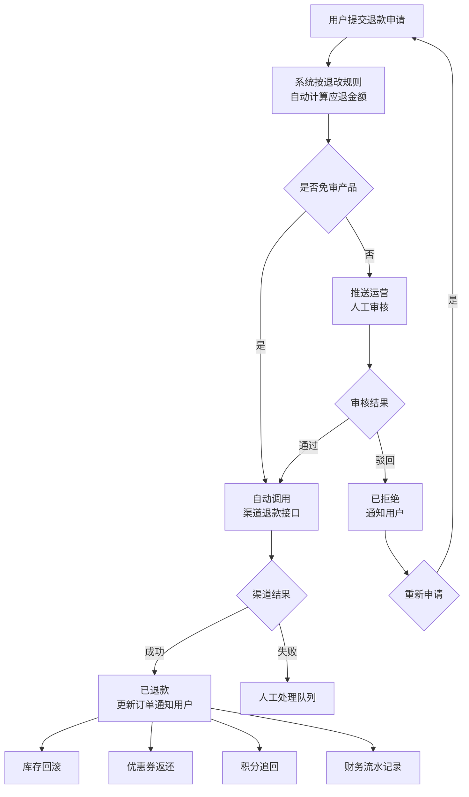

### 5.4 财务对账

财务对账保障交易资金准确性。系统每日凌晨自动从三方渠道拉取前一日对账单，与本地流水逐笔核对，识别金额不一致、状态不一致、单边账等差异 [^555^][^558^][^569^][^572^]。

#### 5.4.1 自动对账

对账任务每日凌晨2点触发。执行流程为六步：第一步调用渠道账单接口——支付宝 `alipay.data.dataservice.bill.downloadurl.query` 获取下载URL，微信 `GET /v3/bill/tradebill`，银联文件接口下载 [^555^]。第二步标准化解析不同格式账单；第三步加载本地前一日支付和退款流水；第四步以 `out_trade_no` 为键执行轧账比对；第五步标记差异生成报告；第六步归档结果 [^558^]。

轧账采用双遍历策略：第一遍遍历渠道记录匹配本地订单，不存在则标记"渠道有/本地无"（漏单），金额不一致标记"金额差异"，状态不一致标记"状态差异"；第二遍遍历本地未匹配记录，标记"本地有/渠道无"（回调丢失或测试数据）[^558^]。任务具备容错设计：下载失败自动重试3次、多任务并发控制、结果持久化存储至 `reconciliation_record` 和 `reconciliation_difference` 表。

#### 5.4.2 差异处理

**表5-4 对账异常类型与处理策略**

| 异常类型 | 定义 | 典型根因 | 自动处理策略 | 人工介入条件 |
|---|---|---|---|---|
| 渠道有/本地无（漏单） | 渠道存在记录，本地无对应订单 | 回调丢失、超时未建单 | 根据渠道记录补建本地订单 | 补单失败或金额>5{,}000元 |
| 本地有/渠道无（单边账） | 本地成功，渠道无记录 | 测试数据混入、数据延迟 | 查询渠道确认；测试数据标记忽略 | 无法确认为测试数据 |
| 金额不一致 | 本地金额与渠道不符 | 单位转换错误、优惠偏差 | 差异<0.01元自动平账 | 差异>=0.01元 |
| 状态不一致 | 本地状态与渠道不符 | 回调异常、重复通知 | 以渠道状态为准自动同步 | 涉及退款或大额订单 |
| 退款差异 | 退款金额或状态不匹配 | 多次部分退款累计偏差 | 核对明细，小额差异自动平账 | 累计差异>=0.01元 |

差异处理遵循**自动优先、人工兜底**原则。系统自动处理精度误差（<0.01元）和次日自动平账（时间延迟导致的临时差异）[^555^][^566^]。无法自动解释的差异生成工单推送财务审核，财务人员可查看详情、上传凭证、选择处理方式（确认平账/调整记录/联系渠道），完成后系统自动重新对账验证 [^576^]。差异工单需在T+1工作日内处理，系统提供差异追踪看板支持按渠道、日期、类型筛选和导出。

### 5.5 电子合同上传

系统不实现合同在线开具，仅支持运营或供应商上传已签署PDF合同至订单供用户下载 [^183^][^187^]。

#### 5.5.1 合同上传功能

运营人员或供应商在后台订单详情页"合同管理"区域上传PDF文件。系统执行格式校验（仅PDF，最大20MB）、病毒扫描和PDF完整性校验。通过后文件写入对象存储，路径按 `contracts/{tenant_id}/{year}/{month}/{order_no}_{version}_{timestamp}.pdf` 组织，数据库 `order_contract` 表记录元数据（文件名、路径、上传人、时间、版本号、大小、SHA-256哈希）[^183^][^188^]。上传成功后系统向用户发送通知，用户在C端订单详情页可下载或预览PDF，下载链接采用30分钟有效期的临时签名URL。

#### 5.5.2 合同与订单关联

合同与订单为**一对多**关系，同一订单支持多次上传不同版本（初始版、变更版、补充协议）。系统为每笔合同分配递增版本号（v1, v2...），上传新版本时历史版本自动标记"已归档"，当前版本标记"有效"。订单层面展示最新有效版本，同时提供历史版本查看入口。合同文件采用AES-256服务端加密存储，满足等保三级静态数据加密要求。删除操作仅做逻辑删除，物理文件保留审计追溯 [^191^]。后台提供合同管理列表，支持按订单号、时间、上传人筛选，支持批量下载和记录导出。

## 6. 功能需求 — 后台管理系统

后台管理系统（Administration System）是旅游预订平台的运营中枢，面向平台运营人员、财务人员、客服人员及供应商，提供产品发布、订单处理、财务结算、用户管理、营销配置和数据洞察的全套能力。本章按照功能域划分为产品管理、订单管理、财务管理、用户与权限管理、营销管理和数据报表六大模块，逐层展开每个模块的功能点、业务规则和数据模型设计。

---

## 6.1 产品管理

产品管理模块是后台系统的核心，覆盖境内游、出境游和邮轮三大产品线的完整生命周期。产品从创建到上架需经过信息录入、行程编排、价格配置、库存设置和审核发布五个阶段，已上架产品的关键字段变更需重新走审核流程[^143^]。

### 6.1.1 境内游产品发布

境内游产品发布功能包含基础信息录入、行程编辑、价格日历配置、退改规则绑定和库存设置五个子环节。基础信息录入模块需支持产品名称（60字以内）、副标题、产品编号（系统自动生成，格式为 `DOM-{品类码}-{YYYYMMDD}-{序号}`）、类目选择（二级联动）、出发地/目的地（支持多选）、行程天数、晚数、交通方式、成团人数区间、产品等级（经济型/舒适型/豪华型/顶级型）、适用人群和费用包含/不含说明等字段[^61^][^107^]。

行程编辑模块采用"每日行程卡片"模式，按照行程天数自动生成对应数量的编辑卡片，每张卡片包含当天标题、行程概述、游览景点（关联景点库）、用餐安排（早餐/午餐/晚餐分别标注含/不含/自理/特色餐）、住宿酒店（关联酒店库）、交通方式、行程图片和温馨提示。景点和酒店必须从资源库中选择，系统支持行程模板的保存与复用[^64^]。

价格日历模块支持按团期日期设置差异化人群价格，覆盖成人价、儿童价（2-12岁不占床）、婴儿价（0-2岁）、单房差和占床儿童价。单房差的计算规则为：当订单成人数为奇数时，系统自动提示需支付单房差，金额等于一间房总价减去已有人均分摊部分[^64^]。退改规则通过关联产品级退改规则模板实现（详见6.2.4节）。库存设置包括团期最大收客人数、截止收客日期（相对出发日期的N天前）和团期状态管理[^67^]。

**表6-1 境内游产品基础信息字段清单**

| 字段分组 | 字段名称 | 字段类型 | 必填 | 说明 |
|---------|---------|---------|------|------|
| 基础标识 | 产品名称 | 文本(60字) | 是 | 含目的地+天数+特色关键词 |
| | 产品编号 | 系统生成 | 是 | DOM-{品类码}-{日期}-{序号} |
| | 产品类型 | 下拉选择 | 是 | 关联类目树叶子节点 |
| | 产品状态 | 系统维护 | 是 | 草稿/待审核/已上架/已下架/暂停销售 |
| 行程信息 | 出发地 | 多级选择 | 是 | 支持多出发地配置 |
| | 目的地 | 多级选择 | 是 | 支持多目的地连线 |
| | 行程天数 | 整数 | 是 | 含往返交通天数 |
| | 晚数 | 整数 | 是 | 住宿晚数 |
| | 交通方式 | 多选 | 是 | 飞机/高铁/大巴/自驾 |
| 成团设置 | 最低成团人数 | 整数 | 是 | 成团门槛 |
| | 最高收客人数 | 整数 | 是 | 单团上限 |
| | 产品等级 | 单选 | 是 | 经济型/舒适型/豪华型/顶级型 |
| 费用说明 | 费用包含 | 富文本 | 是 | 住宿/交通/餐饮/门票/导游等 |
| | 费用不含 | 富文本 | 是 | 个人消费/自费项目/保险等 |
| | 预订须知 | 富文本 | 是 | 退改政策/注意事项 |
| 运营配置 | 供应商 | 关联选择 | 是 | 产品所属供应商 |
| | 佣金比例 | 百分比 | 是 | 平台抽佣比例 |
| | 主题标签 | 多选 | 否 | 亲子游/蜜月游/摄影游等 |

该表覆盖了境内游产品从创建到上架所需的全部基础字段。产品编号采用层级编码规则，确保同类目下唯一性；产品状态机控制产品的生命周期流转，已上架产品编辑关键字段（价格、行程、天数）需重新提交审核[^143^]；成团设置直接影响团期库存计算和订单确认逻辑。

### 6.1.2 出境游产品发布

出境游产品发布在境内游功能基础上增加签证信息配置和护照有效期校验规则两大模块。签证信息配置包括签证类型（免签/落地签/需提前办理）、办理时长、所需材料清单模板（按在职/自由职业/退休/学生分类）、签证费用和有效期限说明[^136^]。护照有效期校验规则由系统自动执行：预订时校验所有出行人护照有效期须覆盖回程日期后至少6个月，系统在前台 booking 流程中拦截不满足条件的订单并提示用户更新证件[^162^][^163^]。

出境游产品额外字段包括：签证说明（富文本）、保险说明（申根国家医疗保额须不少于3万欧元）、购物安排和自费项目列表。在预订流程中，出境游订单需收集护照号码、护照有效期、签发地和国籍等额外字段，系统调用证件OCR识别功能辅助信息录入[^58^]。

### 6.1.3 邮轮产品发布

邮轮产品发布采用"关联+配置"模式，运营人员在发布流程中依次完成：选择关联的邮轮基础信息（船只）→ 选择执行航次 → 配置各舱房类型的销售价格 → 设置岸上观光活动 → 绑定退改规则。邮轮产品与境内/出境游产品在数据模型上保持独立，通过 `product_type` 字段区分。

邮轮定价结构遵循行业惯例：基础船票按双人入住（Double Occupancy）定价，第一人和第二人按完整票价计费，第三人享受折扣价（通常为50%-75% off），第四人折扣更大（25%-50% off），2岁以下婴儿仅收取税费[^504^]。岸上观光活动作为附加服务项配置，每个港口关联可选的观光项目目录，包含项目名称、描述、定价、容量和时长[^550^]。

### 6.1.4 邮轮基础信息管理

邮轮基础信息管理模块维护邮轮公司和船只两类核心实体，支持完整的CRUD操作。邮轮公司信息包括公司名称（中英文）、品牌色、Logo、母公司关系、客服联系方式和资质认证（IMO编号、船级社认证）[^643^]。大型邮轮集团采用多品牌策略，系统需支持集团-品牌-子品牌的层级结构。

**表6-2 邮轮基础信息CRUD字段清单**

| 实体 | 字段名称 | 字段类型 | 必填 | 示例值 |
|------|---------|---------|------|--------|
| 邮轮公司 | 公司名称（中文） | 文本(100字) | 是 | 皇家加勒比国际邮轮 |
| | 公司名称（英文） | 文本(100字) | 是 | Royal Caribbean International |
| | 品牌色 | 色值 | 否 | #0055A4 |
| | Logo URL | 图片 | 否 | - |
| | 母公司 | 关联选择 | 否 | 皇家加勒比集团 |
| | IMO编号 | 文本(20字) | 否 | IMO 1234567 |
| | 状态 | 单选 | 是 | 启用/停用 |
| 邮轮船只 | 船名（中文） | 文本(100字) | 是 | 海洋光谱号 |
| | 船名（英文） | 文本(100字) | 是 | Spectrum of the Seas |
| | 所属公司 | 关联选择 | 是 | 关联邮轮公司 |
| | 总吨位(GRT) | 整数 | 是 | 168,666吨 |
| | 载客量 | 整数 | 是 | 5,622人 |
| | 船员数 | 整数 | 是 | 1,551人 |
| | 舱房数 | 整数 | 是 | 2,137间 |
| | 首航年份 | 整数 | 是 | 2019 |
| | 甲板层数 | 整数 | 是 | 16层 |
| | 船长(米) | 小数 | 否 | 347.1米 |
| | 服务航速(节) | 小数 | 否 | 22节 |
| | 船籍港 | 文本(50字) | 否 | Nassau |
| | 船只状态 | 单选 | 是 | 在航/干船坞/停用/在建 |
| | 是否需要在线值船 | 单选 | 是 | 是/否；选择"是"则C端展示值船流程说明文档 |
| | 是否需要手动上传船票 | 单选 | 是 | 是/否；选择"是"则运营人员后台上传船票供游客下载 |

该表定义了邮轮基础信息维护的完整字段集。总吨位和载客量是C端产品展示的核心参数，直接影响用户决策；首航年份反映船只新旧程度；甲板层数关联舱房和设施的空间管理。船只状态字段控制该船只是否可参与航次安排——处于"干船坞"（维修期）或"停用"状态的船只不可被航次引用[^507^][^498^]。

新增的"是否需要在线值船"和"是否需要手动上传船票"两个配置字段，用于控制C端值船相关功能的展示逻辑。若"是否需要在线值船"设为"是"，则后台需上传该邮轮的值船流程说明文档（PDF格式），C端订单详情页展示"值船指南"入口供游客查看下载；若"是否需要手动上传船票"设为"是"，则运营人员在舱房号分配后需上传船票PDF文件，游客可在订单详情页"我的船票"入口下载。若两个字段均设为"否"，则C端不展示任何值船相关入口。两个字段可同时设为"是"，此时游客既可查看值船流程说明，也可下载船票。

### 6.1.5 邮轮设施信息管理

邮轮设施信息管理模块维护每艘邮轮上的公共设施信息，采用分类+详情的双层结构。设施分类体系覆盖餐厅（DIN）、酒吧/酒廊（BAR）、娱乐设施（ENT）、健身/水疗（WEL）、泳池设施（POL）、购物（SHO）、儿童设施（KID）、户外活动（OUT）、公共区域（PUB）、医疗设施（MED）和服务设施（SVC）共11个大类[^555^]。

每间设施的详细信息包括：设施名称（多语言）、类型分类、所在甲板和区域、最大容纳人数/座位数、每日开放时段、收费模式（免费/付费/含在船票中/会员专享）、预约要求、适用人群（全年龄/成人专属18+/儿童专属）、无障碍设施标识、多角度图片和多语言描述[^600^]。设施信息在C端产品详情页以图文形式展示，帮助用户了解邮轮的服务配置。

### 6.1.6 舱房信息管理

舱房信息管理模块维护邮轮的舱房类型体系、舱房详情和房号映射关系。舱房主类型分为四类：内舱房（Inside/Interior，14-18 m²，无窗户）、海景房（Oceanview，15-20 m²，有舷窗）、阳台房（Balcony/Verandah，19-25 m²，带私人阳台）和套房（Suite，30-230 m²，含专属服务）[^501^][^512^][^506^][^509^]。

**表6-3 舱房类型与参数清单**

| 参数项 | 内舱房 | 海景房 | 阳台房 | 套房 |
|--------|--------|--------|--------|------|
| 类型代码 | INT | OCV | BAL | SUI |
| 典型面积 | 14-18 m² | 15-20 m² | 19-25 m² | 30-230 m² |
| 景观特征 | 无窗户 | 舷窗/窗户 | 私人阳台 | 全景阳台+起居室 |
| 最大容纳人数 | 1-4人 | 1-4人 | 2-4人 | 2-6人 |
| 床型配置 | 大床/双床/可转换 | 大床/双床 | 大床/双床+沙发床 | 大床+独立客厅 |
| 阳台面积 | - | - | 4-8 m² | 8-30 m² |
| 典型设施 | 标准卫浴/电视/保险箱 | 舷窗/标准卫浴 | 阳台家具/迷你冰箱 | 管家服务/优先登船 |
| 景观质量选项 | 虚拟阳台(LED屏幕) | 无遮挡/部分遮挡 | 无遮挡/部分遮挡/遮挡 | 完全无遮挡 |
| 无障碍房型 | 支持 | 支持 | 支持 | 支持 |

舱房详细信息还包括：舱房设施清单（卧室/卫浴/娱乐/家具/阳台/气候控制六大类）、景观质量定义（完全无遮挡/部分遮挡/显著遮挡/封闭式阳台/白色实心墙护栏等，不同景观质量对应差异化定价，价格影响幅度从-5%到-15%不等[^508^][^510^]）、床型配置选项和容纳人数范围。系统支持通过Excel批量导入舱房房号与舱房类型的映射关系，导入模板包含房号、甲板层、舱房类型、位置（前部/中部/后部+左舷/右舷）和特殊属性字段[^511^]。

**船票上传功能。** 对于在邮轮基础信息中标记为"需要手动上传船票"的邮轮，舱房信息管理模块提供船票上传功能。运营人员在为订单分配舱房号后，可在舱房管理界面手动上传该舱房对应的船票PDF文件。上传功能支持：选择目标订单/舱房、上传PDF文件（单文件≤10MB）、文件预览与校验、覆盖上传（版本管理）。上传成功后，系统自动将船票文件关联至对应订单，并向游客发送船票已上传的通知（短信+站内信），游客可在C端订单详情页"我的船票"入口下载。

**值船流程说明文档管理。** 舱房信息管理模块支持上传和管理值船流程说明文档。文档以邮轮/航次维度关联，支持上传PDF或文本格式文件（单文件≤20MB），内容应包含：值船开放时间、值船网址/APP链接、所需材料清单、操作步骤说明、注意事项。上传的文档支持版本管理，新上传的文档自动替换旧版本，同时保留历史版本记录。已关联文档的邮轮/航次在C端订单详情页向游客展示"值船指南"下载入口。

### 6.1.7 航次信息管理

航次信息管理模块维护每个可售航次的完整信息，包括航线规划和停靠港口明细。航次基础字段包括：航次号（唯一编号，如DA20260301）、航线名称、所属邮轮船只、出发日期、返回日期、航次天数、出发港口、目的港口、航次状态（计划中/销售中/即将出航/已完成/取消）、销售状态（开放预订/关闭预订/仅候补）和最低定价[^622^]。

**表6-4 航次信息字段与停靠港口清单**

| 字段分组 | 字段名称 | 字段类型 | 必填 | 说明 |
|---------|---------|---------|------|------|
| 基础信息 | 航次号 | 文本(20字) | 是 | 唯一编号，如DA20260301 |
| | 航线名称 | 文本(200字) | 是 | 市场名称，如"5晚冲绳航线" |
| | 所属船只 | 关联选择 | 是 | 关联邮轮船只 |
| | 出发日期 | 日期 | 是 | 登船日期 |
| | 返回日期 | 日期 | 是 | 离船日期 |
| | 航次天数 | 整数 | 是 | 晚数 |
| | 出发港口 | 文本(100字) | 是 | 始发港 |
| | 最低定价 | 金额 | 是 | 起价（双人入住） |
| 状态控制 | 航次状态 | 单选 | 是 | 计划中/销售中/即将出航/已完成/取消 |
| | 销售状态 | 单选 | 是 | 开放预订/关闭预订/仅候补 |
| 停靠港口 | 停靠顺序 | 整数 | 是 | Day 1, Day 2... |
| | 港口名称 | 文本(100字) | 是 | 中英文名称+国家 |
| | 到达时间 | 日期时间 | 是 | 当地时间 |
| | 离开时间 | 日期时间 | 是 | 当地时间 |
| | 停留时长 | 整数 | 否 | 在港小时数 |
| | 停靠日类型 | 单选 | 是 | 海上航行日/港口日/半日停靠 |

航次管理支持航次模板功能，定义可重复的航线模式（如"每周六出发的5天航线"），基于模板批量生成具体航次实例[^633^]。停靠港口信息中，到港/离港时间以当地时间存储，系统需处理跨时区计算。每航次按舱房类型维护可售库存，库存实时同步至多渠道（B2C网站、B2B代理、呼叫中心）[^622^]。

**值船流程说明文档上传。** 航次信息管理模块支持按航次维度上传值船流程说明文档。当邮轮基础信息中"是否需要在线值船"设为"是"时，运营人员在创建/编辑航次时可上传该航次对应的值船流程说明文档（PDF格式）。文档上传后自动关联至该航次下的所有订单，游客在C端可查看和下载。支持文档替换和版本管理，历史版本保留90天备查。

**船票批量上传。** 对于需要手动上传船票的航次，航次管理模块提供船票批量上传功能。运营人员下载系统提供的船票上传模板（Excel格式），填写订单号、舱房号、游客姓名等信息，并将对应的船票PDF文件打包为ZIP格式上传。系统解析模板后自动将船票文件关联至对应订单，并触发船票分发通知。批量上传功能支持上传进度展示、错误记录下载和重复上传覆盖。

**值船提醒发送。** 航次管理模块集成值船提醒通知功能。当运营人员在后台为订单录入舱房号后，系统自动触发值船提醒通知发送流程。提醒通知分为三个时间节点自动发送：

1. **舱房号分配后即时提醒**：通知游客舱房号已分配，附值船指南文档链接和船票下载链接（如有）。
2. **出发前30天提醒**：提醒游客关注值船截止时间，附值船流程说明文档。
3. **出发前7天最后提醒**：最后一次值船提醒，强调值船截止时间和登船注意事项。

通知渠道覆盖短信和站内信双通道，通知内容支持在后台模板化管理并按邮轮/航次维度自定义。对于已下载船票或已标记为"已完成值船"的订单，系统自动跳过后续提醒发送。运营人员也可在航次管理界面手动选择订单触发即时值船提醒。

### 6.1.8 产品审核流程

产品审核流程确保上线产品的质量、合规性和准确性，采用供应商提交→运营审核→上架/驳回的三级流转模型[^230^][^232^]。所有产品（境内游/出境游/邮轮）共享同一套审核流程引擎，审核流程支持自定义配置审核节点和审核人。

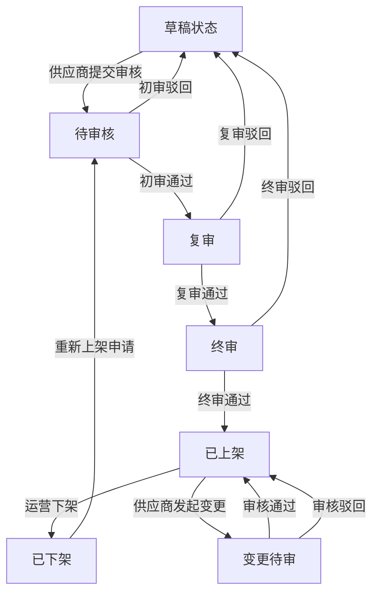

**产品审核流程说明**：供应商在产品编辑完成后提交审核申请，进入"待审核"状态。初审由产品专员执行，审核信息完整性、价格合理性、资源可用性；复审由运营主管执行，审核市场竞争力、营销策略和利润率；终审由质控人员执行，审核合规性、合同条款和风险提示[^230^]。已上架产品的关键字段变更（价格、行程、天数、退改规则）需走"变更审核"流程，非关键字段（副标题、产品特色描述）支持快速编辑免审[^143^][^149^]。每次审核操作均记录审核人、审核时间、审核意见，驳回时必须填写驳回原因。

### 6.1.9 价格日历管理

价格日历管理模块提供可视化的价格管理界面，以月历网格视图展示每日价格，每个日期格子显示成人价、库存状态和特殊标记（节假日/促销/满员）[^98^][^223^]。运营人员可点击任意日期直接编辑价格，也支持选择日期范围进行批量调价。

批量调价提供五种模式：固定价格（直接设为指定金额）、百分比调整（在现有价格基础上按百分比上调或下调）、固定金额调整（加减固定金额）、公式定价（基于成本价乘以系数自动计算售价）和跟随调价（跟随其他产品价格按比例调整）[^98^]。特殊日期定价支持节假日模板管理，系统可预设春节、国庆、五一等节假日的价格模板并一键应用到指定年份的对应日期[^223^]。

价格生效优先级遵循以下规则：特殊日期价 > 节假日价 > 旺季价 > 周末价 > 平时价。当同一日期命中多条价格规则时，按优先级高的规则执行。所有价格变更记录价格历史，保留旧价格、新价格、变更类型和操作人信息[^80^][^178^]。

### 6.1.10 库存管理

库存管理模块采用共享库存模式，所有销售渠道共享同一库存池，防止超售[^58^][^64^][^70^]。库存核心计算公式为：实时余位 = 总库存 - 已确认订单人数 - 待支付订单人数 - 留位人数 + 已取消释放人数。订单创建时锁定库存（占库存但不扣减），支付成功后正式扣减，超时未支付自动释放库存[^59^]。

库存预警机制分四个级别：关注（余位 < 50% 总库存，后台提醒运营）、预警（余位 < 20%，邮件/短信通知）、紧张（余位 < 10%，前台显示"紧张"标签）和满员（余位 = 0，自动停止收客）[^158^]。留位超时释放机制支持设置留位时长（默认30分钟-24小时），超时后系统自动释放锁定的库存[^151^]。

---

## 6.2 订单管理

订单管理模块覆盖订单从下单到完成的全生命周期处理，是后台运营人员日常使用频率最高的功能[^366^]。系统采用主订单+子订单的架构设计，一张主订单可能拆分为酒店子订单、机票子订单、景点子订单等，由不同人员处理[^349^]。

### 6.2.1 订单列表与查询

订单列表页支持多维度组合筛选，覆盖订单标识（订单号/主订单号/子订单号，支持精确匹配和模糊搜索）、渠道来源（官网/APP/小程序/携程/美团/飞猪/抖音等[^376^]）、订单状态（支持多选）、确认方式（自动确认/人工确认）和自定义标签（加急/VIP/投诉/变更中）。

时间范围筛选支持五种时间类型：下单日期、出行日期、返回日期、预订日期和状态变更日期。产品维度筛选包括产品类型、产品名称（模糊搜索）、目的地和供应商。客户维度筛选包括客户姓名、手机号（模糊搜索）、会员等级和客户类型[^366^]。

查询结果列表支持字段自定义、任意字段升序/降序排列、分页显示（默认每页20/50/100条）和快捷操作（确认/取消/备注/查看详情）。列表页鼠标悬浮显示订单关键信息摘要[^373^]。订单号全局唯一，含渠道标识前缀[^349^]。系统支持将筛选后的订单数据导出为Excel/CSV/PDF格式，单次导出上限20万条，超出部分采用异步任务处理[^400^][^413^]。

### 6.2.2 订单状态流转

订单状态机定义了订单从创建到完成的完整流转路径，包含9个核心状态：

**表6-5 订单状态定义与流转规则表**

| 状态名称 | 状态编码 | 定义 | 可正向流转至 | 可逆向流转至 | 可编辑 |
|---------|---------|------|-------------|-------------|--------|
| 待付款 | PENDING_PAY | 已提交未支付，倒计时中 | 已付定金/已付全款 | 已取消 | 是 |
| 已付定金 | PAID_DEPOSIT | 定金支付成功，待付尾款 | 已付全款 | 已取消 | 受限 |
| 已付全款 | PAID_FULL | 全部款项支付完成 | 待出行 | 退款中 | 受限 |
| 待出行 | PENDING_TRAVEL | 出行前准备阶段 | 出行中 | 退款中 | 否 |
| 出行中 | IN_TRAVEL | 已进入行程期间 | 已完成 | - | 否 |
| 已完成 | COMPLETED | 行程结束，用户已完成出游 | - | - | 否 |
| 已取消 | CANCELLED | 订单被取消 | - | - | 否 |
| 退款中 | REFUNDING | 退款流程处理中 | 已退款 | - | 否 |
| 已退款 | REFUNDED | 退款已完成，款项已退回 | - | - | 否 |

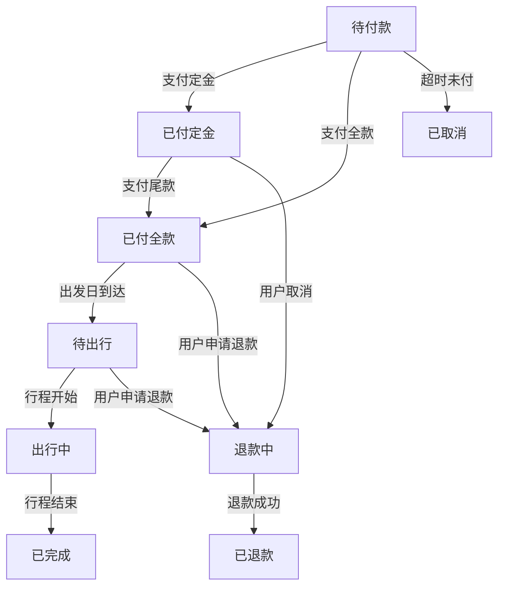

**订单状态流转说明**：正向流转路径为待付款→已付定金→已付全款→待出行→出行中→已完成。待付款订单超过规定时间（30分钟-24小时，按产品配置）自动取消并释放库存[^42^]。到达出发日期当天，已付全款订单自动切换为"待出行"状态；行程开始日自动切换为"出行中"；返回日期次日自动切换为"已完成"。主订单状态由子订单状态聚合决定，全部子订单正向流转时主订单才正向流转[^448^]。已出行/已完成的订单不可取消或变更，特殊情况需走售后流程[^342^]。

### 6.2.3 退改审核

退改审核功能处理用户通过C端提交的退款和改期申请。审核流程由后台客服人员和财务审批人员协作完成。

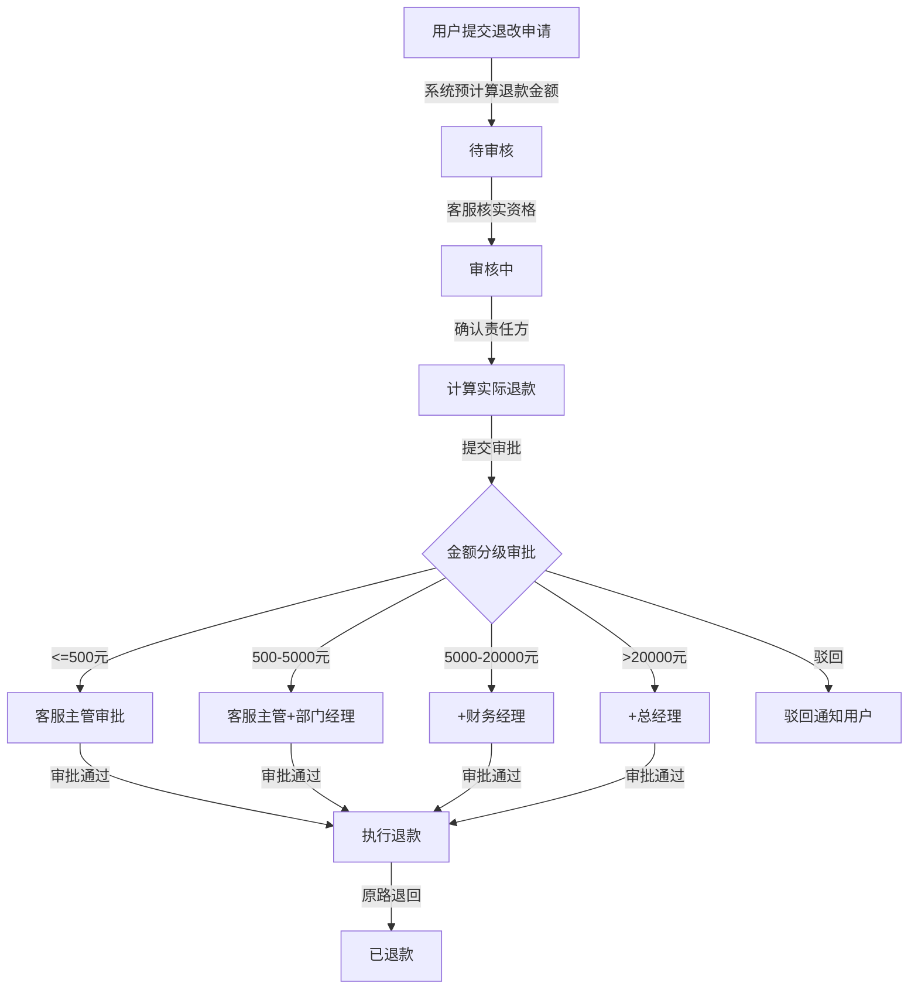

**退改审核流程说明**：用户提交退改申请后，系统根据产品配置的退改规则自动计算预计退款金额。客服首先核实退改资格（是否在允许退改的时间范围内），然后确认退改责任方（用户原因/平台原因/不可抗力），接着与供应商确认已发生费用（如已出票机票的退票费、已预订酒店的取消费），计算实际退款金额后提交分级审批[^341^]。审批通过后执行原路退回，退款原则上退回原支付渠道[^341^]。退款完成后更新订单状态为"已退款"，释放库存，并发送退款完成通知给用户。

### 6.2.4 退改规则配置

退改规则配置模块支持按产品设置阶梯费率，以距出发日期的剩余天数为维度划分退改比例。

**表6-6 退改规则阶梯费率配置表**

| 距出发日期 | 退款比例 | 扣款说明 | 适用场景 |
|-----------|---------|---------|---------|
| >= 30天 | 100% | 全额退款，无手续费 | 提前30天以上取消 |
| 15-29天 | 90% | 扣除10%手续费 | 提前15-29天取消 |
| 8-14天 | 75% | 扣除25%手续费 | 提前8-14天取消 |
| 3-7天 | 50% | 扣除50%手续费 | 提前3-7天取消 |
| 1-2天 | 25% | 扣除75%手续费 | 提前1-2天取消 |
| 出发当天 | 0% | 不可退款 | 出发当日取消 |
| 出发后 | 0% | 不可退款 | 已出行取消 |

该表为阶梯费率的参考模板，实际配置按产品维度独立设置。邮轮产品的退改规则采用更细化的阶梯，参考国际邮轮公司惯例：91天以上仅损失定金，90-57天退75%，56-42天退50%，41-14天退25%，14天以内不退款[^599^][^595^]。出境游产品的退改规则需额外考虑签证费用的不可退属性——签证服务费一旦发生（送签后）不纳入退款计算范围。系统支持保存退改规则模板，同类型产品可快速复用[^341^][^347^]。

退款金额计算公式为：退款金额 = 订单实付金额 - 已发生费用 - 退改手续费 - 不可退费用。其中已发生费用包括已出票机票的退票费、已预订酒店的取消费等；不可退费用包括签证费、保险费等明确约定不可退的项目[^341^]。

### 6.2.5 尾款催收

尾款催收模块服务于定金+尾款支付模式。系统在订单支付定金后自动生成尾款支付计划，包含尾款金额（订单总金额 - 已付定金）、尾款截止支付日期（出发日期前N天，按产品配置）和催收尾款的时间节点[^419^]。

待付尾款订单列表页展示所有尾款未付的订单，支持按尾款截止日排序、按供应商筛选和按订单状态筛选。催收功能支持手动发送提醒（短信/APP推送/站内信）和自动催收（系统在尾款截止前7天、3天、1天自动发送提醒通知）。尾款逾期未付的订单，系统在截止日后宽限期（通常24小时）结束后自动取消，已付定金按退改规则处理[^396^]。

### 6.2.6 签证办理管理

签证办理管理模块专用于出境游订单的签证服务处理。后台运营人员可查看所有签证申请订单，按办理状态（待提交材料/审核中/已送签/已出签/已拒签）筛选[^329^]。

材料审核功能支持运营人员查看用户上传的签证材料扫描件（护照、照片、在职证明、资产证明等），审核通过后推进办理状态至"已送签"；如需补充材料，系统推送通知至用户端[^268^]。签证结果（出签/拒签）通过短信+站内信+小程序推送通知用户[^270^]。签证费用作为附加服务项计入订单总金额，签证状态在订单详情页中独立展示。

### 6.2.7 邮轮订单管理

邮轮订单管理模块覆盖邮轮订单的特有处理流程，包括舱房号分配、船票上传与分发、值船提醒发送等功能。

**舱房号分配。** 邮轮订单支付成功后进入"待分配舱房"状态。运营人员在后台舱房管理界面为订单手动分配具体舱房号，支持按舱房类型筛选可用舱房、查看舱房状态（空闲/已分配/预留）和批量分配操作。舱房号分配后，订单状态自动变更为"已分配舱房"，系统触发舱房号变更通知（短信+站内信）告知游客。

**船票上传与分发。** 对于标记为"需要手动上传船票"的邮轮订单，运营人员在舱房号分配后上传船票PDF文件。船票上传支持单文件上传和批量上传两种模式：单文件上传适用于个别订单的船票补传或更新；批量上传通过Excel模板+ZIP文件包实现，适用于航次下大批量订单的船票集中上传。船票上传成功后，系统自动向对应订单的游客发送船票分发通知（短信+站内信），通知包含船票下载链接。游客点击链接即可在C端下载船票PDF文件。船票文件支持版本管理，重新上传后自动覆盖旧版本并再次通知游客。

**值船提醒管理。** 邮轮订单管理模块提供值船提醒的集中管理功能。运营人员可在订单详情页查看该订单的值船提醒发送记录（发送时间、通知渠道、通知内容、游客是否已读/已下载）。支持手动触发即时值船提醒，适用于游客反馈未收到提醒或需要重新发送的场景。对于即将到达值船截止日期的订单，系统在高优先级位置展示待处理提醒数量，帮助运营人员及时跟进。

**表6-X 邮轮订单管理功能点**

| 功能编号 | 功能点 | 说明 | 优先级 |
|:---------|:-------|:-----|:-------|
| F-C-O01 | 舱房号分配 | 后台手动分配舱房号，支持按类型筛选和批量分配 | P0 |
| F-C-O02 | 舱房号变更通知 | 分配后自动短信+站内信通知游客 | P0 |
| F-C-O03 | 船票单文件上传 | 单个订单船票PDF上传，支持预览和覆盖 | P0 |
| F-C-O04 | 船票批量上传 | Excel模板+ZIP文件包批量上传船票 | P0 |
| F-C-O05 | 船票分发通知 | 上传成功后自动通知游客下载 | P0 |
| F-C-O06 | 船票版本管理 | 重新上传自动覆盖，保留历史版本90天 | P1 |
| F-C-O07 | 值船提醒自动发送 | 舱房分配后/出发前30天/出发前7天三节点自动提醒 | P0 |
| F-C-O08 | 值船提醒手动发送 | 运营人员手动触发即时提醒 | P1 |
| F-C-O09 | 值船提醒记录查询 | 查看提醒发送历史、游客已读/下载状态 | P1 |
| F-C-O10 | 值船流程说明文档管理 | 按邮轮/航次上传值船说明PDF，C端展示下载入口 | P0 |

---

## 6.3 财务管理

财务管理模块覆盖平台资金的收、付、退、结、报全流程，确保交易资金的安全、合规和可追溯。

### 6.3.1 支付流水管理

支付流水管理模块汇集所有渠道的支付记录，支持按订单号、支付方式（支付宝/微信/银联）、支付状态（待支付/支付成功/支付失败/已退款）、时间范围和渠道来源查询。每笔流水关联到具体的业务订单，展示支付金额、支付时间、渠道交易号和手续费[^396^]。

系统自动从各支付渠道获取对账文件（T+1日获取T日数据），解析后与平台订单交易明细逐笔匹配，生成对账结果：匹配成功（金额和状态一致）、短款（渠道金额 < 平台金额）、长款（渠道金额 > 平台金额）、渠道单边账（渠道有记录平台无）和平台单边账（平台有记录渠道无）[^387^]。差异订单自动标记并提交财务核实，系统生成差异报表辅助人工处理。

### 6.3.2 退款管理

退款管理模块处理订单退款的全流程。退款类型包括全额退款、部分退款和多次部分退款。退款审批采用分级机制：500元以内由客服主管审批，500-5,000元需部门经理复核，5,000-20,000元需财务经理审批，超过20,000元需总经理审批[^347^]。

退款执行遵循原路退回原则，通过对接支付渠道的退款接口将款项退回用户原支付账户。退款状态机包括：待处理→处理中→退款成功/退款失败。每笔退款生成独立退款单，记录退款金额、退款原因、操作人和退款时间。退款完成后系统自动更新订单支付状态，涉及优惠券的订单按规则退回优惠券[^427^]。

### 6.3.3 供应商结算

供应商结算模块是平台与供应商之间的资金清算中枢，按结算周期自动计算佣金与应收金额。

**表6-7 供应商结算单字段与状态定义表**

| 字段分组 | 字段名称 | 字段类型 | 说明 |
|---------|---------|---------|------|
| 结算标识 | 结算单号 | 系统生成 | SET-{供应商码}-{日期}-{序号} |
| | 结算周期 | 日期范围 | 如2025-01-01至2025-01-31 |
| | 供应商 | 关联选择 | 结算对象供应商 |
| 订单明细 | 订单数量 | 整数 | 本周期内应结算订单数 |
| | 订单总金额 | 金额 | 订单实付金额合计 |
| | 退款金额 | 金额 | 本周期内退款金额合计 |
| 费用计算 | 平台佣金 | 金额 | 订单金额 × 佣金比例 |
| | 退款佣金扣回 | 金额 | 退款订单的佣金扣回 |
| | 应付供应商金额 | 金额 | 订单总金额 - 平台佣金 - 退款金额 + 退款佣金扣回 |
| 状态控制 | 结算状态 | 单选 | 待结算/结算中/已结算/已付款 |
| | 付款凭证 | 文件 | 银行转账回单上传 |
| | 结算时间 | 日期时间 | 实际结算时间 |

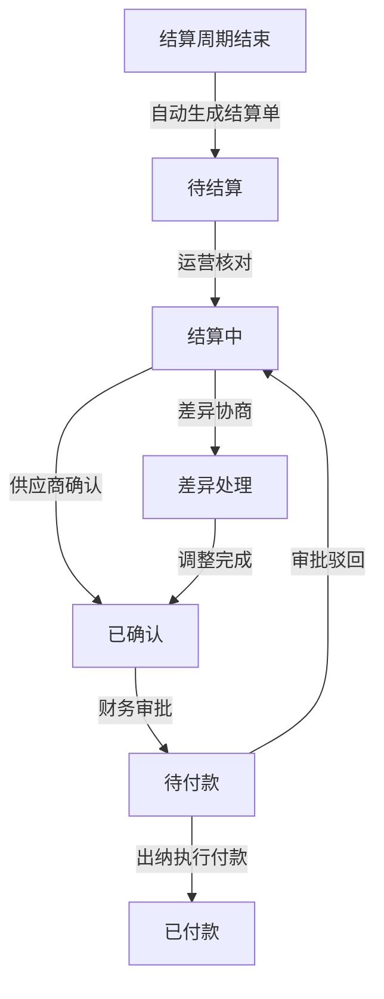

**供应商结算流程说明**：系统按结算周期（T+7/T+15/T+30，按合同约定）自动生成结算单，汇总该周期内供应商的订单明细、退款明细和佣金计算结果[^390^]。运营人员核对结算单后推送至供应商确认，如有差异进入差异协商流程。双方确认后进入付款审批流程，审批通过后由出纳执行银行转账，上传付款凭证，结算完成。平台佣金比例按供应商或按产品品类配置，支持阶梯佣金率（如月销100单以下15%，100-500单13%，500单以上10%）[^395^]。结算数据全量留痕，支持审计追溯[^414^]。

### 6.3.4 定金/尾款财务

定金/尾款财务模块分别记录定金收款、尾款收款和退款三类流水，确保财务核账清晰。每笔流水标记款项类型（定金/尾款/全额/退款），关联到具体订单和支付渠道。定金比例按产品配置（通常为20%-50%），尾款截止支付日按产品独立设置[^396^]。

对于定金+尾款模式的订单，系统分别记录两笔收款的流水信息，财务报表中可独立统计定金收入和尾款收入。取消订单的定金处理按退改规则执行：在免费取消期内全额退还定金，超出免费期按比例扣除。

### 6.3.5 发票管理

发票管理模块处理用户的发票申请。用户在线申请后，后台运营人员审核发票信息（抬头、税号、发票类型），审核通过后标记开票状态。系统支持增值税普通发票（电子）和增值税专用发票（电子）两种类型[^360^]。

发票金额不得超过订单实付金额（不含优惠部分）[^368^]。已退款订单需红冲或退回原发票后方可完成退款流程[^368^]。电子发票生成PDF/OFD格式，通过邮箱或APP交付给用户。发票操作记录完整审计日志，保留至少5年[^378^]。

### 6.3.6 财务报表

财务报表模块提供收入日报/月报/年报、产品收入分析、渠道收入分析、供应商付款报表、退款支出报表和毛利分析报表。收入报表维度包括时间（日/周/月/季度）、产品类型、销售渠道和目的地；支出报表涵盖供应商结算、渠道佣金和退款支出[^392^]。

所有报表支持按时间段导出为Excel格式，大数据量采用异步导出任务。核心财务指标包括GMV（成交总额）、实付GMV（扣除优惠）、净收入（扣除退款）、客单价、退款率和佣金率。报表数据以T+1方式更新，核心指标准实时（5-15分钟延迟）。

---

## 6.4 用户与权限管理

用户与权限管理模块覆盖C端用户、供应商账户和运营人员三类账户的全生命周期管理。

### 6.4.1 C端用户管理

C端用户管理功能包括用户列表查询、详情查看、状态管理和实名认证审核。用户列表支持按注册时间、手机号、会员等级、状态（正常/冻结/注销）和注册渠道筛选[^430^]。用户详情页展示完整档案：基础信息、联系方式、实名认证状态、会员等级、积分余额、订单历史和用户行为记录。

用户状态管理支持三种操作：冻结（禁止登录和下单）、解冻和注销。注销前系统校验用户无未完成订单、无欠款，注销后个人信息脱敏处理，保留交易记录[^430^]。实名认证审核功能处理用户提交的姓名+身份证信息，系统自动调用公安库校验，特殊情况转人工审核。每个身份证最多绑定5个账号，防止羊毛党[^436^]。

### 6.4.2 供应商账户管理

供应商账户管理模块覆盖供应商入驻审核、账户状态管理和佣金比例设置三大功能。供应商提交入驻资料（企业信息、营业执照、法人信息、经营范围、联系人）后，平台运营审核资质，审核通过后开通账户[^478^]。

账户状态包括：待审核/已通过/已拒绝/已冻结。已通过的供应商可登录供应商后台发布产品、管理订单和查看结算数据。平台按供应商或按产品品类设置佣金抽成比例，支持阶梯佣金率[^395^]。供应商评级体系基于产品质量、退款率、用户评分和履约率等维度自动计算。

### 6.4.3 运营人员管理

运营人员管理采用RBAC（Role-Based Access Control，基于角色的访问控制）权限模型，通过角色分配菜单和操作权限，实现最小权限原则[^478^][^497^]。

**表6-8 RBAC角色权限分配矩阵**

| 功能模块 | 超级管理员 | 运营人员 | 财务人员 | 客服人员 | 供应商 |
|---------|-----------|---------|---------|---------|--------|
| 产品发布与编辑 | 全部 | 全部 | 无 | 无 | 仅自有产品 |
| 产品审核与上架 | 全部 | 审核权限 | 无 | 无 | 无 |
| 订单查询与处理 | 全部 | 全部 | 查看 | 全部 | 仅自有订单 |
| 退款审核 | 全部 | <500元 | 全部金额 | <500元 | 无 |
| 价格日历管理 | 全部 | 全部 | 无 | 无 | 仅自有产品 |
| 库存设置 | 全部 | 全部 | 无 | 无 | 仅自有产品 |
| 用户管理 | 全部 | 查看 | 无 | 查看 | 无 |
| 供应商管理 | 全部 | 查看 | 无 | 无 | 仅自身账户 |
| 结算管理 | 全部 | 查看 | 全部 | 无 | 仅自身结算 |
| 财务报表 | 全部 | 查看 | 全部 | 无 | 仅自身报表 |
| Banner/专题配置 | 全部 | 全部 | 无 | 无 | 无 |
| 优惠券管理 | 全部 | 全部 | 无 | 无 | 无 |
| 数据报表 | 全部 | 运营报表 | 财务报表 | 客服报表 | 销售报表 |
| 权限管理 | 全部 | 无 | 无 | 无 | 无 |

该矩阵定义了五个标准角色的功能权限范围。超级管理员拥有全部权限；运营人员负责日常产品管理和营销活动配置；财务人员专责结算、对账和报表；客服人员处理订单和退款；供应商仅能管理自有产品、订单和结算数据。权限控制粒度细化到菜单可见性和按钮操作级，数据权限按供应商维度隔离，确保供应商只能查看和操作归属自身的数据[^497^]。

---

## 6.5 营销管理

营销管理模块支撑平台的流量获取和转化提升，涵盖首页内容配置、优惠券管理和促销活动三大功能域。

### 6.5.1 首页/专题配置

首页配置模块管理C端首页的Banner轮播图、推荐位、热门目的地和专题活动页。Banner管理支持多位置配置（首页顶部、分类页、频道页），每个Banner包含图片、标题、跳转链接、展示时间和排序号[^502^][^516^]。推荐位配置支持产品推荐、分类推荐、活动推荐和智能推荐四种类型[^503^]。

专题活动页管理支持可视化编辑器创建活动页面，通过拖拽组件（顶部Banner、优惠券领取、产品列表、倒计时、规则说明、分享配置）组合生成完整的H5专题页[^556^]。专题页支持定时发布/下线，发布后生成H5链接和二维码供推广使用。

### 6.5.2 优惠券管理

优惠券管理模块覆盖优惠券的创建、发放、核销和数据分析全链路。

**表6-9 优惠券类型与配置参数表**

| 参数项 | 满减券 | 折扣券 | 现金券 | 兑换券 |
|--------|--------|--------|--------|--------|
| 优惠方式 | 满X元减Y元 | 按比例折扣 | 无门槛直接减免 | 0元兑换指定商品 |
| 面额配置 | 固定金额 | 折扣比例+上限 | 固定金额 | 兑换商品/服务 |
| 折扣上限 | - | 必填（防过度优惠）[^425^] | - | - |
| 最低消费门槛 | 必填 | 可选 | 无门槛 | 无门槛 |
| 总库存 | 必填 | 必填 | 必填 | 必填 |
| 每人限领 | 必填 | 必填 | 必填 | 必填 |
| 设备号限领 | 可选 | 可选 | 可选 | 可选 |
| 有效期类型 | 固定时段/领取后N天 | 固定时段/领取后N天 | 固定时段/领取后N天 | 固定时段 |
| 适用产品范围 | 全品类/指定品类/指定产品 | 全品类/指定品类/指定产品 | 全品类/指定品类 | 指定商品 |
| 适用渠道 | APP/H5/小程序/全渠道 | APP/H5/小程序/全渠道 | 全渠道 | 全渠道 |
| 叠加规则 | 不可叠加/可叠加特定类型 | 不可叠加/可叠加特定类型 | 不可叠加 | 不可叠加 |

优惠券发放方式包括系统推送（精准触达目标用户）、领券中心（用户主动领取）、商品挂载（商品详情页展示）、活动赠送（满足条件自动到账）、分享裂变（社交传播）和兑换码（线下地推）[^425^]。优惠券状态机为：未开始→待使用→已占用（下单时）→已使用（支付后）/已过期/已退还（退款时）/已作废[^425^]。系统提供优惠券效果分析功能，统计发放量、领取量、核销量、核销率和拉动GMV，评估ROI[^425^]。

### 6.5.3 促销活动管理

促销活动管理模块支持限时特惠、满减活动和早鸟优惠三类促销规则的配置。

限时特惠通过设置活动时间段和参与商品，在活动期间以特惠价格销售。活动配置包括活动名称、起止时间、参与产品、秒杀价/特惠价、活动库存（与日常库存隔离）和限购数量[^470^]。活动库存采用预扣机制，用户下单时锁定库存，支付成功后正式扣减，超时未支付释放库存[^474^]。

满减活动支持阶梯满减（如满200减20、满500减60）和统一满减两种模式，可设置活动范围（全平台/指定品类/指定产品）和叠加规则（是否可与优惠券叠加）。

早鸟优惠针对邮轮和长线出境游产品，按提前预订时间设置阶梯折扣，如提前60天预订享8折、提前30天享9折[^466^]。系统根据订单的下单日期与出发日期的差值自动匹配适用折扣。

---

## 6.6 数据报表

数据报表模块为运营决策提供数据支撑，覆盖销售、运营、用户和财务四个分析维度。核心指标准实时（5-15分钟延迟），明细报表以T+1方式更新。

### 6.6.1 销售数据看板

销售数据看板展示订单量、销售额（GMV/实付GMV）、退款额、退款率等核心指标，支持按产品类型（境内游/出境游/邮轮）、目的地、供应商和时间维度（日/周/月/季度）进行下钻分析[^431^]。热销/滞销产品识别基于近30天销量、转化率和退款率综合评分[^498^]。

### 6.6.2 运营数据报表

运营数据报表关注产品上架量、产品浏览量（PV/UV）、转化率和渠道流量分析。转化率分析覆盖全链路转化漏斗：曝光→点击→浏览详情→下单→支付→完成出行[^431^][^433^]。渠道流量分析对比各渠道（官网/APP/小程序/OTA分销）的流量贡献和转化效率。

### 6.6.3 用户数据看板

用户数据看板展示注册量、活跃量（DAU/MAU）、复购率和用户画像分布。用户增长分析包括新增用户统计、渠道获客分析（CAC计算）和首单转化分析[^461^]。用户留存分析提供次日留存、7日留存、30日留存和同期群分析（Cohort Analysis）[^498^][^499^]。用户画像维度涵盖基础属性（性别/年龄/城市）、消费能力、出行偏好、品类偏好和生命周期阶段[^461^][^464^]。用户价值分层采用RFM模型（Recency最近消费时间、Frequency消费频率、Monetary消费金额），将用户划分为高价值/中价值/低价值三层[^499^]。

### 6.6.4 财务报表

财务报表模块提供应收/实收/退款/佣金汇总，支持按日/周/月/季度导出。报表类型包括：营收日报（每日收入、退款、优惠、佣金明细）、营收月报（月度趋势、同比环比）、优惠成本统计（优惠券投入、会员折扣成本、活动补贴）和佣金统计（按供应商/品类/时间维度）[^392^]。

**表6-10 数据报表维度与指标汇总表**

| 报表类型 | 分析维度 | 核心指标 | 更新频率 | 数据粒度 |
|---------|---------|---------|---------|---------|
| 销售数据看板 | 产品/目的地/供应商/时间 | 订单量、GMV、实付GMV、退款额、退款率、客单价 | 准实时(5min) | 日/周/月/季度 |
| 运营数据报表 | 渠道/产品类型/页面 | PV、UV、转化率、跳失率、搜索无结果率 | T+1 | 日/周/月 |
| 用户数据看板 | 注册渠道/会员等级/画像 | 新增用户、DAU、MAU、留存率、复购率、LTV | T+1 | 日/周/月 |
| 财务报表 | 时间/产品/供应商/渠道 | 应收、实收、退款、佣金、毛利、现金流 | T+1 | 日/周/月/季度 |
| 退改分析 | 产品/退改原因/时间 | 退改率、退改金额、退改提前期 | T+1 | 周/月 |
| 供应商绩效 | 供应商/产品 | 销量、评分、退款率、履约率、结算金额 | T+1 | 月/季度 |

该表汇总了后台管理系统数据报表模块的全部报表类型。销售数据看板为准实时更新，支撑运营人员的日常监控；运营数据报表和用户数据看板以T+1方式更新，支撑中期策略调整；财务报表严格按日终结算数据生成，确保财务准确性。所有报表均支持按时间段导出为Excel格式，大数据量采用异步任务处理避免影响系统性能。

---

*本章覆盖后台管理系统的六大功能模块：产品管理（含境内/出境/邮轮三条产品线及审核流程）、订单管理（含退改审核与尾款催收）、财务管理（含结算与发票）、用户与权限管理（含RBAC模型）、营销管理（含优惠券与促销活动）和数据报表（含销售/运营/用户/财务四维分析）。各模块通过统一的用户体系和权限模型进行集成，数据通过报表模块实现跨模块关联分析。*

## 7. 功能需求 — 供应商/开放平台

供应商/开放平台模块是旅游预订系统实现多边市场模式的核心支撑。该模块面向第三方旅游服务供应商（旅行社、邮轮公司、景区门票方、酒店集团等），提供从入驻申请到日常运营的全生命周期管理能力。平台通过佣金抽成模式实现商业化，供应商在平台规则框架内自主管理产品与订单，平台则负责流量分发、交易担保与资金结算[^349^]。以下按供应商入驻、工作台、佣金结算三个维度展开功能需求。

### 7.1 供应商入驻

#### 7.1.1 入驻申请

供应商入驻申请是开放平台运营的第一道关口。系统需提供标准化的在线入驻申请入口，供应商通过PC端供应商后台或运营端代为录入的方式提交入驻资料。

入驻申请信息采集范围包括：企业基础信息（企业全称、统一社会信用代码、企业注册地址、注册资本、成立日期）；营业执照扫描件（支持JPG/PNG/PDF格式，单文件不超过5MB）；法人身份信息（法人姓名、身份证号、身份证正反面扫描件）；经营范围描述（主营业务类型，如境内组团、出境组团、邮轮代理、景区门票等）；旅行社业务经营许可证（如适用，出境游需额外提交出境游经营许可）；联系人信息（业务对接人姓名、职务、手机号、邮箱，财务对接人信息）；银行账户信息（开户行、账户名、账号，用于后续结算打款）；企业资质补充文件（如ISO认证、行业协会会员证书等选填项）。

系统在供应商填写过程中提供表单校验与自动保存功能，所有上传的资质文件存入对象存储服务并按供应商ID建立索引。提交后系统生成唯一的入驻申请编号，格式为 `APP-YYYYMMDD-NNNN`，供应商可凭此编号查询审核进度。

#### 7.1.2 资质审核

资质审核由平台运营团队在后台管理系统中完成。审核流程采用二级审核制：初审由运营专员负责，核查申请资料的完整性与真实性，通过工商信息接口自动校验企业注册状态；复审由运营主管负责，评估供应商的经营能力与平台匹配度，重点审查经营范围与平台品类策略的一致性[^230^]。

审核操作包括三种结果：通过（供应商状态变更为"已入驻"，系统自动开通供应商工作台账号并发送通知邮件/短信）、拒绝（必须填写拒绝原因，如"资质不全"、"经营范围不符"、"经营异常"等，系统自动通知供应商并允许补充资料后重新提交）、退回修改（资料存在瑕疵但可补正，系统列出需修改项，供应商在7个自然日内可更新后再次提交）。

审核时效要求：初审在提交后2个工作日内完成，复审在初审通过后1个工作日内完成。超过时效未处理的申请系统自动升级告警至运营经理。

#### 7.1.3 合同签署

审核通过后，平台与供应商进入合同签署环节。系统内置电子合同模板管理功能，合同模板按供应商类型区分（境内组团社模板、出境组团社模板、邮轮代理模板、单项资源供应商模板），模板内容涵盖：合作期限、佣金比例区间、结算周期、服务质量标准、违规处罚条款、数据安全责任、争议解决机制等。

合同签署采用CA认证电子签章方案，满足《电子签名法》第十三条对可靠电子签名的四要素要求[^902^][^914^]。签署流程为：平台方在系统中生成合同文件（PDF格式，包含供应商信息与定制化条款）→ 平台运营负责人通过UKey或短信验证码完成平台方签章 → 系统自动通知供应商方进行签署 → 供应商法人/授权代表通过实名认证后完成签章 → 合同生效，系统生成合同编号并存档。合同存档期限不少于合同履行期满后2年[^917^]，支持供应商与平台双方随时下载查阅。

以下流程图展示供应商从申请到正式入驻的完整业务流程：

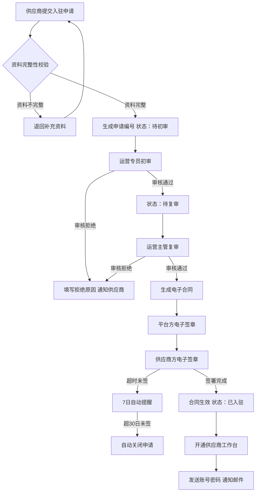

### 7.2 供应商工作台

供应商工作台是供应商日常运营的核心操作界面，采用Vue 3 + Element Plus技术栈构建，与平台运营后台共用基础框架但具备独立的菜单体系与数据视图。工作台通过 `tenant_id` 与 `supplier_id` 双重隔离确保供应商仅能访问自身数据[^923^]。

**表 7-1 供应商工作台功能清单**

| 功能模块 | 功能点 | 功能描述 | 操作权限 | 优先级 |
|:---|:---|:---|:---|:---:|
| 产品管理 | 产品发布 | 创建新产品，填写基础信息/行程/价格/库存，提交平台审核 | 供应商编辑+平台审核 | P0 |
| 产品管理 | 产品编辑 | 修改已保存或已驳回产品的信息，修改后需重新提交审核 | 供应商编辑 | P0 |
| 产品管理 | 产品上下架 | 已上架产品可主动下架，下架后停止前台展示与新订单接入 | 供应商操作+平台监控 | P0 |
| 产品管理 | 团期管理 | 为产品创建/编辑出发团期，设置日期/价格/库存/截止收客日 | 供应商编辑 | P0 |
| 产品管理 | 库存调整 | 实时查看各团期余位，手动调整库存数量（需填写调整原因） | 供应商编辑 | P0 |
| 产品管理 | 审核状态追踪 | 查看产品审核进度（草稿/待审核/审核中/已通过/已驳回） | 供应商只读 | P0 |
| 订单处理 | 订单列表 | 查看本供应商产品的所有订单，支持按状态/日期/产品筛选 | 供应商只读 | P0 |
| 订单处理 | 订单确认 | 对待确认订单进行确认或拒绝操作，确认后锁定资源 | 供应商操作 | P0 |
| 订单处理 | 订单详情 | 查看订单完整信息（出游人/联系人/支付状态/操作日志） | 供应商只读 | P0 |
| 订单处理 | 退改处理 | 查看用户提交的退改申请，同意或拒绝并填写处理意见 | 供应商操作 | P0 |
| 财务结算 | 结算单查看 | 按结算周期查看平台生成的结算单，核对订单明细与金额 | 供应商只读 | P0 |
| 财务结算 | 结算确认 | 对结算单进行确认或提出异议，异议需填写原因 | 供应商操作 | P0 |
| 财务结算 | 提现申请 | 发起提现请求，选择提现金额与收款账户，提交平台审批 | 供应商操作 | P0 |
| 财务结算 | 收支明细 | 查看每笔订单的平台佣金、应收金额、退款扣减等明细 | 供应商只读 | P0 |
| 数据统计 | 销量统计 | 按产品/日期维度查看销售件数、订单数、取消数 | 供应商只读 | P1 |
| 数据统计 | 销售额统计 | 按时间维度查看销售额趋势（订单总额/佣金/实收金额） | 供应商只读 | P1 |
| 数据统计 | 评价数据 | 查看用户对本供应商产品的评价内容、评分分布、回复评价 | 供应商操作 | P1 |

上表涵盖供应商工作台的四大核心功能域。产品管理模块允许供应商在平台类目体系内自主发布和管理产品，但所有涉及前台展示的产品变更均需经过平台审核，以保证产品质量与信息准确性[^143^]。订单处理模块提供从订单接收到退改处理的完整闭环，供应商对订单的确认/拒绝操作直接影响订单状态机流转，系统要求供应商在24小时内完成待确认订单的处理，超时未处理则自动触发平台客服介入[^349^]。财务结算模块是供应商最关心的功能域，平台按预设结算周期自动生成结算单，结算金额计算公式为：`应收金额 = Σ(订单实付金额) - Σ(平台佣金) - Σ(退款金额) - Σ(其他扣款)`[^392^]。数据统计模块提供基础经营分析能力，帮助供应商了解产品表现与用户反馈。

### 7.3 平台佣金与结算

#### 7.3.1 佣金规则配置

平台佣金是开放平台的核心收入来源。系统支持两层级的佣金规则配置：按产品品类配置和按供应商单独配置。品类级佣金为默认规则，适用于所有该品类下的供应商；供应商级佣金可覆盖品类默认值，用于差异化定价策略（如头部供应商享受更低佣金以换取独家产品资源）。

佣金计算支持两种模式：比例佣金（按订单实付金额的百分比计算，如跟团游品类佣金比例为8%-15%）和固定佣金（每笔订单收取固定金额，适用于低价标准化产品如景区门票）。系统还支持阶梯佣金（按供应商月销售额设置递减佣金比例，激励供应商提升销量）和促销期佣金减免（平台运营可针对特定活动临时调整佣金比例，活动结束后自动恢复）。

佣金比例的调整需经过审批流程：运营人员提交调整申请 → 运营主管审批 → 财务确认 → 生效。系统记录每次佣金规则变更的版本历史，便于追溯与对账。

#### 7.3.2 结算周期与流程

结算周期在供应商合同中约定，系统支持日结（T+1）、周结（每周一结算上周数据）、月结（每月5日结算上月数据）三种模式。结算周期的配置以供应商维度独立管理，运营后台可针对单个供应商进行调整。

**表 7-2 佣金结算规则与周期配置表**

| 配置项 | 选项值 | 默认设置 | 适用场景 | 业务规则 |
|:---|:---|:---|:---|:---|
| 结算周期 | 日结（T+1）/ 周结 / 月结 | 月结 | 日结适用于高频小额供应商；月结为行业通用标准 | 结算周期在供应商合同中约定，变更需双方确认 |
| 佣金模式 | 比例佣金 / 固定佣金 / 阶梯佣金 | 比例佣金 | 比例佣金适用于大多数旅游产品；固定佣金适用于门票等标品 | 品类级默认+供应商级覆盖，取两者中优先级高的配置 |
| 比例佣金区间 | 5% ~ 25% | 跟团游10% / 邮轮12% / 门票5% | 出境游佣金通常高于境内游；高客单价产品佣金比例可适当降低 | 佣金以订单实付金额为基数计算，不含优惠抵扣部分 |
| 退款扣减规则 | 全额退款退佣金 / 按比例扣减 / 不退佣金 | 全额退款退佣金 | 出发前N天以上全额退款退全部佣金；临出发退款按比例扣减 | 退款发生后系统在下一结算周期自动调整应收金额 |
| 最低结算金额 | 100元 / 500元 / 1000元 / 自定义 | 500元 | 减少小额转账手续费支出 | 未达最低结算金额时自动累积至下一周期 |
| 结算币种 | CNY / 多币种 | CNY | 出境游涉及外币结算时按约定汇率转换 | 汇率以结算日中间价为准 |
| 打款方式 | 银行转账 / 第三方支付 | 银行转账 | 对公账户转账为主 | 打款前需完成结算单双方确认 |
| 结算单生成时间 | 每日0:00 / 每周一0:00 / 每月5日0:00 | 按周期自动 | 系统自动触发，无需人工干预 | 结算单生成后发送通知给供应商与平台财务 |

结算流程遵循"生成 → 核对 → 确认 → 打款 → 归档"的五步标准：

**（1）结算单自动生成**。系统在结算周期触发时点自动汇总该供应商在周期内的全部已完成的订单（出行结束且已过退改保护期），按佣金规则计算平台佣金与供应商应收金额，生成结算单PDF文件。结算单包含：结算周期、订单明细列表（订单号/产品名称/出行日期/订单金额/佣金比例/佣金金额/应收金额）、退款扣减明细、其他扣减项、本期应结算总额。

**（2）结算单核对**。供应商在工作台收到结算单通知后，可在7个自然日内对结算单进行确认或提出异议。逾期未操作则系统自动视为确认。异议处理流程为：供应商填写异议原因与涉及订单 → 平台财务在3个工作日内核实 → 核实属实则调整结算单重新生成，不属实则驳回异议并说明理由。

**（3）结算确认**。双方确认后的结算单进入待打款状态，系统自动触发付款审批流程。付款审批按金额分级：1万元以下由财务专员审批；1万至5万元由财务主管审批；5万元以上由运营总监与财务总监联合审批[^404^]。

**（4）打款执行**。审批通过后，财务人员在系统中录入转账信息并上传银行回单凭证，系统记录打款时间、金额、流水号。供应商在工作台实时查看打款状态。

**（5）归档**。结算完成后，结算单状态变更为"已结算"，系统自动归档。所有结算数据关联到供应商财务档案，支持按年度/季度导出完整的结算历史报表，满足税务审计要求[^387^]。

---

## 8. 二级分销功能

### 8.1 分销体系概述

#### 8.1.1 分销模式定义

本系统采用**二级分销**模式，即分销链路最多包含两个层级：一级分销商（直接推广者）与二级分销商（一级分销商的下级推广者）。该模式适用于平台全部三条产品线——境内跟团游、出境跟团游与邮轮游——任何上架产品均可被分销商推广销售。

二级分销的核心商业逻辑遵循"谁推广谁受益、上级享间接收益"原则。当二级分销商推广的产品成交时，二级分销商获得一级佣金（直接推广报酬），其上级一级分销商获得二级佣金（团队管理报酬）。平台总佣金支出为两级佣金之和，从订单实付金额中按比例划拨。此模式在法律合规层面严格遵守《禁止传销条例》关于层级限制的明确规定，将分销深度控制在两级以内，避免多层级分销带来的合规风险。

分销功能在系统整体架构中作为独立模块部署，与产品服务、订单服务、支付服务、用户服务通过内部 API 交互，不侵入核心交易链路的业务逻辑。分销关系数据存储于独立的数据表中，通过 `distributor_id` 与 `parent_id` 字段建立层级关联，确保分销体系的扩展与维护不影响主业务流程的稳定性。

**优先级：P0（一期核心功能）**

#### 8.1.2 分销关系链

分销关系链的标准结构为 **平台 → 一级分销商 → 二级分销商 → 消费者**，形成四级参与主体、三级交易关系。平台作为规则的制定者与佣金的结算方，负责分销商资质审核、佣金比例配置、结算审核与资金划拨。一级分销商是分销体系的骨干节点，直接从平台获得推广权限，可发展下级分销商并享受其推广成交的间接佣金。二级分销商是分销体系的末梢推广节点，直接面向消费者进行产品推广，获取一级佣金。消费者通过分销商的推广链接或二维码进入产品页面，完成浏览、下单、支付全流程，其用户体验与普通消费者完全一致，无需感知分销链路的存在。

分销关系的建立具有唯一性与排他性。每个二级分销商只能有一个上级一级分销商，绑定关系一旦建立原则上不允许变更（防止分销商资源争夺与恶性竞争）。一级分销商可发展的二级分销商数量不设上限，但其团队总佣金支出受平台配置的品类/产品佣金上限约束。分销关系链在数据库中以 `distributor_relation` 表维护，核心字段包括 `distributor_id`（分销商唯一标识）、`parent_id`（上级分销商 ID，一级分销商此字段为 NULL）、`level`（分销层级，取值 1 或 2）、`bind_time`（关系建立时间）、`status`（关系状态：正常/解除）。

以下表格汇总分销关系链中各参与主体的角色定义与核心权限：

| 参与主体 | 角色定位 | 核心权限 | 收益类型 | 收益来源 |
|:---:|:---|:---|:---|:---|
| 平台运营方 | 规则制定者、结算方 | 审核分销商、配置佣金比例、审核提现、查看全量数据报表 | 平台抽佣（既有业务） | 订单成交金额 × 平台抽佣比例 |
| 一级分销商 | 团队负责人、直接推广者 | 发展下级、生成推广链接/二维码、查看团队业绩、提现 | 一级佣金（自营推广）+ 二级佣金（团队间接） | 自营订单实付金额 × 一级比例；下级订单实付金额 × 二级比例 |
| 二级分销商 | 末梢推广者 | 生成推广链接/二维码、查看个人业绩、提现 | 一级佣金（直接推广） | 推广订单实付金额 × 一级比例 |
| 消费者 | 购买者 | 产品浏览、下单、支付、售后（与普通消费者完全一致） | 无 | 无 |

**优先级：P0（一期核心功能）**

### 8.2 分销商管理

#### 8.2.1 分销商入驻申请

分销商入驻采用"自主申请 + 资质审核"模式，支持**个人分销商**与**企业分销商**两种主体类型。个人分销商适用于个体推广者，企业分销商适用于旅行社、旅游自媒体、OTA 渠道商等组织主体。两种类型的申请资料要求有所差异，确保平台可根据分销商资质匹配相应的产品推广权限与佣金等级。

个人分销商申请需提交以下资料：真实姓名、有效身份证号码（需上传身份证正反面照片）、实名认证手机号、常用电子邮箱、结算银行卡信息（开户行、卡号、持卡人姓名需与身份证一致）、推广渠道说明（简述主要推广方式与渠道，如微信朋友圈、旅游社群、短视频平台等）。

企业分销商申请需提交以下资料：企业全称、统一社会信用代码（需上传营业执照扫描件）、法定代表人姓名及身份证号、企业对公银行账户信息（开户行、账号）、企业联系人姓名与手机号、企业经营旅游业务的相关资质证明（如旅行社业务经营许可证，非强制但上传后可提升审核通过率）、预期月均推广订单量。

申请入口分布在 PC 端分销商独立页面与微信小程序分销商中心。申请人填写表单并上传资料后，系统首先进行自动校验：身份证号的校验码验证、营业执照代码的工商信息接口核验（调用天眼查或企查查 API）、银行卡号的银联卡 Bin 校验。自动校验通过后，申请状态标记为"待人工审核"，提交至平台运营后台的审核队列。

**优先级：P0（一期核心功能）**

#### 8.2.2 分销商审核

平台运营人员在后台"分销商审核"模块处理入驻申请。审核工作台以列表形式展示待审核申请，支持按申请类型（个人/企业）、申请时间、申请状态筛选。运营人员可查看申请人提交的全部资料，包括身份证/营业执照图片的放大预览。审核操作包含三种结果：

**通过**：申请人正式成为一级分销商，系统自动生成唯一分销编码（8 位字母数字组合，如 `DISA7B3C`），用于后续推广链接的参数标识。同时系统向申请人发送审核通过通知（短信 + 站内信），附带分销商中心登录指引。

**拒绝**：运营人员需填写拒绝原因（资料不全/资质不符/其他），系统自动向申请人发送拒绝通知，申请人可在补充资料后重新提交。

**转补充材料**：运营人员勾选需补充的材料项，系统向申请人发送补充材料通知，申请状态变更为"待补充"，申请人有 7 天时间完成补充，超时自动拒绝。

审核通过后，分销商首次登录分销商中心时须完成协议签署——在线阅读并确认《分销商合作协议》，协议核心条款包括佣金结算规则、推广行为规范、违规处理措施、数据保密义务。协议签署采用电子签名方式，记录签署时间与 IP 地址，具备法律效力。

**优先级：P0（一期核心功能）**

#### 8.2.3 分销商等级

系统设置两级分销商等级体系：**普通分销商**与**高级分销商**，不同等级对应差异化的佣金比例与推广权限。分销商等级由平台运营根据分销商历史业绩、推广能力、合规记录综合评定，支持自动升级与手动调整两种机制。

| 等级名称 | 佣金比例 | 升级条件 | 附加权限 | 有效期 |
|:---:|:---|:---|:---|:---:|
| 普通分销商 | 一级佣金按品类基础比例执行，二级佣金按品类基础比例执行 | 默认等级，审核通过即获得 | 基础推广链接/二维码、个人业绩查看、标准提现周期 | 永久 |
| 高级分销商 | 一级佣金在基础比例上上浮 20%-50%（平台配置），二级佣金同比例上浮 | 近 90 天推广订单 ≥ 50 单 且 成交总额 ≥ 10 万元 且 无违规记录 | 专属客服通道、优先结算（T+3 加速）、推广素材库全量访问、团队下级数量无上限 | 90 天，到期复核 |

等级评定由系统每日凌晨自动计算近 90 天业绩数据，满足升级条件的分销商自动标记为"待升级"，运营人员可在后台一键确认或延迟升级。高级分销商的有效期为 90 天，到期时系统重新核算业绩，未达标的自动降级为普通分销商。运营人员可手动调整分销商等级，调整操作记录审计日志。

**优先级：P1（一期增强功能）**

#### 8.2.4 分销商状态管理

分销商全生命周期包含四种状态，状态流转由平台运营控制或系统自动触发：

**正常**：分销商可正常进行推广、查看业绩、申请提现。这是分销商的默认工作状态。

**冻结**：当分销商出现违规操作（如刷单、虚假宣传、恶意竞争）或存在异常交易模式时，平台运营可手动冻结其账号。冻结状态下，分销商的推广链接失效（新用户点击返回"推广已失效"提示），已产生的待结算佣金暂停结算，但历史已入账佣金不受影响。冻结操作需填写冻结原因与预计解冻时间，分销商可提交申诉。

**注销**：分销商主动申请注销账号，或平台因严重违规强制注销。注销申请提交后有 30 天冷静期，期间分销商可撤销注销。冷静期结束后，系统执行注销操作：清除所有未结算佣金（已入账佣金可正常提现）、解除与下级分销商的绑定关系（下级分销商转为平台直接管理的一级分销商）、禁用登录权限。注销操作不可逆。

**待激活**：分销商审核通过但尚未完成协议签署的状态。此状态下分销商可登录中心查看协议内容但无法进行推广，超过 15 天未完成签署自动转为"已拒绝"。

**优先级：P0（一期核心功能）**

#### 8.2.5 分销商邀请机制

一级分销商可通过邀请机制发展二级分销商，构建自己的推广团队。邀请方式包括两种形态：

**邀请链接**：一级分销商在分销商中心"我的团队"模块生成专属邀请链接，链接格式为 `https://domain.com/distributor/invite?code=XXXX`，其中 `code` 为一级分销商的唯一邀请码。被邀请人点击链接后进入分销商入驻申请页面，系统自动将邀请码关联到申请表单的 `parent_id` 字段，审核通过后即建立二级分销关系。

**邀请码**：一级分销商可查看自己的专属邀请码（6 位大写字母，如 `INVITE`）。被邀请人在入驻申请页面的"邀请码"字段手动输入该代码，同样可建立上级关联。此方式适用于线下场景（如面对面邀请、社群分享）。

每个一级分销商的邀请数据在"我的团队"模块实时展示，包括：已邀请二级分销商数量、各下级近期 7/30/90 天业绩、团队总佣金收益（一级佣金 + 二级佣金汇总）。系统限制一级分销商不能邀请已成为其他一级分销商下级的用户（防止分销关系冲突），也不能邀请已注册为平台普通会员的用户（防止与现有用户体系冲突）。

**优先级：P0（一期核心功能）**

### 8.3 推广与跟踪

#### 8.3.1 分销链接生成

每个分销商可为平台上的任意上架产品生成专属推广链接。推广链接的结构遵循以下格式：`https://domain.com/product/{product_id}?distributor_code={code}&track={timestamp}`。其中 `distributor_code` 为分销商的唯一推广编码，`track` 为链接生成时间戳，用于防止链接被缓存后无法追踪到最新分销商。

推广链接的生成入口分布在：PC 端分销商中心"我的推广"模块、微信小程序分销商中心"推广赚钱"模块。分销商在产品列表中选择目标产品，点击"生成推广链接"按钮，系统实时返回短链接（通过短链服务压缩，如 `https://domain.com/s/Ab3dE`）便于社交媒体传播。每个分销商的每个产品仅维护一个有效推广链接，重复生成将返回同一短链接。

推广链接的跟踪机制采用 **URL 参数优先 + Cookie 备用** 的双轨策略。用户首次点击推广链接时，系统从 URL 参数中解析 `distributor_code`，将分销商编码写入浏览器 Cookie（有效期 30 天）或小程序本地存储（有效期 30 天）。用户在有效期内直接访问产品页面（不带推广参数），系统从 Cookie/本地存储中读取分销商编码，确保佣金归属不丢失。超过有效期后，推广关联自动失效，后续下单不再计入该分销商业绩。

**优先级：P0（一期核心功能）**

#### 8.3.2 推广二维码生成

系统为每个分销商的每个推广产品生成专属推广二维码，便于线下场景与社交媒体图片分享。二维码的生成逻辑为：将分销商的推广链接（短链接）编码为 QR Code 图片，图片尺寸支持 300×300px、500×500px、800×800px 三种规格，格式为 PNG，背景透明。

二维码图片中心可嵌入平台 Logo（占整体尺寸的 15%），提升品牌辨识度。分销商可在中心下载不同尺寸的二维码图片，用于微信公众号推文、朋友圈海报、线下展架等场景。

二维码的跟踪机制与推广链接一致，用户通过微信扫码后进入产品小程序页面或 H5 页面，系统从扫码 URL 中解析分销商编码并完成关联。每个二维码附带唯一的 `qr_id` 标识，系统可统计每个二维码的扫描次数、扫码后下单转化率，帮助分销商优化推广渠道。

**优先级：P0（一期核心功能）**

#### 8.3.3 订单跟踪

分销订单的跟踪核心在于建立"推广行为 → 订单创建 → 佣金计算"的完整数据链路。当消费者通过分销商的推广链接或二维码进入产品页面并完成下单时，系统在订单表中记录分销来源信息。以下是分销订单跟踪的数据结构：

| 字段名称 | 类型 | 说明 | 示例值 |
|:---|:---|:---|:---|
| `order_id` | VARCHAR(32) | 订单唯一标识 | `ORD202501010001` |
| `product_id` | VARCHAR(32) | 产品 ID | `PROD_domestic_001` |
| `product_category` | TINYINT | 产品品类：1-境内游 2-出境游 3-邮轮游 | `1` |
| `consumer_id` | VARCHAR(32) | 消费者用户 ID | `USER20240001` |
| `distributor_id_l1` | VARCHAR(32) | 一级分销商 ID（直接推广者） | `DIS20240002` |
| `distributor_id_l2` | VARCHAR(32) | 二级分销商 ID（上级分销商，可为 NULL） | `DIS20240001` |
| `promotion_code` | VARCHAR(20) | 推广编码 | `DISA7B3C` |
| `actual_amount` | DECIMAL(12,2) | 订单实付金额（扣除优惠券后） | `3999.00` |
| `commission_l1` | DECIMAL(12,2) | 一级佣金金额 | `199.95` |
| `commission_l2` | DECIMAL(12,2) | 二级佣金金额 | `79.98` |
| `commission_status` | TINYINT | 佣金状态：0-待结算 1-已冻结 2-可提现 3-已提现 4-已追回 | `1` |
| `track_source` | TINYINT | 跟踪来源：1-推广链接 2-二维码 3-其他 | `1` |
| `bind_time` | DATETIME | 推广关联建立时间 | `2025-01-01 10:30:00` |
| `order_time` | DATETIME | 订单创建时间 | `2025-01-01 14:20:00` |
| `settle_time` | DATETIME | 佣金结算时间（可提现时更新） | `2025-01-08 00:00:00` |

分销订单跟踪遵循以下核心规则：一个订单只能关联一个一级分销商（直接推广者），若存在上级则同时关联二级分销商；佣金以订单实付金额为基数计算，实付金额 = 订单总金额 - 优惠券抵扣 - 积分抵扣 - 其他平台优惠；订单发生退款时，对应佣金按退款比例同步扣除或追回。

**优先级：P0（一期核心功能）**

#### 8.3.4 推广素材

为降低分销商的内容制作成本、提升推广素材的质量与合规性，平台建立统一的推广素材库。素材库的内容由平台运营团队维护，分销商可在"我的推广"模块免费下载使用。

推广素材按产品线分类，包括：产品高清图片（每个产品 5-10 张精选图片，尺寸适配朋友圈、公众号、小红书等不同平台）、推广文案模板（包含产品亮点、行程亮点、价格优势、行动号召等模块的文案模板，分销商可自定义修改）、海报模板（可配置的产品海报 PSD/在线编辑模板，支持替换产品图片与价格信息）、短视频脚本（适用于抖音、视频号推广的 15-60 秒短视频脚本模板）。

素材库的使用权限与分销商等级挂钩：普通分销商可使用基础图片与文案模板；高级分销商可解锁全部海报模板、视频脚本及专属高清素材。平台定期（每周）更新热门产品的推广素材，并在分销商中心推送"本周热门推广素材"通知。

**优先级：P1（一期增强功能）**

### 8.4 佣金管理

#### 8.4.1 佣金规则配置

佣金规则采用**三级优先级**配置体系，从高到低依次为：产品级 > 品类级 > 全局级。系统按此优先级逐层匹配，找到最高优先级的有效配置即执行，未命中则继续向下匹配。

| 配置层级 | 优先级 | 配置维度 | 适用场景 | 配置权限 |
|:---:|:---:|:---|:---|:---|
| 全局级 | 最低（默认） | 全平台统一的一级佣金比例、二级佣金比例 | 适用于未单独设置佣金比例的产品，作为系统默认值 | 平台运营管理员 |
| 品类级 | 中 | 境内游/出境游/邮轮游分别设置一级/二级佣金比例 | 适用于整条产品线的佣金策略调整，如出境游佣金比例普遍高于境内游 | 平台运营管理员 |
| 产品级 | 最高 | 单个产品独立设置一级/二级佣金比例 | 适用于爆款产品的高佣推广或清仓产品的加佣促销 | 平台运营管理员 + 供应商（在平台允许范围内） |

佣金比例的配置单位为百分比（%），精确到小数点后一位。一级佣金比例与二级佣金比例独立配置，两者之间无固定数学关系，平台运营可根据推广策略灵活调整。例如，可设置境内游一级佣金 5%、二级佣金 2%，出境游一级佣金 8%、二级佣金 3%，邮轮游一级佣金 6%、二级佣金 2%。

佣金比例的有效期可配置：支持设置生效时间与失效时间，适用于限时加佣活动。失效后自动回退至下一优先级的配置。所有佣金比例变更操作记录审计日志，变更后 5 分钟内生效（通过 Redis 缓存刷新机制实现）。

以下表格展示典型佣金配置示例：

| 产品线 | 配置层级 | 一级佣金比例 | 二级佣金比例 | 备注 |
|:---:|:---:|:---:|:---:|:---|
| 全部产品 | 全局级 | 3.0% | 1.0% | 系统默认值 |
| 境内跟团游 | 品类级 | 5.0% | 2.0% | 覆盖全局默认值 |
| 出境跟团游 | 品类级 | 8.0% | 3.0% | 客单价高，佣金比例上浮 |
| 邮轮游 | 品类级 | 6.0% | 2.0% | 介于境内与出境之间 |
| 云南 6 日深度游（爆款） | 产品级 | 10.0% | 4.0% | 限时加佣活动，有效期 30 天 |
| 三亚亲子 5 日游 | 产品级 | 7.0% | 2.5% | 暑期旺季加佣 |

**优先级：P0（一期核心功能）**

#### 8.4.2 佣金计算

佣金计算的基数为**订单实付金额**，即消费者实际支付的金额，计算公式为：

```
实付金额 = 订单产品总金额 + 附加服务费用 - 优惠券抵扣 - 积分抵扣 - 满减优惠
```

佣金计算的具体规则如下：

**一级佣金计算**：一级佣金 = 实付金额 × 一级佣金比例（按优先级匹配后的有效比例）。一级佣金的获得者是直接促成订单的推广分销商（一级分销商或二级分销商）。

**二级佣金计算**：二级佣金 = 实付金额 × 二级佣金比例。二级佣金的获得者是订单关联的一级分销商（即直接推广者的上级）。若订单由一级分销商直接推广成交（无二级分销商参与），则二级佣金不产生，平台仅支出一级佣金。

**平台总佣金支出**：当订单由二级分销商推广成交时，平台总佣金支出 = 一级佣金 + 二级佣金。例如，某出境游产品订单实付金额为 8,000 元，一级佣金比例 8%，二级佣金比例 3%，则一级佣金 = 8,000 × 8% = 640 元（二级分销商获得），二级佣金 = 8,000 × 3% = 240 元（其上级一级分销商获得），平台总佣金支出 = 880 元。

佣金计算在订单支付成功时触发，由订单服务发送佣金计算消息至分销服务的消息队列，分销服务异步完成佣金计算并写入佣金明细表。计算结果需在分销商中心的"佣金明细"模块实时可查。

**优先级：P0（一期核心功能）**

#### 8.4.3 佣金冻结与解冻

佣金结算采用**T+N 冻结期**模式，确保在退货退款窗口期内平台不会因已发放的佣金而产生资金损失。佣金生命周期包含以下状态流转：

**待结算**：订单支付成功后，佣金进入待结算状态，此时仅完成金额计算，尚未进行任何资金划拨。

**已冻结**：订单确认完成（消费者出游结束或产品核销完成）后，佣金从"待结算"转入"已冻结"状态。冻结期内分销商可在佣金明细中查看该笔佣金，但不可申请提现。冻结期的 N 值由平台配置，默认：境内游 T+7 天、出境游 T+15 天、邮轮游 T+15 天。

**可提现**：冻结期届满后，系统自动将佣金状态变更为"可提现"，分销商可在提现模块发起提现申请。

**已提现**：分销商提交提现申请并经平台审核通过后，佣金状态变更为"已提现"，资金划拨至分销商绑定的银行卡。

**已追回**：若订单在冻结期内发生退款，对应佣金按退款比例部分或全部追回，已追回佣金从分销商的可提现余额中扣除。若分销商余额不足，记录为负值，后续新产生的佣金优先抵扣。

以下 Mermaid 流程图展示分销订单的完整佣金计算与结算流程：

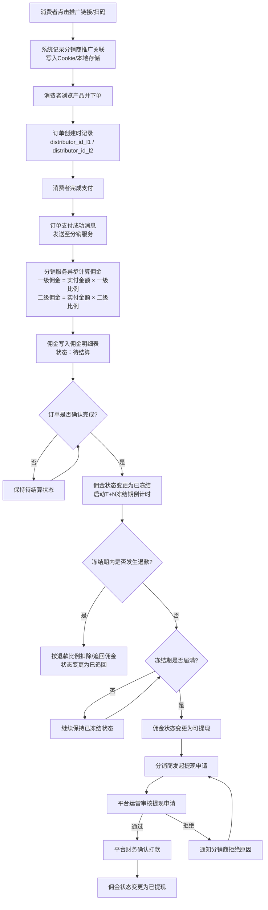

**优先级：P0（一期核心功能）**

#### 8.4.4 佣金明细

分销商可在分销商中心"佣金明细"模块查看其所有佣金的详细记录。佣金明细列表支持按时间范围、产品品类、佣金状态筛选，支持导出 Excel。

每笔佣金明细展示以下信息：来源订单号、产品名称、产品品类、订单实付金额、佣金比例、佣金金额、佣金状态、结算时间（可提现时显示）、对应消费者昵称（脱敏显示）。

一级分销商的佣金明细包含两部分：自营推广产生的一级佣金、团队下级推广产生的二级佣金。二级分销商的佣金明细仅展示一级佣金。两类佣金在明细列表中以标签区分，便于分销商核对自己的收益构成。

佣金明细的数据实时性要求：佣金计算完成后 30 秒内可在明细列表中查询到。已冻结和可提现状态的佣金汇总在"我的资产"模块顶部以卡片形式展示（已冻结金额、可提现金额分别显示）。

**优先级：P0（一期核心功能）**

### 8.5 分销商 C 端功能

#### 8.5.1 分销商中心

分销商中心是分销商登录系统后的核心操作界面，覆盖 PC 端 Web 页面与微信小程序两端。分销商使用申请时注册的手机号 + 验证码方式登录，登录后进入专属中心首页。

分销商中心首页为数据概览看板，顶部展示三项核心资产数据：**累计佣金**（历史产生佣金总额）、**可提现金额**（当前可申请提现的余额）、**冻结中金额**（尚在冻结期内的佣金总额）。中部为快捷操作入口，包括"生成推广链接""查看佣金明细""申请提现""我的团队"四个核心功能的快捷卡片。底部为"最新公告"模块，展示平台运营发布的推广活动通知、佣金比例调整通知、新上线产品推荐等信息。

分销商中心的布局采用侧边栏导航（PC 端）或底部 Tab 导航（小程序端），导航菜单项包括：首页、我的推广、我的团队、佣金明细、个人设置。分销商中心的访问权限与分销商状态关联：正常状态可访问全部功能；冻结状态仅可查看历史数据，不可进行推广和提现；待激活状态仅可查看协议内容。

**优先级：P0（一期核心功能）**

#### 8.5.2 我的推广

"我的推广"模块是分销商管理其推广产品、查看推广数据的核心页面。模块包含以下功能：

**推广产品列表**：展示分销商已生成推广链接的所有产品，每个产品卡片展示产品缩略图、产品名称、出发城市、行程天数、产品售价、佣金比例、佣金金额估算。分销商可通过产品名称搜索或按品类（境内/出境/邮轮）筛选。

**推广链接管理**：分销商可为列表中的任意产品生成/重新获取推广链接与二维码。已生成的链接支持复制、分享到微信好友/朋友圈、下载二维码图片。每个链接/二维码的右侧展示其推广数据概览（点击量、订单量）。

**推广数据统计**：系统为每个产品的每个推广链接记录以下数据：点击 PV（页面浏览次数）、点击 UV（独立访客数）、加购次数（加入购物车次数）、下单转化率（下单数 ÷ UV）、成交订单数、成交金额。数据以"今日/近 7 天/近 30 天"三个时间维度聚合展示，帮助分销商评估推广效果并优化推广策略。

**优先级：P0（一期核心功能）**

#### 8.5.3 我的团队

"我的团队"模块仅限一级分销商访问，用于管理和发展下级二级分销商团队。

**团队成员列表**：以列表形式展示所有直属二级分销商，每行展示下级分销商昵称、注册时间、近 30 天推广订单数、近 30 天成交金额、为上级贡献的二级佣金总额。支持按昵称搜索、按注册时间排序。

**团队业绩汇总**：页面顶部展示团队整体数据卡片，包括：团队总人数、今日团队订单数、本月团队成交额、累计二级佣金收益。数据实时更新（T+0 延迟不超过 5 分钟）。

**邀请功能**：提供"邀请新成员"按钮，点击后弹出邀请方式选择（复制邀请链接/查看邀请码/分享至微信），并实时展示邀请链接的点击次数与成功转化人数。

**团队排行榜**：可选展示团队成员的业绩排行（近 30 天成交金额 TOP10），激发团队内部竞争氛围。排行榜仅一级分销商自己可见，不在下级之间展示。

**优先级：P0（一期核心功能）**

#### 8.5.4 佣金提现

佣金提现是分销商将可提现佣金提取至个人银行卡的核心功能。

**提现申请**：分销商在"佣金提现"页面查看可提现余额，输入提现金额（不得低于最低提现门槛 100 元，不得高于可提现余额），选择已绑定的银行卡（如未绑定则先引导完成绑卡），提交提现申请。系统对提现申请进行自动校验：提现金额 ≥ 最低门槛、银行卡信息完整、分销商状态正常。

**提现审核**：提现申请提交后进入平台运营后台的提现审核队列。运营人员查看提现申请列表，核对分销商身份、提现金额、银行卡信息，审核操作包括"确认打款"与"拒绝提现"。确认打款后，平台财务人员通过企业网银或银企直联接口完成转账。审核时效承诺：工作日 24 小时内处理，节假日顺延。

**提现记录**：分销商可查看历史提现记录，每条记录展示：提现单号、提现金额、提现状态（待审核/审核通过已打款/已拒绝）、申请时间、审核时间、拒绝原因（如适用）。提现记录支持按时间范围筛选，支持导出。

**优先级：P0（一期核心功能）**

#### 8.5.5 业绩看板

业绩看板为分销商提供多维度的推广数据可视化分析，帮助分销商评估推广效果、优化推广策略。

看板包含以下数据模块：

**趋势图表**：折线图展示近 30 天的访客数、订单数、成交额、佣金四指标的趋势变化，支持点击图例切换指标显示/隐藏。

**数据汇总卡片**：今日数据（访客数、订单数、成交额、佣金）与昨日对比的环比增幅；本周数据汇总；本月数据汇总。数据每日凌晨自动刷新。

**产品表现排行**：分销商推广的所有产品按成交金额降序排列，展示 TOP10 产品的名称、成交订单数、成交金额、佣金贡献，帮助分销商识别高转化产品并加大推广力度。

**渠道分析**：统计不同推广渠道（朋友圈、微信群、公众号、线下扫码等）的点击量与转化率，帮助分销商了解哪些渠道效果最好（渠道识别通过推广链接/二维码的不同参数标记实现）。

**优先级：P1（一期增强功能）**

### 8.6 后台分销管理

#### 8.6.1 分销商列表

平台运营后台的"分销管理 → 分销商列表"模块提供全平台分销商的集中管理能力。

分销商列表以表格形式展示所有分销商的核心信息，支持按分销商类型（个人/企业）、等级（普通/高级）、状态（正常/冻结/注销/待激活）、注册时间范围筛选，支持按昵称/手机号/分销编码搜索。

列表字段包括：分销商 ID、昵称、类型（个人/企业）、等级、状态、上级分销商（一级分销商显示"-"，二级分销商显示上级昵称）、注册时间、累计推广订单数、累计成交金额、累计佣金金额、可提现余额。

点击分销商记录可进入分销商详情页，展示完整的分销商资料（基本信息、资质文件、银行卡信息、推广数据汇总、佣金明细、操作日志）。运营人员可在详情页执行以下操作：调整等级、冻结/解冻账号、手动注销（需二次确认）、查看该分销商的全部推广订单。

**优先级：P0（一期核心功能）**

#### 8.6.2 佣金结算审核

"佣金结算审核"模块处理分销商提交的佣金提现申请，是平台财务流程的关键环节。

提现审核列表展示所有待审核的提现申请，每条记录包含：提现单号、分销商昵称/企业名、提现金额、收款银行、银行卡号（脱敏显示后四位）、申请时间、累计提现次数。列表支持按金额区间、申请时间范围筛选，支持按申请时间倒序排列。

审核操作包括：

**确认打款**：运营人员核对提现信息后点击确认，系统自动向财务系统发起打款指令（对接银企直联或手动导出打款清单）。打款完成后，系统自动将佣金状态变更为"已提现"，并向分销商发送提现到账通知（短信 + 站内信）。

**批量打款**：支持勾选多条提现申请进行批量确认打款，提升财务处理效率。

**拒绝提现**：运营人员填写拒绝原因（如银行卡信息异常、分销商存在违规嫌疑等），系统通知分销商重新提交或联系客服。

**优先级：P0（一期核心功能）**

#### 8.6.3 分销数据报表

分销数据报表模块为平台运营提供分销业务的宏观数据分析能力，支持日/周/月/自定义时间范围的数据聚合。

报表体系包含以下维度：

**分销订单统计**：时间范围内的分销订单总量、分销订单占平台总订单比例、各品类的分销订单分布（境内/出境/邮轮）、一级分销商自营订单与二级分销商推广订单的占比。

**佣金支出统计**：时间范围内的总佣金支出金额、一级佣金与二级佣金的金额分布、各品类的佣金支出分布、佣金支出占平台营收的比例（佣金率）。

**分销商活跃度分析**：活跃分销商数量（有推广成交的分销商）、新增分销商数量、分销商留存率（近 30 天有成交的分销商 ÷ 总正常分销商数）、TOP 分销商排行（按成交金额/佣金贡献）。

所有报表数据支持导出 Excel/PDF，支持图表可视化展示（柱状图、饼图、折线图）。报表数据每日凌晨由定时任务预聚合，查询响应时间不超过 2 秒。

**优先级：P1（一期增强功能）**

#### 8.6.4 分销规则配置

"分销规则配置"模块是平台运营调整分销策略的核心入口，涵盖佣金比例配置与结算规则配置两大功能。

**佣金比例配置**：运营人员可在三级优先级体系（全局/品类/产品）中分别配置一级佣金比例与二级佣金比例。配置表单包含：配置层级选择器、品类/产品选择器（根据层级联动）、一级佣金比例输入框（0.1%-50.0%）、二级佣金比例输入框（0.1%-30.0%）、生效时间选择器、失效时间选择器（可选，为空表示永久有效）。配置提交后 5 分钟内生效，新产生的推广订单按最新配置计算佣金。

**结算规则配置**：运营人员可配置 T+N 冻结期的 N 值（各品类独立配置）、最低提现门槛金额（默认 100 元）、单日/单笔提现上限、自动结算开关（开启后冻结期届满的佣金自动变更为可提现，无需人工干预）。

所有规则变更记录操作日志，包含变更前值、变更后值、操作人、操作时间，便于后续审计与追溯。

**优先级：P0（一期核心功能）**

#### 8.6.5 分销订单查询

"分销订单查询"模块支持按多维度检索分销订单，满足运营排查、财务对账、纠纷处理等场景需求。

查询条件包括：订单号（精确匹配）、分销商编码/昵称（模糊匹配）、产品名称（模糊匹配）、产品品类（境内/出境/邮轮）、分销层级（一级推广/二级推广）、佣金状态（待结算/已冻结/可提现/已提现/已追回）、下单时间范围、结算时间范围。

查询结果列表展示订单核心信息：订单号、产品名称、实付金额、一级分销商、二级分销商（如有）、一级佣金、二级佣金、佣金状态、下单时间、结算时间。点击订单记录可查看完整的分销订单详情，包含消费者信息（脱敏）、推广来源（链接/二维码）、佣金计算明细。

查询结果支持导出 Excel（单次最多导出 10,000 条），导出文件包含全部字段，便于财务人员进行佣金对账。

**优先级：P0（一期核心功能）**

### 8.7 业务规则

#### 8.7.1 佣金计算规则

佣金计算遵循以下明确规则，确保计算过程的透明、可预期、无歧义：

**基数规则**：佣金以订单实付金额为计算基数。实付金额定义为订单中消费者实际支付的金额，即扣除全部平台优惠后的净额。计算公式：实付金额 = 产品总金额 + 附加服务费 - 优惠券抵扣 - 积分抵扣 - 满减活动优惠 - 其他平台级优惠。若订单使用平台余额或礼品卡支付，该部分金额计入实付金额（因属消费者预付资金）；若订单发生部分退款，佣金按退款后的实际成交金额重新计算。

**比例规则**：一级佣金比例始终大于或等于二级佣金比例（一级佣金比例 ≥ 二级佣金比例），确保直接推广者的收益不低于间接推广者。系统在校验佣金配置时强制执行此约束，不满足的配置无法提交。

**归属规则**：一笔订单的一级佣金归属给直接促成成交的分销商（通过其推广链接或二维码下单）；二级佣金归属给该分销商的上级一级分销商。若消费者通过一级分销商的推广链接直接下单（无二级分销商介入），则仅产生一级佣金，不产生二级佣金。

**上限规则**：单笔订单的平台总佣金支出（一级佣金 + 二级佣金）不得超过订单实付金额的 50%，防止极端配置导致平台亏损。系统在佣金计算时自动强制执行此上限，超出部分按比例压缩。

**优先级：P0（一期核心功能）**

#### 8.7.2 防薅羊毛规则

分销体系面临多种薅羊毛风险，系统通过以下规则进行防范：

**自购禁止规则**：分销商不能购买自己推广的产品。当分销商点击自己的推广链接时，系统识别其登录身份与推广编码的一致性，自动清除推广关联，该订单不计入分销业绩。此规则适用于分销商使用同一账号、同一设备、同一浏览器 Cookie 的场景。

**身份隔离规则**：同一用户账号不能既是分销商又是其下级分销商的消费者。即：若用户 A 是用户 B（分销商）的下级分销商，则用户 A 不能以消费者身份通过 B 的推广链接下单（防止分销商发展自己为下级后自购套利）。系统通过用户 ID 比对实现此隔离。

**设备关联规则**：同一设备（通过设备指纹标识）在 30 天内关联的多个账号，若其中一个为分销商，则其他账号通过该分销商推广链接的下单不计入分销业绩。此规则防止分销商通过注册多个小号自购套利。

**IP 频率限制规则**：同一 IP 地址在 1 小时内通过同一推广链接产生超过 10 次点击，系统自动触发反作弊标记，后续该 IP 的点击不再计入推广数据。运营人员可在后台查看反作弊标记明细并人工复核。

**违规处罚规则**：系统通过数据模型识别异常推广模式（如短时间内大量订单来自同一 IP 段、订单支付后迅速退款等），标记为"疑似违规"。运营人员审核确认后，可对分销商执行以下处罚：警告（站内信通知）、佣金扣除（扣除违规订单对应佣金）、账号冻结（暂停推广与提现权限 7-30 天）、永久注销（严重违规）。所有处罚记录审计日志。

**优先级：P0（一期核心功能）**

#### 8.7.3 退款退佣规则

订单发生退款时，佣金处理遵循以下规则：

**全额退款**：若订单全额退款（退款金额 = 实付金额），则对应佣金全额追回。已结算（可提现或已提现）的佣金从分销商当前可提现余额中扣除；余额不足时记录为负值。未结算（待结算/已冻结）的佣金直接取消。

**部分退款**：若订单部分退款（退款金额 < 实付金额），则佣金按退款比例同步扣除。计算公式：应追回佣金 = 原佣金金额 ×（退款金额 ÷ 实付金额）。例如，订单实付 4,000 元，一级佣金 200 元，消费者退款 1,000 元，则应追回一级佣金 = 200 ×（1,000/4,000）= 50 元。

**冻结期内退款**：若退款发生在佣金冻结期内（T+N 期间），系统自动调整佣金金额，无需额外追回操作（因佣金尚未进入可提现状态）。

**冻结期外退款**：若退款发生在佣金冻结期届满后（佣金已可提现或已提现），系统启动追回流程：从分销商可提现余额中扣除相应金额，发送佣金追回通知。若余额不足，记录为负值并在后续新佣金产生时优先抵扣。

**优先级：P0（一期核心功能）**

#### 8.7.4 佣金结算周期

佣金结算采用 **T+N 模式**，T 为订单确认完成的时间节点，N 为平台配置的冻结天数。订单确认完成的定义因产品品类而异：

| 产品品类 | T 的定义 | 默认 N 值 | 总结算周期 |
|:---:|:---|:---:|:---:|
| 境内跟团游 | 消费者出游结束日期（团期结束日） | 7 天 | 出游结束后约 7 天 |
| 出境跟团游 | 消费者出境行程结束日期（回程抵达日） | 15 天 | 行程结束后约 15 天 |
| 邮轮游 | 邮轮航次结束日期（下船日） | 15 天 | 航次结束后约 15 天 |

T+N 模式的设计依据是旅游产品的退款风险周期。境内游退款风险相对较低，冻结期较短（7 天）；出境游和邮轮游因涉及签证、国际交通等复杂因素，退款风险窗口较长，冻结期设置为 15 天。平台运营可在后台调整各品类的 N 值，调整后对新确认完成的订单生效，已冻结的订单不受影响。

分销商发起提现后，平台财务审核时效为工作日 24 小时内。高级分销商享受加速结算（T+3），即冻结期缩短为 3 天，不受品类默认 N 值限制。

**优先级：P0（一期核心功能）**

## 9. 功能需求 — 多租户管理

多租户管理（Multi-Tenancy Management）是指在同一套系统实例中为多个逻辑上独立的组织（租户，Tenant）提供服务的架构模式。旅游预订系统采用多租户架构，使平台运营方能够为不同的品牌方、区域代理商或业务线快速开通独立的运营实例，每个租户拥有隔离的数据空间、独立的品牌展示和自主的运营配置能力[^929^][^932^]。以下从租户生命周期、数据隔离、租户级定制三个维度展开功能需求。

### 9.1 租户生命周期管理

#### 9.1.1 租户创建与开通

租户创建由平台超级管理员在运营后台执行。创建流程包括：填写租户基础信息（租户名称、租户编码、所属行业、联系人信息）；选择服务套餐（基础版/标准版/旗舰版，不同套餐对应不同的资源配额与功能权限）；配置生效时间与到期时间（支持按年/按月订阅模式）；分配独立域名或子域名（如 `tenant1.travel-platform.com` 或租户自有域名）；上传品牌Logo与配置主题色（支持HEX色值输入或色板选择）；初始化系统数据（根据租户类型预置基础类目、默认角色权限模板、示例产品数据）。

租户创建完成后，系统自动执行初始化操作：创建租户级数据库Schema（在共享数据库模式下）或分配独立数据库实例（在大客户模式下）；初始化Redis Key前缀命名空间；生成租户级JWT签名密钥对；创建默认管理员账号并发送激活邮件。整个初始化过程在5分钟内完成，超时则触发告警通知运维人员。

#### 9.1.2 租户配置

租户开通后，超级管理员与租户管理员均可对租户配置进行管理。可配置项包括：品牌展示配置（C端网站Logo、浏览器Favicon、主题色、首页Banner、页脚版权信息）；域名配置（子域名绑定、自定义域名CNAME指向、SSL证书自动申请与续期）；联系信息配置（客服电话、客服邮箱、在线客服入口开关、公司地址）；支付方式配置（各租户可独立选择启用的支付渠道，配置渠道参数如商户号、API密钥等）；通知模板配置（短信签名、邮件发件人名称、各类通知模板内容定制）；退改规则默认模板（租户级退改规则可作为旗下产品的默认配置）。

配置变更实时生效，涉及域名或支付参数的变更需经过平台运营审核后方可生效，以防止配置错误导致的服务中断或资金风险。

#### 9.1.3 租户状态管理

租户在其生命周期中经历多种状态，系统提供完整的状态机管理：

- **初始化中**：租户刚创建，系统正在执行数据初始化操作。此状态下租户后台不可登录，C端不可访问。
- **正常运行**：租户处于正常服务状态，所有功能可用。这是租户的主要运营状态。
- **已过期**：租户订阅的服务套餐已到期且未续费。此状态下C端仍可访问但展示续费提醒横幅，供应商工作台和运营后台仅保留只读权限，禁止新订单创建。
- **已停用**：因违规操作（如发布非法产品、恶意刷单）或租户主动申请暂停而被平台停用。此状态下C端展示"暂停服务"页面，所有后台功能锁定。
- **已注销**：租户主动申请注销或长期未续费后由系统自动清理。此状态为终态，数据进入冷冻期（90天），冷冻期过后可彻底删除。注销操作不可逆，需超级管理员二次确认。

状态变更操作全部记录审计日志，包括变更前状态、变更后状态、操作人、操作时间、变更原因。从"正常运行"变更为"已停用"或"已注销"前，系统需自动通知租户管理员并预留7个自然日的申诉期。

### 9.2 租户数据隔离

#### 9.2.1 数据隔离方案

系统采用混合隔离模式（Hybrid Isolation Model），结合共享数据库+行级安全策略（Row-Level Security, RLS）与独立数据库实例两种方式，在成本、隔离性与扩展性之间取得平衡[^923^][^933^]。

**表 8-1 多租户数据隔离方案对比**

| 隔离维度 | 共享数据库+RLS | 独立数据库实例 | 系统采用策略 |
|:---|:---|:---|:---|
| 数据隔离级别 | 逻辑隔离（tenant_id字段区分） | 物理隔离（独立数据库） | 混合模式：中小租户共享库+RLS，大客户（数据量>200GB或TPS>500）分配独立实例 |
| 资源成本 | 低（共享计算与存储资源） | 高（独立服务器/实例） | 按租户规模动态选择，降低整体基础设施成本 |
| 查询性能 | 所有查询需携带tenant_id过滤条件，需建立联合索引 | 无额外过滤开销，性能最优 | 共享库场景下核心表强制建立 `(tenant_id, 业务字段)` 联合索引 |
| 数据备份 | 统一备份，按tenant_id恢复 | 独立备份策略 | 统一备份框架，支持按租户粒度恢复 |
| 扩容灵活性 | 高（水平扩展数据库集群即可） | 低（需单独迁移扩容） | 支持租户从共享库平滑迁移至独立实例 |
| 安全合规 | RLS策略防止跨租户数据访问，依赖数据库层实现 | 物理隔离天然安全 | PostgreSQL原生支持RLS[^929^]，满足等保三级要求 |
| 适用租户规模 | 中小租户（日均订单<1000） | 大型品牌客户（日均订单>1000） | 默认共享库，超阈值自动评估迁移 |

共享数据库模式下的技术实现要点如下。所有业务表均包含 `tenant_id BIGINT NOT NULL` 字段，作为租户隔离的核心标识。PostgreSQL启用行级安全策略（RLS），为每张业务表创建策略：`CREATE POLICY tenant_isolation ON product USING (tenant_id = current_setting('app.current_tenant')::BIGINT)`。应用层在每次数据库连接建立后执行 `SET app.current_tenant = '{tenant_id}'`，确保当前会话仅能访问该租户的数据。API网关层从JWT Token中提取 `tenant_id` 声明，并将其注入到所有下游服务请求上下文中[^944^]。Redis缓存通过Key前缀实现隔离：`tenant:{tenant_id}:product:{product_id}`。全文搜索引擎Meilisearch的索引按租户分片，搜索请求自动附加 `tenant_id = X` 过滤条件。

即使在大客户独立数据库模式下，系统仍保留 `tenant_id` 字段以维持代码层的一致性，避免两套数据访问逻辑。租户迁移工具支持从共享库导出指定租户的全部数据并导入至独立实例，迁移过程采用在线双写策略，确保业务不中断。

#### 9.2.2 资源配额管理

为防止单一租户过度占用系统资源而影响其他租户，系统实施严格的资源配额管理机制。配额在租户创建时根据所选服务套餐初始化，运营后台可针对单个租户进行调整。

**表 8-2 租户资源配额配置**

| 配额项 | 基础版 | 标准版 | 旗舰版 | 超限处理策略 |
|:---|:---:|:---:|:---:|:---|
| 产品数量上限 | 200个 | 1{,}000个 | 5{,}000个 | 达到上限后禁止新建产品，提示升级套餐 |
| 供应商数量上限 | 10家 | 50家 | 200家 | 达到上限后禁止新供应商入驻 |
| 存储空间（图片/文件） | 10GB | 50GB | 200GB | 达到80%容量时预警通知，达到100%时禁止新上传 |
| 并发在线管理员数 | 5人 | 20人 | 100人 | 超过并发数时新登录请求被阻塞并提示 |
| 月订单处理量 | 5{,}000单 | 20{,}000单 | 100{,}000单 | 达到80%时预警，达到100%时系统建议升级套餐 |
| API调用频率（QPS） | 100 | 500 | 2{,}000 | 超限请求触发429状态码，需等待限流窗口刷新 |
| 自定义域名数量 | 1个 | 3个 | 10个 | 达到上限后禁止新域名绑定 |

资源配额的校验在关键操作节点进行：产品创建时检查产品数量配额、文件上传时检查存储空间配额、用户登录时检查并发数配额、订单创建时检查月订单量配额。所有配额使用情况在租户后台实时展示，并以图表形式呈现历史使用趋势，帮助租户合理规划资源。

### 9.3 租户级定制

#### 9.3.1 独立品牌展示

多租户架构的核心价值之一是品牌独立性。C端销售平台（Nuxt.js SSR渲染）在接收到用户请求时，通过域名或URL路径中的租户标识确定当前访问的租户实例，动态加载该租户的品牌配置并渲染个性化页面。

品牌定制范围覆盖：全局样式（主题色替换、按钮圆角、字体选择）；页面头部（Logo替换、导航菜单可配置项、客服入口开关）；首页模块（Banner轮播图、热门目的地推荐位、产品推荐模块的自定义排序）；页脚区域（公司信息、ICP备案号、联系方式、友情链接）；小程序端（Uni-App运行时根据租户配置动态渲染主题色与首页布局）。系统预定义一套标准UI组件库，所有品牌定制均在组件库支持的变量范围内进行，确保定制后的页面在视觉差异性与用户体验一致性之间取得平衡。不允许租户直接注入自定义CSS或JavaScript代码，以防止XSS攻击与页面布局破坏[^889^]。

#### 9.3.2 独立支付配置

各租户可独立配置其支付渠道参数，实现资金流的租户级隔离。支付配置管理界面提供以下能力：渠道启用开关（租户可选择启用支付宝、微信支付、银联中的一个或多个）；渠道参数配置（商户号（mchid）、API密钥、应用ID（appid）、证书上传与自动更新）；支付费率展示（各渠道的官方手续费率，平台可在渠道费率基础上加收服务费）；结算账户绑定（每个支付渠道绑定独立的结算银行账户，确保资金直接结算至租户指定账户）。

支付参数采用加密存储（AES-256-GCM），租户管理员可查看商户号等基本信息，但API密钥等敏感字段仅显示掩码（前4后4位），修改需重新输入完整值。支付配置的变更需平台运营审核，审核通过后由系统自动重新加载支付渠道SDK配置，无需重启服务。每笔支付订单在数据库层记录 `tenant_id` 与 `payment_channel` 字段，确保财务对账时能够按租户维度精确拆分支付流水[^943^]。

## 10. 非功能需求

非功能需求定义了系统在性能、安全、可用性、可维护性和兼容性等方面的质量属性约束。这些约束不直接对应具体业务功能，但决定了系统能否在实际生产环境中稳定、高效、合规地支撑业务运行。本章以日均 1{,}000 单、并发用户 10{,}000 人、可用性 99.9%、等保三级合规作为基线，将质量目标分解为可验证的技术指标与实现约束。所有指标基于 Windows Server 2022+ 部署平台和 Go 1.26+ 生态进行推导，兼顾旅游行业处理敏感个人信息与在线支付的特殊合规要求。

### 10.1 安全需求

安全需求覆盖认证授权、数据安全、攻击防护、安全审计与等保合规五个维度，须同时满足《网络安全法》《个人信息保护法》及等保三级要求[^888^][^891^][^895^]。

#### 10.1.1 认证与授权

系统采用多因素认证（Multi-Factor Authentication，MFA）与基于角色的访问控制（Role-Based Access Control，RBAC）相结合的体系。MFA 将认证因素分为知识因素（密码）、拥有因素（短信验证码、TOTP 动态码、硬件令牌）和生物因素（指纹、人脸识别）。普通用户采用"密码 + 短信验证码"双因素认证，登录异常时自动触发；企业管理员采用"密码 + TOTP + 短信"三因素认证；运维人员采用"密码 + 硬件令牌"高安全方案[^895^]。

API 鉴权采用 OAuth 2.0 + JWT（JSON Web Token）方案[^944^][^952^]。认证服务颁发 Access Token（有效期 15 分钟）与 Refresh Token（有效期 7 天），JWT 采用 RS256 非对称签名，Redis 维护 Token 黑名单以支持服务端强制登出[^955^]。JWT 载荷包含用户 ID、权限范围（`scope`）及租户 ID（`tenant_id`），API 网关对签名、过期时间和 scope 三层校验后转发下游。

RBAC 划分为功能权限（菜单/按钮/API）、数据权限（本人/本部门/全量）和字段权限（敏感字段查看/编辑）三个维度，角色层级从超级管理员延伸至普通用户，下级角色继承上级基础权限并叠加专属权限[^478^][^497^]。

#### 10.1.2 数据安全

敏感数据采用 AES-256-GCM 字段级加密存储，密钥由 KMS（Key Management Service）统一管理，支持每季度自动轮换[^940^][^947^]。用户密码采用 Argon2id 单向哈希。传输层全站启用 HTTPS（TLS 1.3，最低 TLS 1.2），配置 HSTS 头部（max-age >= 31{,}536{,}000 秒），证书到期前 30 天自动续期。API 请求使用 HMAC-SHA256 签名防篡改，时间戳有效期 ±5 分钟，结合 nonce 唯一性校验防止重放[^947^]。

展示层实施动态脱敏：手机号显示前 3 后 4 位，身份证号显示前 6 后 4 位，护照号显示前 2 后 2 位，银行卡号显示前 6 后 4 位，姓名仅显示姓氏。脱敏在 API 响应层和日志输出层双重实施，确保日志中永不出现明文敏感信息[^940^][^953^]。

#### 10.1.3 攻击防护

SQL 注入防护采用参数化查询（GORM ORM 或预编译语句）、输入白名单校验和最小权限数据库账号的组合策略，严禁字符串拼接 SQL，定期通过 `gosec` 扫描[^889^][^890^]。XSS 防护采用输出编码、CSP 头部、HttpOnly + Secure + SameSite=Strict Cookie 三重机制[^889^][^890^]。CSRF 防护要求所有 Cookie 设置 SameSite=Strict，表单提交携带 CSRF Token[^890^][^896^]。

DDoS 防护采用四层纵深架构：CDN 吸收静态流量攻击；高防 IP 提供 100Gbps~1Tbps 流量清洗（RTO < 3 秒）；WAF 防护 HTTP Flood 和 CC 攻击（10 万 QPS）；应用层基于令牌桶实现单机 1 万 QPS 限流[^941^][^945^][^946^]。接口防重放通过时间戳 ±5 分钟与 nonce 唯一性校验实现。

#### 10.1.4 安全审计

审计系统以结构化 JSON 格式全量记录四类事件：登录事件（用户 ID、IP、时间、结果、设备信息）、操作事件（操作类型、操作对象、变更前后值、操作人、时间戳）、敏感操作（密码修改、权限变更、大额退款、数据导出）和安全事件（异常登录、暴力破解、越权访问）。登录与操作事件保留 2 年，敏感操作与安全事件永久保留[^966^][^967^][^981^]。每条审计记录包含 20 余个字段，覆盖时间戳、事件类型、事件分类、用户身份、IP 地址、资源类型、资源标识、操作动作、变更前后值、操作结果、会话 ID、请求 ID 和风险评分，确保操作全流程可追溯。

异常行为检测引擎内置五条核心规则：同一账号 5 分钟内密码错误 >= 5 次触发账号锁定 15 分钟，防范暴力破解；异地登录叠加设备变更强制要求 MFA 验证，防范账户盗用；单用户 1 分钟内 API 调用 > 100 次触发限流并推送告警，防范接口滥用；越权访问直接拒绝请求、记录日志并推送安全告警；单 IP 短时间内发起大量查询触发验证码挑战与临时封禁，防范数据爬取。审计日志启用基于 HSM（Hardware Security Module）保管密钥的数字签名机制，防止日志被篡改或删除，确保审计数据的法律效力。

#### 10.1.5 等保三级合规对照表

等保 2.0/3.0 三级要求涵盖安全物理环境、安全通信网络、安全区域边界、安全计算环境和安全管理中心五个层面[^895^][^925^][^927^]。表 9-1 将 6 大控制点共 32 项测评要求与系统实现逐项对照。

**表 9-1 等保三级合规对照表**

| 编号 | 控制点 | 测评项 | 等保要求 | 系统实现 | 验证方式 |
|:---|:---|:---|:---|:---|:---|
| 1 | 身份鉴别 | a) 用户身份标识 | 身份标识具有唯一性 | 手机号+密码+短信三因素，用户 ID 全局唯一 | 功能测试 |
| 2 | 身份鉴别 | b) 鉴别信息复杂度 | 密码 >= 8 位，含大小写+数字+特殊字符 | 密码策略强制校验 | 配置核查 |
| 3 | 身份鉴别 | c) 登录失败处理 | 5 次失败后锁定 15 分钟 | Redis 计数自动锁定 | 功能测试 |
| 4 | 身份鉴别 | d) 会话管理 | 超时自动退出 | JWT Access Token 15 分钟过期 | 渗透测试 |
| 5 | 身份鉴别 | e) 双因素认证 | 重要操作需双因素 | 管理员 MFA 强制开启 | 功能测试 |
| 6 | 身份鉴别 | f) 口令更换周期 | 90 天强制更换 | 到期提醒+强制修改 | 配置核查 |
| 7 | 访问控制 | a) 最小权限 | 授予最小必要权限 | RBAC 三级权限模型 | 功能测试 |
| 8 | 访问控制 | b) 权限分离 | 管理员与普通用户分离 | 五角色隔离设计 | 配置核查 |
| 9 | 访问控制 | c) 敏感操作二次授权 | 敏感操作需二次确认 | 退款/权限变更二次验证 | 功能测试 |
| 10 | 访问控制 | d) 默认账户管理 | 重命名/删除默认账户 | 初始化强制创建账户 | 配置核查 |
| 11 | 访问控制 | e) 控制粒度 | 控制到按钮/API 级 | 功能+数据+字段三维度 | 功能测试 |
| 12 | 安全审计 | a) 审计范围 | 覆盖所有用户操作 | 全量操作日志无豁免 | 日志核查 |
| 13 | 安全审计 | b) 记录内容 | 记录时间/类型/主体/客体/结果 | 结构化 JSON 含 20+ 字段 | 日志核查 |
| 14 | 安全审计 | c) 记录保护 | 防篡改、防删除 | 日志数字签名+独立库 | 渗透测试 |
| 15 | 安全审计 | d) 留存期限 | >= 6 个月 | 审计日志 2 年 | 配置核查 |
| 16 | 安全审计 | e) 集中管理 | 集中管理审计记录 | ELK/Loki 集中采集 | 配置核查 |
| 17 | 入侵防范 | a) 恶意代码防护 | 恶意代码检测清除 | WAF + HIDS | 功能测试 |
| 18 | 入侵防范 | b) 漏洞管理 | 及时发现并修补 | 月度扫描+季度渗透 | 配置核查 |
| 19 | 入侵防范 | c) 异常行为检测 | 检测异常登录/越权 | 5 条规则+实时告警 | 功能测试 |
| 20 | 入侵防范 | d) 入侵防范产品 | 网络/主机级防范 | CDN+高防+WAF+HIDS | 架构评审 |
| 21 | 数据完整性 | a) 传输完整性 | 传输过程完整性保护 | TLS 1.3 + HMAC-SHA256 | 渗透测试 |
| 22 | 数据完整性 | b) 存储完整性 | 存储过程完整性保护 | 行级校验+日志签名 | 配置核查 |
| 23 | 数据完整性 | c) 重要数据备份 | 定期备份 | 每日全量+每小时增量 | 配置核查 |
| 24 | 数据保密性 | a) 传输加密 | 敏感数据传输加密 | 全站 TLS 1.3 | 渗透测试 |
| 25 | 数据保密性 | b) 存储加密 | 敏感数据存储加密 | AES-256-GCM 字段级 | 配置核查 |
| 26 | 数据保密性 | c) 数据脱敏 | 展示脱敏 | API+日志+网关三层脱敏 | 功能测试 |
| 27 | 数据保密性 | d) 密钥管理 | 密钥安全保管 | KMS 统一管理自动轮换 | 配置核查 |
| 28 | 备份恢复 | a) 备份策略 | 定期异地备份 | 同城+异地双备份 | 配置核查 |
| 29 | 备份恢复 | b) 恢复演练 | 定期演练 | 季度灾备演练 | 管理评审 |
| 30 | 个人信息 | a) 最小必要 | 仅采集必要信息 | 隐私协议，可选不强制 | 功能测试 |
| 31 | 个人信息 | b) 授权同意 | 处理前取得同意 | 注册/敏感操作单独授权 | 功能测试 |
| 32 | 个人信息 | c) 主体权利 | 支持查阅/更正/删除 | 用户中心信息管理 | 功能测试 |

表 9-1 中，身份鉴别与访问控制构成认证授权基线，安全审计确保操作可追溯，入侵防范对应攻击防护纵深设计，数据完整性与保密性覆盖传输和存储两大环节，备份恢复支撑业务连续性，个人信息保护响应《个人信息保护法》专项要求。验证方式分为功能测试、配置核查、渗透测试、架构评审和管理评审五类，系统可在等保测评中逐项举证。

### 10.2 性能需求

性能需求以日均 1{,}000 单、并发 10{,}000 用户为基线，按 5 倍预留扩展空间。基线指标基于峰值系数 3 倍（峰值 3{,}000 单/天）、高峰持续 6 小时、每单平均涉及 5 次 API 调用进行测算：高峰时段每秒订单量约 3{,}000 / (6 × 3{,}600) ≈ 0.14 单/秒，考虑促销等突发场景按 10 倍安全系数放大，得出订单 TPS >= 500、全站 QPS >= 10{,}000 的基线目标。扩展目标 5 倍（50{,}000 并发、QPS 50{,}000）通过水平扩容服务实例和数据库分片即可达到，无需架构重构。

#### 10.2.1 并发能力

**表 9-2 性能指标表**

| 指标类别 | 指标项 | 基线目标 | 扩展目标 | 说明 |
|:---|:---|:---|:---|:---|
| 并发用户 | 峰值同时在线 | 10{,}000 人 | 50{,}000 人 | 思考时间 3-10 秒 |
| 吞吐量 | 全站峰值 QPS | >= 10{,}000 | >= 50{,}000 | 含静态资源与 API |
| 吞吐量 | 订单创建 TPS | >= 500 | >= 2{,}500 | 含库存校验、价格计算 |
| 吞吐量 | 支付处理 TPS | >= 200 | >= 1{,}000 | 含第三方支付交互 |
| 响应时间 | 首页首屏 (P95) | <= 1.5s | <= 1.0s | SSR <= 500ms |
| 响应时间 | 产品列表 (P99) | <= 1.0s | <= 500ms | Meilisearch 命中 |
| 响应时间 | 产品详情 (P99) | <= 1.0s | <= 500ms | 多级缓存命中 |
| 响应时间 | 订单确认 (P99) | <= 500ms | <= 300ms | 本地缓存命中 |
| 响应时间 | 支付接口 (P99) | <= 2.0s | <= 1.5s | 系统内部 <= 500ms |
| 响应时间 | 通用 API (P95) | <= 200ms | <= 100ms | 简单查询 |
| 响应时间 | 复杂查询 (P99) | <= 1.0s | <= 500ms | 报表统计类 |
| 数据库 | SQL 查询 (P99) | <= 100ms | <= 50ms | 命中索引 |
| 容量 | 订单数据量 | 1{,}000 万条 | 5{,}000 万条 | 按 user_id 哈希分片 |

表 9-2 中，QPS 10{,}000 与订单 TPS 500 是满足日均 1{,}000 单的最低要求，扩展目标通过水平扩容即可达到。响应时间区分不同页面的用户体验：首页和详情页流量最大，P99 不超过 1 秒；订单确认页处于转化关键环节，P99 不超过 500ms；支付接口因涉及第三方渠道，上限放宽至 2 秒，系统内部处理仍控制在 500ms 内。数据库 SQL 查询 P99 <= 100ms 通过核心字段 100% 索引覆盖和连接池优化实现。

#### 10.2.2 响应时间分级

系统按业务优先级实施响应时间分级：P50 < 50ms（简单查询，如用户信息）；P95 < 200ms（一般 API 通用标准）；P99 < 500ms（复杂查询，如搜索聚合）；P99.9 < 2{,}000ms（极少数长尾上限，超阈值触发告警）。

#### 10.2.3 数据库性能

数据库性能保障围绕索引优化、查询优化、连接池管理和读写分离四个层面展开。索引策略要求核心查询字段（product_id、order_id、user_id、status、create_time）100% 覆盖索引，定期审查慢查询日志并通过 EXPLAIN 分析执行计划，必要时使用物化视图降低计算复杂度。SQL 优化禁止 N+1 查询，批量操作使用 `INSERT ... ON CONFLICT` 或批量 UPDATE 减少往返次数。连接池大小按公式（CPU 核心数 × 2）+ 有效磁盘数 计算，设置 `statement_timeout`（默认 5 秒）防止慢查询拖垮连接池，池内连接空闲超时 30 分钟自动回收。

读写分离采用 1 主 2 从架构，写请求路由至主库，读请求通过负载均衡分发至从库。复制方式默认异步复制以保证写入性能，支付状态查询、刚下单后的订单查询等关键场景强制读主库，避免复制延迟导致状态不一致。主从延迟正常阈值 1 秒，超过 5 秒触发 P1 告警[^963^][^977^]。订单数据量达到 1{,}000 万条时启用分库分表，按 user_id 哈希分片至 16 库 64 表，分片路由由应用层实现，避免引入额外中间件复杂度。

#### 10.2.4 缓存策略

系统采用五级缓存架构：浏览器缓存（Cache-Control: max-age=31536000）→ CDN 边缘缓存（5-50ms）→ 应用本地缓存（ristretto，1μs，TTL 5-10 分钟）→ Redis Cluster（1-5ms，TTL 10 分钟~1 小时）→ 数据库查询缓存[^903^][^915^]。

**表 9-3 缓存策略表**

| 数据类型 | 缓存位置 | 过期策略 | 更新模式 | 一致性保障 | 预热策略 |
|:---|:---|:---|:---|:---|:---|
| 产品基础信息 | Redis + CDN | TTL 1 小时 | Cache-Aside | 变更时主动失效 | 启动全量加载 |
| 产品价格/库存 | Redis | TTL 5 分钟 + 主动更新 | Write-Through | 变更同步写 Redis | 高库存产品预热 |
| 搜索结果 | Redis | TTL 10 分钟 | Cache-Aside | 每次重新计算 | 热门搜索词预热 |
| 用户会话 | Redis | TTL 30 分钟 + 滑动过期 | Write-Through | 登录写/登出删 | 无需预热 |
| 热门产品列表 | 本地 + Redis | 本地 5 分钟 / Redis 10 分钟 | Cache-Aside | 本地定时同步 Redis | 每日定时预热 |
| 配置信息 | 本地缓存 | TTL 30 分钟 + 变更刷新 | Write-Through | 变更广播刷新 | 启动加载 |
| 静态资源 | CDN + 浏览器 | CDN 1 天 / 浏览器 1 年 | 版本号触发刷新 | 文件名哈希 | 部署时预热 |
| 字典/枚举 | 本地缓存 | 无限 + 手动刷新 | Write-Through | 管理后台刷新 | 启动加载 |

表 9-3 覆盖 8 类典型数据，从缓存位置、过期策略、更新模式、一致性保障和预热策略五个维度定义。Cache-Aside（旁路缓存）适用于读多写少的数据（产品信息、搜索结果），读取时先查缓存、未命中则查数据库并回填，写入时先写数据库再使缓存失效；Write-Through（直写）适用于一致性要求高的数据（会话、库存、配置），写入时同步更新缓存和数据库，确保两者始终一致。

本地缓存与 Redis 缓存之间通过 TTL 差异化实现多级防护：本地缓存 TTL（5-10 分钟）短于 Redis TTL（10 分钟~1 小时），本地失效后从 Redis 读取，Redis 失效后才查询数据库。热点数据在系统启动时全量加载产品基础信息、字典数据和支付配置，热门搜索词和热门产品列表通过定时任务每日更新，避免冷启动时大量请求穿透至数据库。

### 10.3 可用性与可靠性

可用性以 99.9% 年度可用性为核心目标，年停机不超过 8.76 小时，同时满足 RTO 和 RPO 约束。

**表 9-4 可用性指标表**

| 指标项 | 目标值 | 说明 |
|:---|:---|:---|
| 系统年度可用性 | 99.9% | 年停机 <= 8.76 小时 |
| 核心服务可用性 | 99.95% | 订单/支付/用户服务，3 实例跨可用区 |
| 计划内维护窗口 | <= 4 小时/月 | 滚动发布，业务零中断 |
| 服务级 RTO | <= 5 分钟 | 自动故障转移 + 容器重启 |
| 数据级 RPO | <= 1 分钟 | 半同步复制 + 实时 Binlog |
| 数据库故障切换 | <= 30 秒 | MHA/Orchestrator 自动切换 |
| 滚动发布中断 | 0 | 先扩容后缩容 |

核心服务因 3 实例跨可用区部署，可用性提升至 99.95%。RTO <= 5 分钟要求系统在检测到故障后自动摘除异常实例、启动备用实例并恢复流量接入[^845^][^849^]。RPO <= 1 分钟通过数据库半同步复制和实时 Binlog 备份实现[^866^]。

健康检查机制分三层：存活检查（Liveness）通过 TCP/HTTP 探测，5 秒间隔、3 次失败触发容器重启；就绪检查（Readiness）验证业务依赖（数据库、Redis），3 秒间隔，影响流量接入；启动检查（Startup）保护启动慢的服务，最长 5 分钟保护期。滚动发布采用"先扩容后缩容"策略，新版本实例先启动并通过三层健康检查，再逐步将流量从旧版本切换，全程零中断。数据库故障通过 MHA/Orchestrator 在 30 秒内自动完成主从切换。

#### 10.3.1 故障恢复分级

故障恢复按灾难等级分级：1 级（单实例故障）RTO < 1 分钟、RPO = 0，K8s 自动重启；2 级（服务集群故障）RTO < 5 分钟、RPO = 0，跨可用区自动转移；3 级（可用区故障）RTO < 15 分钟、RPO < 1 分钟，同城灾备切换；4 级（地域灾难）RTO < 30 分钟、RPO < 5 分钟，异地灾备切换；5 级（数据损坏）RTO < 1 小时、RPO < 1 小时，延迟从库 + Binlog 时间点恢复[^845^][^849^][^866^]。

#### 10.3.2 限流降级

限流从五个维度实施：全局 QPS 令牌桶 10{,}000；单 IP 滑动窗口 100 次/分钟；单用户滑动窗口 60 次/分钟；接口级按敏感度差异化（登录 10 次/分钟）；服务间调用限制最大并发 100[^900^][^901^][^910^]。

降级分四级：L1（某服务 RT > 2s）关闭非核心功能；L2（错误率 > 10%）返回缓存/静态页面；L3（核心服务不可用）仅保留查询暂停下单；L4（错误率 > 50% 持续 1 分钟）熔断，30 后半开试探恢复[^900^][^904^]。

### 10.4 可维护性

#### 10.4.1 日志管理

日志采用结构化 JSON 格式，每条日志包含时间戳、级别、服务名、Trace ID、Span ID、环境标识、主机名、消息体和业务字段。Trace ID 在 API 网关生成后贯穿请求全链路，传递至所有下游服务，确保分布式场景下的请求追踪与问题定位。日志级别分 DEBUG/INFO/WARN/ERROR/FATAL 五级，生产环境默认 INFO 及以上，支持通过配置中心动态调整级别而无需重启服务。

保留策略按级别差异化：ERROR/FATAL 日志保留 180 天（满足等保 >= 6 个月要求），INFO/WARN 保留 30 天，DEBUG 仅 7 天且仅限开发环境，审计日志保留 2 年。日志通过 Filebeat 或 Fluentd 采集，经 Kafka 削峰后存储至 Elasticsearch 或 Grafana Loki，在 Kibana 或 Grafana 中实现全文检索和可视化分析[^926^][^931^]。文件轮转通过 lumberjack 实现，单文件上限 100MB，保留 10 个历史文件，超出后自动删除最旧文件。

#### 10.4.2 监控告警

监控采用四层架构：基础设施层（CPU/内存/磁盘/网络）、中间件层（PostgreSQL/Redis/NATS）、应用层（QPS/RT/错误率/饱和度）和业务层（订单量/支付成功率/退款率）[^926^][^936^]。

**表 9-5 监控项表**

| 层级 | 监控类别 | 监控项 | 采集周期 | 告警阈值 | 级别 | 通知方式 |
|:---|:---|:---|:---|:---|:---|:---|
| 基础设施 | CPU | CPU 使用率 | 15s | > 80% 持续 10min | P2 | 短信+钉钉 |
| 基础设施 | 内存 | 内存使用率 | 15s | > 85% 持续 10min | P2 | 短信+钉钉 |
| 基础设施 | 磁盘 | 磁盘使用率 | 60s | > 80% | P2 | 短信+钉钉 |
| 中间件 | 数据库 | 活跃连接数/最大连接数 | 15s | > 80% | P1 | 电话+短信+钉钉 |
| 中间件 | 数据库 | 主从复制延迟 | 15s | > 5s | P1 | 电话+短信+钉钉 |
| 中间件 | 数据库 | 慢查询数(>100ms)/分钟 | 60s | > 10 条 | P2 | 短信+钉钉 |
| 中间件 | 缓存 | Redis 内存使用率 | 15s | > 85% | P2 | 短信+钉钉 |
| 中间件 | 消息队列 | NATS 消费堆积数 | 15s | > 1{,}000 条持续 5min | P1 | 电话+短信+钉钉 |
| 应用 | 性能 | 服务 QPS | 15s | < 基线 50% 持续 5min | P1 | 电话+短信+钉钉 |
| 应用 | 性能 | P99 响应时间 | 15s | > 1s 持续 5min | P1 | 电话+短信+钉钉 |
| 应用 | 稳定性 | 错误率(5xx/总请求) | 15s | > 1% 持续 5min | P1 | 电话+短信+钉钉 |
| 业务 | 交易 | 每分钟订单量 | 60s | < 基线 50% 持续 15min | P1 | 电话+短信+钉钉 |
| 业务 | 交易 | 支付成功率 | 60s | < 95% 持续 10min | P1 | 电话+短信+钉钉 |
| 业务 | 交易 | 退款率 | 60s | > 20% 持续 30min | P2 | 短信+钉钉 |
| 业务 | 安全 | 5 分钟登录失败次数 | 60s | > 100 次 | P2 | 短信+钉钉 |
| 业务 | 安全 | 5 分钟 ERROR 日志条数 | 60s | > 100 条 | P2 | 短信+钉钉 |

表 9-5 定义 16 项监控指标。P1 为紧急告警（服务可用性下降、数据库连接池耗尽等直接影响体验的场景），通知通道电话+短信+钉钉；P2 为一般告警（资源使用率偏高等需关注但尚不影响服务的场景），通知短信+钉钉。应用层指标遵循 RED 方法（Rate/Errors/Duration），业务层指标通过定时任务聚合。支付成功率 < 95% 触发 P1，直接关联资金安全；退款率 > 20% 持续 30 分钟触发 P2，提示可能存在产品或供应商问题。

#### 10.4.3 配置管理

配置按环境分离：开发用 `.env` 文件，测试用 ConfigMap + Secret，生产用配置中心（Nacos/Apollo）+ K8s Secret。敏感配置加密存储，运行时解密加载。支持动态热更新的配置项包括限流阈值、熔断阈值、日志级别、功能开关、缓存 TTL 和超时时间，变更后 30 秒内生效，无需重启[^900^]。

### 10.5 兼容性需求

**表 9-6 兼容性矩阵表**

| 平台类型 | 目标环境 | 版本要求 | 验证项 | 优先级 |
|:---|:---|:---|:---|:---:|
| 桌面浏览器 | Google Chrome | 最新 2 个大版本（126+） | 渲染、交互、支付 | P0 |
| 桌面浏览器 | Mozilla Firefox | 最新 2 个大版本（127+） | 渲染、交互、支付 | P0 |
| 桌面浏览器 | Apple Safari | 最新 2 个大版本（17+） | 渲染、交互、支付 | P0 |
| 桌面浏览器 | Microsoft Edge | 最新 2 个大版本（126+） | 渲染、交互、支付 | P0 |
| 移动浏览器 | Chrome Android / Safari iOS | 最新 2 个大版本 | 响应式布局、触摸交互 | P0 |
| 微信小程序 | 微信客户端 | 基础库 2.30+ | 登录、支付、分享、订阅消息 | P0 |
| 抖音小程序 | 抖音客户端 | 最新稳定版 | 登录、支付、分享 | P0 |
| 支付宝小程序 | 支付宝客户端 | 最新稳定版 | 登录、支付、芝麻信用 | P0 |
| 服务器 OS | Windows Server | 2022+ | 服务/数据库/中间件原生运行 | P0 |
| 开发环境 | Windows 11 | 23H2+ | 本地开发、调试、单元测试 | P0 |
| 容器运行时 | Docker Desktop | 4.30+（Windows） | 容器化组件辅助部署 | P1 |

表 9-6 覆盖浏览器、小程序、服务器和容器四类平台共 11 个环境。浏览器支持 Chrome/Firefox/Safari/Edge 最新两个大版本，覆盖 95% 以上桌面用户；移动浏览器通过响应式设计和触摸交互优化实现兼容。小程序要求微信基础库 2.30+ 以支持 Vue 3 完整特性，抖音和支付宝小程序跟随最新稳定版。

Windows Server 2022+ 是核心部署平台，所有 Go 编译的二进制文件、PostgreSQL 18+、Redis、NATS、Meilisearch 等中间件须在此环境下原生运行或通过 Docker Desktop for Windows 容器化运行[^732^][^748^][^759^]。后台服务通过 WinSW（Windows Service Wrapper）注册为 Windows 服务，支持开机自启、崩溃自动重启和日志重定向。开发环境统一 Windows 11 23H2+，与生产环境保持一致，避免环境差异导致部署问题。CI/CD 流水线基于 GitHub Actions 官方 Windows Runner 构建，输出 Windows 原生可执行文件（.exe）。

## 11. 外部接口需求

### 11.1 支付接口

旅游预订系统的支付模块需对接支付宝、微信支付、银联三大主流渠道，覆盖境内跟团游、出境游及邮轮业务的在线收款场景。系统采用统一支付抽象层设计，上层业务系统通过标准化接口发起支付请求，由渠道网关层适配各支付平台的协议差异，实现业务代码与支付渠道解耦[^646^]。

#### 11.1.1 支付宝接口

支付宝接入基于开放平台 OpenAPI v3 版本，采用 RSA2 (SHA256) 签名算法，密钥长度 2048 位[^535^]。系统需对接以下核心接口：

**统一下单接口** `alipay.trade.page.pay`（PC 网站支付）与 `alipay.trade.wap.pay`（手机网站支付）用于用户确认订单后的支付跳转。接口调用流程为：商户系统构造包含订单号、金额、商品描述等字段的请求参数，使用应用私钥完成 RSA2 签名后，以 HTTP POST 形式提交至支付宝网关 `https://openapi.alipay.com/gateway.do`，支付宝返回支付页面 URL，用户完成支付后通过异步通知回调商户系统[^542^]。小程序场景则调用 `alipay.trade.app.pay` 获取支付参数后交由小程序 SDK 调起支付。

**订单查询接口** `alipay.trade.query` 用于主动查询订单支付状态，解决异步通知延迟或丢失的场景。请求参数仅需商户订单号 `out_trade_no` 或支付宝交易号 `trade_no`，响应包含交易状态（WAIT_BUYER_PAY / TRADE_SUCCESS / TRADE_CLOSED 等）、 buyer_user_id、 实收金额等字段。系统应在支付发起后 30 秒内未收到异步通知时触发主动查询，并在后续每隔 60 秒重试直至获取终态或超时。

**退款接口** `alipay.trade.refund` 支持全额退款与部分退款，退款金额累计不得超过原订单金额[^593^]。退款请求需传入原订单号、退款金额、退款原因等参数，支付宝实时返回退款结果。退款成功后原订单状态变更为 TRADE_CLOSED（全额退款）或保持 TRADE_SUCCESS（部分退款）。系统需记录退款流水号，支持同一订单的多次部分退款，单次退款请求需做幂等性控制，避免网络超时重试导致重复退款。

**对账单下载接口** `alipay.data.dataservice.bill.downloadurl.query` 用于每日凌晨自动获取前一交易日对账文件。接口返回账单下载 URL，文件格式支持 CSV 与 JSON，包含交易流水号、商户订单号、交易金额、服务费、交易状态等字段。系统下载后解析并与本地支付流水进行轧账比对，识别金额差异、状态差异及漏单情况[^555^]。

支付宝 Go SDK 采用社区维护的 `smartwalle/alipay/v3` 包，GitHub Stars 超过 2{,}000，支持公钥证书与普通公钥两种验签方式、沙箱环境及接口内容加密[^542^]。初始化方式如下：

```go
client, err := alipay.New(appId, privateKey, isProduction)
```

其中 `isProduction` 为 `false` 时自动切换至沙箱网关地址 `https://openapi-sandbox.dl.alipaydev.com/research`，便于开发联调[^542^]。

#### 11.1.2 微信支付接口

微信支付接入基于 APIv3 版本，采用 RSA-SHA256 签名与 AES-256-GCM 加密传输[^536^]。系统需对接以下核心接口：

**JSAPI 下单接口** `POST /v3/pay/transactions/jsapi` 用于微信小程序与公众号内支付场景。调用时需在请求体中传入 `openid` 标识用户，微信支付返回 `prepay_id`，前端通过 `wx.requestPayment` 调起支付收银台[^520^]。**Native 下单接口** `POST /v3/pay/transactions/native` 用于 PC 网站扫码支付，返回 `code_url`，商户系统将其转换为二维码展示，用户使用微信扫码完成支付[^517^]。**H5 下单接口** `POST /v3/pay/transactions/h5` 用于手机浏览器支付，返回 `h5_url`，商户页面跳转至该链接唤起微信支付[^518^]。

**退款接口** `POST /v3/refund/domestic/refunds` 支持全额与部分退款，单笔交易最多 50 次部分退款，退款频率限制为 150 qps，同一订单多次退款间隔不少于 1 分钟[^614^]。退款状态机包含 PROCESSING（退款中）、SUCCESS（退款成功）、CLOSED（退款关闭）、ABNORMAL（退款异常）四种终态，系统需根据异步通知与主动查询双重机制跟踪退款状态变更。

**证书管理** 是微信支付接入的关键环节。商户需妥善保管 API 私钥（`apiclient_key.pem`）与 APIv3 密钥（32 字节随机字符串）[^537^]。官方 Go SDK `wechatpay-go` 内置自动获取与缓存微信支付平台证书的功能，支持回调通知的验签与解密，降低证书轮换的运维负担[^536^]。初始化方式如下：

```go
mchPrivateKey, _ := utils.LoadPrivateKeyWithPath("/path/to/apiclient_key.pem")
opts := []core.ClientOption{
    option.WithWechatPayAutoAuthCipher(mchID, serialNo, mchPrivateKey, apiV3Key),
}
client, err := core.NewClient(ctx, opts...)
```

SDK 同时提供 `core/notify` 包处理回调通知的验签与解密，商户只需关注业务逻辑实现[^536^]。

**合单支付** `/v3/combine-transactions/{渠道}` 接口支持多笔子订单合并为一次支付，适用于用户同时预订机票、酒店与旅游套餐的场景。普通商户支持 2-10 笔子订单合单，服务商模式下可扩展至 1-50 笔[^609^][^606^]。合单支付需指定合并订单号与各子订单明细，每笔子订单可独立设置分账接收方。

**账单查询接口** `GET /v3/bill/tradebill` 用于下载交易账单，`GET /v3/bill/fundflowbill` 用于下载资金流水账单，文件格式为 CSV，每日凌晨生成前一交易日账单[^555^]。

#### 11.1.3 银联支付接口

银联支付接入基于全渠道平台 5.1.0 版本，采用 pfx 格式签名证书与 RSA-SHA256 签名算法[^601^]。系统需对接以下核心接口：

**网关支付接口** 用于 PC 端与移动端浏览器支付。请求参数需包含版本号（固定 5.1.0）、交易类型（txnType=01 消费）、交易子类（txnSubType=01 ）、渠道类型（channelType=07 为 PC，08 为手机）、商户号、订单号、交易金额（单位为分）、币种代码（156 为人民币）、前台通知地址与后台通知地址等[^601^][^615^]。银联采用前台通知（`frontUrl`）与后台通知（`backUrl`）双重机制，商户系统必须以后台通知或主动查询结果为准更新订单状态，前台通知仅作参考[^603^]。

**消费撤销接口** 用于当日交易的全额撤销，仅限当日未结算交易调用。**退货接口** 用于隔日交易退款，支持部分退货，需传入原交易查询 ID（`queryId`）与退货金额，多次退货累计金额不得超过原交易金额[^603^]。

**对账文件下载接口** 按《全渠道平台接入接口规范 第 3 部分 文件接口》提供交易明细与清算信息[^601^]。系统每日凌晨自动拉取前一交易日对账文件，解析后与本地交易记录进行三方轧账。

银联 Go SDK 采用 `smartwalle/unionpay` 包，已实现网页支付创建、App 支付创建、交易状态查询、消费撤销与退货接口[^603^]。测试阶段可从银联开放平台获取测试商户号（77 开头）与测试证书[^553^]。

#### 11.1.4 支付接口对比汇总

下表从接口规格、安全机制、Go SDK 方案与对账方式四个维度对三大支付渠道进行对比。

| 对比维度 | 支付宝 | 微信支付 | 银联支付 |
|:---|:---|:---|:---|
| **开放平台** | open.alipay.com [^535^] | pay.weixin.qq.com [^517^] | open.unionpay.com [^553^] |
| **API 版本** | OpenAPI v3 | APIv3（主推）| 5.1.0 |
| **签名算法** | RSA2 (SHA256) | RSA-SHA256 / HMAC-SHA256 | RSA-SHA256 |
| **统一下单接口** | `alipay.trade.page.pay` / `wap.pay` | `POST /v3/pay/transactions/{native\|jsapi\|h5}` | txnType=01, txnSubType=01 |
| **退款接口** | `alipay.trade.refund` | `POST /v3/refund/domestic/refunds` | 消费撤销 / 退货 |
| **退款时效** | 默认 3 个月内 | 交易时间超 1 年不可退款 | 支持隔日部分退货 |
| **对账接口** | `bill.downloadurl.query` | `GET /v3/bill/tradebill` | 文件接口下载 |
| **账单格式** | CSV / JSON | CSV | 文本文件 |
| **分账功能** | 支持，最大 100% 比例 | 支持，最多 50 个接收方 | 支持 |
| **官方 Go SDK** | 无官方 SDK | wechatpay-go [^536^] | 无官方 SDK |
| **推荐 Go SDK** | smartwalle/alipay v3 [^542^] | wechatpay-go v0.2.14+ [^536^] | smartwalle/unionpay [^603^] |
| **SDK Stars** | 2{,}000+ | 1{,}000+ | 100+ |
| **密钥/证书** | RSA2 密钥对（应用私钥 + 支付宝公钥）| API 私钥 + APIv3 密钥 + 平台证书 | pfx 签名证书 + cer 验签证书 |
| **沙箱环境** | 有 | 有 | 有 [^549^] |
| **异步通知响应** | 返回字符串 `success` | HTTP 200 + 返回指定 JSON | HTTP 200 |
| **支付超时设置** | `timeout_express` 字段 | `time_expire` 字段 | `payTimeout` 字段 |

三大支付渠道在接口设计理念上存在显著差异。支付宝采用传统的接口名+参数包模式，每个功能对应独立的接口方法名，开发者需组装公共参数与业务参数后整体签名；微信支付 APIv3 遵循 RESTful 风格，以 HTTP 方法区分操作类型，请求与响应均采用 JSON 格式，并引入序列号机制管理商户证书与平台证书；银联支付则沿用金融行业的报文规范，以 `txnType` 与 `txnSubType` 组合标识交易类型，金额以分为单位，证书管理采用 pfx 容器格式[^601^][^611^]。在 Go SDK 生态方面，微信支付提供官方维护的 SDK，证书管理与回调处理最为完善；支付宝与银联则依赖社区维护的高质量第三方 SDK，其中 smartwalle/alipay 的 Stars 数超过 2{,}000，生产环境验证充分[^542^]。系统通过渠道网关层的适配器模式封装上述差异，为上层业务提供统一的 `CreatePayment`、`QueryPayment`、`Refund`、`DownloadBill` 等标准化方法[^616^]。

### 11.2 地图展示方案

为控制运营成本，系统不接入付费地图 API，采用零成本的静态地图展示方案，由运营后台上传地图图片，C 端前台展示。此方案覆盖产品详情页的目的地地图、行程路线示意、港口位置标注等场景。

#### 11.2.1 静态地图图片上传与展示

**运营后台上传功能** 运营人员在后台管理系统上传静态地图图片，支持 JPG、PNG 格式，单张图片大小不超过 5MB。每张图片需关联用途类型：

| 用途类型 | 说明 | 适用场景 |
|:---|:---|:---|
| 目的地位置图 | 展示景点、酒店、餐厅等相对位置 | 境内游/出境游产品详情页 |
| 行程路线图 | 以静态图片形式展示每日行程路线示意 | 行程详情页，标注途经点顺序 |
| 港口位置图 | 邮轮航线各停靠港口的位置标注 | 邮轮航次页，展示航线及停靠港口 |

图片支持按产品 ID、行程日次、航次 ID 等多维度关联，确保前端在正确位置展示对应地图。运营后台提供图片裁剪与压缩工具，建议上传宽度 1200px 以上的高清原图，系统自动生成多尺寸缩略图适配不同端。

**C 端展示方式** 产品详情页、行程详情页、邮轮航次页等场景通过 `` 标签加载运营上传的静态地图图片，支持点击放大查看（全屏弹窗模式）。地图图片与其他内容图片统一走 CDN 加速，通过懒加载策略优化页面性能。无地图图片关联时，该模块自动隐藏，不展示占位区域。

#### 11.2.2 经纬度坐标记录

系统支持在产品、景点、酒店、港口等实体中记录经纬度坐标信息，坐标数据在后台表单中录入和编辑。经纬度坐标用于以下场景：

- 在 C 端以文本形式展示位置信息（如"东经 121.47°，北纬 31.23°"）
- 作为运营人员制作静态地图图片的参考数据
- 为未来可能接入地图服务预留数据基础

坐标存储采用 WGS-84 坐标系，字段类型为 `DECIMAL(10,8)`（纬度）与 `DECIMAL(11,8)`（经度），支持正负数表示东西经和南北纬。后台录入表单提供格式校验，确保输入值在有效范围内（纬度 -90°~+90°，经度 -180°~+180°）。

#### 11.2.3 嵌入式地图（可选）

对于需展示交互式地图的场景，系统可选支持嵌入式 iframe 地图方案。此功能为可选特性，不影响核心业务流程，默认关闭：

- **开源方案**：嵌入 OpenStreetMap 等开源地图的 iframe，通过标记参数标注目的地位置，无需 API Key，无调用费用
- **免费额度方案**：使用地图服务商的静态地图图片 API（非 JS API），利用其免费日配额生成地图图片 URL

嵌入式地图功能由运营人员在后台按需开启。开启后，C 端在静态地图图片下方展示嵌入式地图区域，用户可切换查看。系统对嵌入式地图的加载实施性能监控，若加载超时或失败自动降级为仅展示静态地图图片，确保用户体验不受影响。

### 11.3 消息推送接口

#### 11.3.1 短信服务

系统对接阿里云短信服务与腾讯云短信，实现验证码、订单通知、出行提醒与营销短信的下发。采用主备通道架构，主通道异常时自动切换至备用通道，确保短信到达率。

**阿里云短信服务** 基于 `dysmsapi.aliyuncs.com` 域名，核心接口为 `SendSms`，支持向单个或多个手机号（单次最多 1{,}000 个）发送相同签名与模板的短信[^1012^]。请求参数包括手机号（`PhoneNumbers`）、签名名称（`SignName`）、模板代码（`TemplateCode`）与模板变量（`TemplateParam`）。接口 QPS 限制为 5{,}000/秒，国内短信按运营商回执状态计费，调用成功但运营商回执失败时不计费。阿里云短信不支持幂等能力，系统需在调用层实现幂等控制，防止网络超时重试导致重复发送[^1012^]。

**腾讯云短信** 基于 `sms.tencentcloudapi.com` 域名，核心接口同样为 `SendSms`，单次群发最多支持 200 个号码[^1011^]。采用腾讯云 API 3.0 签名机制（TC3-HMAC-SHA256），请求需携带 SecretID 与 SecretKey 完成签名验证。接口 QPS 限制为 3{,}000/秒，支持 Go SDK 直接调用[^1016^]。

系统需为三类短信场景配置独立模板：验证码类（注册、登录、密码重置）模板内容如"您的验证码是 ${code}，5 分钟内有效"；通知类（订单确认、支付成功、出行提醒）模板内容如"您预订的 ${product_name} 出行日期为 ${departure_date}，请提前准备相关证件"；营销类（促销活动、优惠券到期提醒）需遵守《通信短信息服务管理规定》，在内容末尾附加退订提示。所有模板需提前向运营商提交审核，审核通过后方可调用发送。

#### 11.3.2 小程序订阅消息

微信小程序订阅消息是系统向用户推送订单状态变更、出行提醒与退款进度通知的核心渠道。订阅消息分为一次性订阅与长期订阅两种类型[^987^]。

**一次性订阅消息** 用户每次主动订阅后，开发者在任意时间可下发一条对应模板的消息。若用户勾选"总是保持以上选择，不再询问"并点击允许，则后续订阅调用不再弹窗，系统自动保持用户之前的选择[^987^][^989^]。系统利用这一机制实现"准长期订阅"效果：在用户首次授权时引导勾选"总是保持以上选择"，并在关键业务节点（如下单、支付）埋入订阅触发点，确保用户在业务旅程中持续授予订阅权限[^986^]。

**长期订阅消息** 用户订阅一次后，开发者可长期多次下发消息。但长期订阅目前仅向政务民生、医疗、交通、金融、教育等线下公共服务开放，普通商业小程序（含旅游类）无法申请[^987^][^994^]。

**接入规范** 开发者在微信公众平台订阅消息模块选用或申请模板，获取模板 ID（`tmplId`）。小程序端在按钮点击事件中调用 `wx.requestSubscribeMessage({ tmplIds: ['模板ID'] })` 调起授权弹窗，最多一次传入 3 个模板 ID[^992^]。用户授权后，服务端调用 `subscribeMessage.send` 接口下发消息，请求需携带 access_token、用户 openid、模板 ID 与模板变量数据[^987^]。开通支付能力的小程序日下发上限为 3{,}000 万条，未开通的为 1{,}000 万条[^987^]。错误码 43101 表示用户拒绝接受消息或取消了订阅关系，系统收到该错误码后应停止对该用户的后续推送并记录退订状态[^993^]。

#### 11.3.3 微信模板消息与公众号消息

**微信模板消息（公众号）** 适用于关注公众号的用户。认证服务号可通过模板消息接口向用户推送结构化通知，消息卡片展示在服务通知会话中，用户点击可跳转至指定页面。系统通过公众号模板消息向绑定微信的用户推送订单确认通知、出行前提醒（出发前 24 小时）、退款结果通知等。调用接口为 `templateMessage.send`，需传入用户公众号 openid、模板 ID、跳转 URL 与模板数据。

**公众号订阅通知** 是微信于 2020 年推出的替代模板消息的新能力，采用用户主动订阅模式。认证服务号可在图文消息、网页中插入订阅组件，用户点击订阅后，服务号可通过 `sendNewSubscribeMsg` 接口下发通知[^1005^]。订阅通知同样分为一次性订阅（不限时间下发一条）与长期订阅（长期多次下发，限公共服务领域）。旅游预订系统可将公众号订阅通知作为小程序订阅消息的有效补充，覆盖用户在 Web 端与公众号内的通知触达场景。

#### 11.3.4 消息推送渠道对比

| 渠道 | 推送类型 | 适用场景 | 用户授权方式 | 日配额/限制 | Go SDK 支持 |
|:---|:---|:---|:---|:---|:---|
| **阿里云短信** | 验证码 / 通知 / 营销 | 注册验证码、订单通知、出行提醒 | 无需授权，需合规模板审核 | 5{,}000 qps [^1012^] | 官方 SDK |
| **腾讯云短信** | 验证码 / 通知 / 营销 | 阿里云通道备用 | 无需授权，需合规模板审核 | 3{,}000 qps [^1011^] | 官方 SDK [^1016^] |
| **小程序一次性订阅** | 服务通知 | 订单状态变更、支付提醒、出行通知 | 用户点击按钮主动授权 `wx.requestSubscribeMessage` [^987^] | 3{,}000 万条/日（已开通支付）[^987^] | 服务端 HTTP 调用 |
| **小程序长期订阅** | 服务通知 | 旅游场景暂不可申请（限公共服务）| 一次性弹窗授权 | 3{,}000 万条/日 | 服务端 HTTP 调用 |
| **公众号模板消息** | 服务通知 | 关注公众号用户的订单/出行通知 | 关注公众号即授权 | 10 万条/日（服务号）| 服务端 HTTP 调用 |
| **站内信** | 系统通知 | 全平台用户的订单/系统消息 | 注册即授权 | 无限制 | 系统内部实现 |

消息推送渠道的选择遵循"高优先级多渠道、低优先级单渠道"的分级策略。验证码类消息同时下发短信与语音备选，确保到达率；订单支付成功通知同时推送小程序订阅消息与站内信；出行前 24 小时提醒同时推送小程序订阅消息、短信与站内信；营销类消息仅通过站内信与公众号推文触达，避免过度打扰用户。系统需建立消息模板管理中心，运营人员可在后台配置各类通知的模板内容、启用状态与推送渠道优先级，支持变量替换（如 `{user_name}`、`{order_no}`、`{departure_date}`）动态生成个性化消息内容。

---

## 12. 数据库设计要点

### 12.1 核心实体关系

数据库采用 PostgreSQL 18+ 作为主力关系型数据库，利用其 JSONB 数据类型存储半结构化数据（如产品图片列表、行程每日安排、舱房设施配置），减少关联表数量同时保持查询灵活性[^697^]。所有业务表统一携带 `tenant_id` 字段，配合 PostgreSQL 行级安全策略（Row Level Security，RLS）实现多租户数据隔离[^929^][^930^]。主键统一采用 `BIGSERIAL` 自增类型，订单号、产品编号等业务编码采用带前缀的字符串格式（如 `ORD-20250701-000001`），在应用层通过雪花算法或日期序列生成，确保全局唯一与可读性。

#### 12.1.1 用户域实体

**用户表**（`user_account`）存储 C 端注册用户的基础信息，包括手机号（唯一索引）、密码哈希（Argon2id 算法）、昵称、头像 URL、性别、出生日期、邮箱、真实姓名、身份证号（AES-256 加密存储）、实名认证状态、会员等级、成长值、信用分、账户状态（active / frozen / deleted）与注册渠道。手机号作为登录主键，需建立唯一索引。

**实名认证表**（`real_name_verification`）记录用户实名认证的详细信息，包括用户 ID、证件类型（身份证 / 护照 / 港澳通行证）、证件号码（加密存储）、证件有效期、认证状态（unverified / pending / verified / rejected）、认证时间与审核备注。出境游场景中，系统校验护照有效期需覆盖回程后 6 个月[^162^]。

**常用出游人表**（`frequent_traveller`）存储用户保存的常用出行人信息，包括用户 ID、姓名、姓名拼音、性别、出生日期、证件类型与号码（加密）、国籍、手机号、是否儿童标记、紧急联系人信息、特殊需求说明。用户下单时可从常用出游人列表快速选择，避免重复填写。

**会员等级表**（`member_level`）定义会员等级体系，包括等级编号、等级名称、成长值下限、成长值上限、等级权益（JSONB 格式，如积分倍率、专属折扣、优先客服）与状态。用户成长值根据消费金额与参与活动情况累计，每日定时任务计算用户等级变更。

用户域实体关系为：一个用户（1）可对应多个常用出游人（N），一个用户（1）有且仅有一条实名认证记录（1），一个用户（1）对应一个会员等级（N，随成长值变化而变更）。

#### 12.1.2 产品域实体

**产品表**（`product`）是产品域的核心实体，存储产品名称、产品编号（唯一）、类目 ID、产品类型（`domestic_group` / `outbound_group` / `cruise`）、出发地 ID、目的地 ID、行程天数、晚数、交通方式、最低成团人数、最高团人数、产品档次（经济 / 舒适 / 豪华）、适用人群（JSONB）、产品特色标签（JSONB）、费用包含（富文本）、费用不含（富文本）、预订须知、签证说明（出境游）、状态（draft / pending_review / approved / suspended）、供应商 ID、主题标签（JSONB）与图片列表（JSONB）。

**行程表**（`itinerary`）存储每日行程安排，包括产品 ID、第几天、日期偏移、行程标题、行程描述、用餐安排（早餐 / 午餐 / 晚餐）、住宿酒店、交通说明、景点列表（JSONB，含景点名称、停留时间、门票信息）与行程图片。通过 `product_id` 与产品表建立一对多关系，一个产品包含多条行程记录。

**团期表**（`departure_date`）定义产品的可出发日期与库存，包括产品 ID、出发日期、返程日期、成人价格、儿童价格、婴儿价格、单房差价格、可售库存（总名额）、已售名额、预留名额、截止收客日期、团期状态（open / full / closed / cancelled）。团期状态通过定时任务自动流转：当已售名额达到总名额时状态变更为 full；当超过截止收客日期时状态变更为 closed。

**价格表**（`price_rule`）支持产品级别的灵活定价，包括产品 ID、生效日期范围、成人价、儿童价、婴儿价、单房差、价格类型（标准 / 早鸟 / 促销）与优先级。系统按日期匹配生效的价格规则，优先级高的规则覆盖优先级低的规则。

**退改规则表**（`refund_rule`）存储每个产品独立配置的退改政策，包括产品 ID、规则名称、距出发天数区间（如 91 天以上）、退款比例、扣款金额、是否可改期、改期手续费与状态。用户申请退改时，系统根据订单出发日期自动计算适用的退款比例[^341^]。

产品域实体关系为：一个产品（1）包含多条行程记录（N）；一个产品（1）包含多个团期（N）；一个产品（1）对应多条价格规则（N），按日期范围与优先级生效；一个产品（1）对应多条退改规则（N），按距出发天数阶梯生效；一个产品（N）归属于一个类目（1），类目表支持三级层级结构（parent_id 自关联）；一个产品（N）归属于一个供应商（1）。

#### 12.1.3 订单域实体

**主订单表**（`main_order`）是订单域的核心实体，存储订单号（唯一）、用户 ID、产品 ID、团期 ID、订单状态（pending_pay / paid / confirmed / travelling / completed / cancelled / refunding / refunded）、支付状态（unpaid / paid / partial_refunded / fully_refunded）、订单总金额、优惠金额、实付金额、币种（默认 CNY）、成人/儿童/婴儿数量、单房差金额、联系人姓名、联系人手机号、联系人邮箱、备注、下单渠道（web / app / miniprogram）与各时间点（创建、更新、支付、出发、完成、取消）。

**子订单表**（`sub_order`）用于主订单内多资源拆分，支持合单支付后的内部结算。字段包括主订单 ID、子订单号（唯一）、资源类型（hotel / flight / attraction / visa / insurance）、资源 ID、供应商 ID、子订单状态、金额与佣金比例。例如一个出境游订单可拆分为旅游套餐子订单、签证代办子订单与保险子订单，各子订单可独立结算给对应供应商。

**订单状态流水表**（`order_status_log`）记录订单全生命周期的状态变更历史，包括订单 ID、变更前状态、变更后状态、操作类型（system / user / admin）、操作人 ID、操作人角色（user / admin / supplier / system）、变更原因与变更时间。该表为审计追踪与纠纷处理提供数据支撑，满足等保三级安全审计要求[^966^]。

**支付流水表**（`payment_transaction`）记录每一笔支付请求的详细信息，包括支付单号（唯一）、业务订单号、支付渠道（alipay / wechat / unionpay）、支付方式（pc / web / app / h5 / native / jsapi）、支付金额、币种、支付状态（created / paying / paid / failed / closed / refunded）、渠道交易号（支付成功后回填）、支付完成时间、支付超时时间、异步通知地址、同步跳转地址与渠道特有参数（JSONB，如支付宝 buyer_id、微信 openid）。

**退款记录表**（`refund_record`）记录每一笔退款申请与执行结果，包括退款单号（唯一）、支付流水 ID、关联订单号、退款金额、退款原因、退款类型（full / partial）、退款状态（pending / processing / success / failed）、渠道退款单号（退款成功后回填）、创建时间与完成时间。支持同一支付流水的多次部分退款，累计退款金额不得超过原支付金额[^593^][^614^]。

订单域实体关系为：一个主订单（1）包含多个子订单（N），子订单通过 `main_order_id` 关联；一个主订单（1）对应多条支付流水（N，定金与尾款分开记录）；一个主订单（1）对应多条订单状态流水（N）；一笔支付流水（1）对应多条退款记录（N）。

#### 12.1.4 邮轮域实体

**邮轮公司表**（`cruise_line`）存储邮轮公司基础信息，包括名称、英文名称、品牌色、Logo URL 与状态。**邮轮船只表**（`cruise_ship`）存储船只详细信息，包括所属公司 ID、船名、IMO 编号、总吨位、载客量、船员数、舱房总数、首航年份、甲板层数、船长（米）与服务航速（节）。

**舱房类型表**（`cabin_category`）定义每艘船的舱房分类体系，包括船只 ID、类型编码（INT / OCV / BAL / SUI 分别对应内舱房、海景房、阳台房、套房）、类型名称、最小/最大面积、最大入住人数、床型配置（JSONB）、设施清单（JSONB）、是否有阳台与是否有遮挡。C 端仅支持按舱房类型选择，不展示交互式甲板图[^142^][^143^]。

**舱房库存表**（`cabin_inventory`）记录每个航次各舱房类型的可售库存，包括航次 ID、舱房类型 ID、总舱房数、已售舱房数、预留舱房数、维护舱房数与可用舱房数（通过 generated column 自动计算：`total_count - sold_count - reserved_count - maintenance_count`）。通过唯一索引 `(sailing_id, cabin_category_id)` 确保同一航次同一类型仅一条库存记录。

**航次表**（`sailing`）存储每个航次的基础信息，包括船只 ID、航次编号（唯一）、航线名称、出发日期、返程日期、行程天数、出发港、返程港、状态（on_sale / closed / completed / cancelled）与最低起价（双人入住基准价）。**停靠港口表**（`port_of_call`）记录航次每日停靠信息，包括航次 ID、停靠顺序、港口名称、港口代码、到港时间、离港时间、停留时长与时区。

邮轮域实体关系为：一个邮轮公司（1）拥有多艘船只（N）；一艘船（1）包含多种舱房类型（N）；一个航次（1）关联一艘船（1），包含多个停靠港口（N）；一个航次（1）与一种舱房类型（N）通过舱房库存表建立多对多关系，库存表记录每个组合的实时可售数量。

#### 12.1.5 供应商域实体

**供应商表**（`supplier`）存储开放平台入驻供应商的信息，包括供应商名称、联系人姓名、联系人手机号、联系人邮箱、营业执照号、旅行社业务经营许可证号、资质文件 URL、佣金比例、结算周期（T+N）、账户状态（pending / active / suspended / terminated）、入驻时间与评级得分。

**供应商资质表**（`supplier_qualification`）记录供应商提交的经营资质文件，包括供应商 ID、资质类型（business_license / travel_license / insurance / other）、资质文件 URL、有效期、审核状态、审核人与审核时间。

**结算单表**（`settlement_statement`）记录平台与供应商的周期性结算数据，包括结算单号（唯一）、供应商 ID、结算周期起始/结束日期、订单总金额、平台佣金、供应商应收金额、退款扣减金额、调整后金额、结算状态（pending / confirmed / paid / disputed）与支付时间。

**佣金规则表**（`commission_rule`）定义平台佣金计算规则，支持按供应商全局设置与按产品品类差异化设置，包括规则名称、适用对象类型（supplier / category）、适用对象 ID、佣金比例（%）、生效日期范围与优先级。

供应商域实体关系为：一个供应商（1）对应多条资质记录（N）；一个供应商（1）对应多张结算单（N）；一个供应商（N）可对应一条佣金规则（1），如不单独设置则使用平台默认规则。

#### 12.1.6 平台管理实体

**运营账号表**（`admin_user`）存储后台管理系统用户，包括用户名、密码哈希（Argon2id）、真实姓名、手机号、邮箱、头像、账户状态（active / locked / disabled）、最后登录时间与创建时间。**角色表**（`role`）定义角色信息，包括角色名称、角色编码（唯一）、描述、是否系统内置与状态。**权限表**（`permission`）定义细粒度权限点，包括权限名称、权限编码（唯一，如 `user:list`、`order:refund`）、权限类型（menu / button / api / data）、父权限 ID、资源路径与 HTTP 方法。**菜单表**（`menu`）定义后台管理系统的导航菜单结构，包括菜单名称、菜单路径、组件名称、图标、父菜单 ID、排序号、权限编码与状态。**租户表**（`tenant`）存储多租户信息，包括租户名称、品牌标识、域名、生效时间、状态与配置参数（JSONB）。

平台管理实体关系为：一个运营账号（N）可分配多个角色（N），通过 `admin_user_role` 关联表实现；一个角色（N）可拥有多个权限（N），通过 `role_permission` 关联表实现；一个角色（1）可配置多个菜单（N），通过 `role_menu` 关联表实现；所有业务表（N）归属于一个租户（1），通过 `tenant_id` 字段关联。

#### 12.1.7 核心实体 ER 关系总览

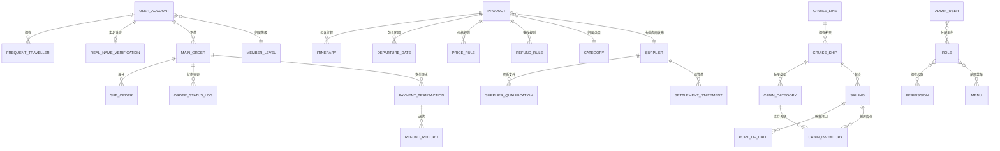

上述 ER 图展示了系统六大实体域之间的关联关系。用户域与订单域通过 `user_id` 建立一对多关系，一个用户可下达多个订单；产品域与订单域通过 `product_id` 与 `departure_id` 关联，主订单同时指向产品表与团期表，确保订单快照与产品实时数据的分离；邮轮域相对独立，通过 `cruise_booking` 表与主订单域桥接，实现邮轮订单的特殊字段扩展（舱房类型、值船状态、登船证等）；供应商域通过 `supplier_id` 与产品域、订单域关联，支撑开放平台的抽佣结算模式；平台管理实体独立于业务实体，通过 RBAC 模型控制后台操作权限，并通过 `tenant_id` 字段与所有业务表建立租户归属关系。

### 12.2 关键索引设计

#### 12.2.1 订单查询索引

订单表是系统中数据量增长最快、查询场景最复杂的表，索引设计直接影响订单管理、用户查询与财务对账的性能表现。

**按用户 ID + 状态查询** 是 C 端"我的订单"页面的核心查询模式，用户按全部 / 待付款 / 待出行 / 已完成 / 退款中等状态筛选订单。创建复合索引 `idx_main_order_user_status`（`user_id`, `order_status`, `created_at DESC`），将 `user_id` 置于最左列是因为该查询 always 包含用户过滤条件，状态作为第二列支持等值匹配，`created_at` 降序排列确保最新订单优先返回。该索引覆盖 90% 以上的 C 端订单查询场景。

**按供应商 ID + 日期查询** 是供应商后台"我的订单"列表与平台运营订单管理的核心查询模式。创建复合索引 `idx_main_order_supplier_date`（`supplier_id`, `created_at DESC`），支持供应商按时间范围查看归属订单，同时服务于平台按供应商维度的销售统计报表。

**按订单号唯一索引** `uk_main_order_no`（`order_no`）确保业务订单号的唯一性，支持用户与客服通过订单号精确定位订单。订单号采用字符串格式（如 `ORD-20250701-000001`），包含有序前缀，避免 UUID 类型主键的索引碎片化问题。

**支付流水索引** 创建复合索引 `idx_payment_channel_trade_no`（`channel_trade_no`）用于按渠道交易号查询，支撑支付回调处理中的幂等性校验；创建 `idx_payment_biz_order`（`biz_order_no`, `channel`）用于按业务订单号查询支付记录，支撑订单详情页的支付信息展示。

**退款记录索引** 创建复合索引 `idx_refund_payment`（`payment_id`, `status`）用于查询某笔支付下的全部退款记录，支撑退款金额累计校验。

#### 12.2.2 产品搜索索引

**按目的地 + 状态 + 上架时间查询** 是产品列表页的核心查询模式。创建复合索引 `idx_product_destination_status`（`destination_id`, `status`, `created_at DESC`），支持按目的地筛选在售产品并按上架时间排序。由于产品搜索常涉及多维度组合条件（目的地 + 出发城市 + 天数 + 价格区间），纯数据库索引难以覆盖全部组合场景。

**Meilisearch 外部索引** 产品搜索的核心能力由 Meilisearch 搜索引擎提供[^693^]。系统通过变更数据捕获（CDC）机制将产品表的变更实时同步至 Meilisearch 索引 `products_tenant_{tenant_id}`，索引文档包含产品 ID、名称、目的地、出发地、天数、价格、状态、标签等搜索字段。前端搜索请求直接发往 Meilisearch 服务，获取产品 ID 列表后回查 PostgreSQL 获取完整产品详情。Meilisearch 支持多属性搜索、分面过滤（faceting）、同义词配置与 typo 容错，搜索延迟低于 50 毫秒[^700^]。数据库索引作为精确查询与 Meilisearch 不可用时的降级保障。

### 12.3 分区与分表策略

#### 12.3.1 订单表按月分区

主订单表（`main_order`）是数据量最大的业务表。按日均 1{,}000 单、峰值 3{,}000 单估算，年数据量约 110 万条，3 年累计约 330 万条。考虑到每笔订单关联的状态流水、支付流水与子订单记录，总订单相关记录数可达千万级别。为控制单表数据量、优化历史数据查询性能，主订单表按 `created_at` 字段进行范围分区，每月一个分区（`main_order_2025_07`、`main_order_2025_08` 等）。

分区策略带来以下收益：历史月份的分区表变为只读，查询计划器可快速定位目标分区避免全表扫描；过期数据（如超过 3 年的订单）可通过 `DETACH PARTITION` 快速归档至冷存储，无需逐行删除；`VACUUM` 与 `ANALYZE` 操作可在单个分区上并行执行，减少维护窗口。分区键 `created_at` 需包含在按时间范围查询的所有复合索引的最左前缀中，确保分区裁剪（partition pruning）生效。

支付流水表（`payment_transaction`）按季度分区，每季度一个分区。支付流水数据量约为订单量的 1-2 倍（含定金、尾款与重试记录），季度分区在查询性能与分区管理复杂度之间取得平衡。

#### 12.3.2 多租户 RLS 策略

系统采用共享数据库 + `tenant_id` 字段隔离的多租户架构，中小客户共享同一数据库实例，大客户（数据量超 200 GB）可独立数据库实例[^923^]。在共享表模式下，所有业务表均包含 `tenant_id BIGINT NOT NULL` 字段，并创建以 `tenant_id` 为最左列的复合索引（如 `idx_product_tenant_destination` (`tenant_id`, `destination_id`, `status`)），确保查询时先过滤租户再执行条件匹配。

PostgreSQL 行级安全（RLS）策略为数据隔离提供数据库层保障。为每张业务表启用 RLS 并创建策略：

```sql
ALTER TABLE product ENABLE ROW LEVEL SECURITY;

CREATE POLICY tenant_isolation_policy ON product
    USING (tenant_id = current_setting('app.current_tenant_id')::BIGINT);
```

应用层在执行查询前通过 `SET LOCAL app.current_tenant_id = '{tenant_id}'` 设置会话级变量，PostgreSQL 自动过滤不属于当前租户的数据行。该机制作为应用层租户过滤的安全兜底，即使应用代码遗漏租户条件，数据库层仍阻止跨租户数据访问[^929^]。超级管理员角色（`bypass_rls` 属性）可查询全部租户数据，用于平台级运营分析。

Redis 缓存采用 `tenant:{id}:{entity}:{pk}` 的 Key 前缀格式实现多租户缓存隔离[^932^]；Meilisearch 为每个租户创建独立索引 `products_tenant_{tenant_id}`，避免搜索结果跨租户泄露。通过数据库 RLS、缓存前缀与搜索索引隔离的三层防护，确保多租户环境下的数据安全与合规。

## 13. 风险与实施建议

### 13.1 技术风险

#### 13.1.1 PostgreSQL 18+版本稳定性风险

本项目指定采用 PostgreSQL 18+ 作为主力关系型数据库。PostgreSQL 18 于 2025 年发布，官方通过 EDB 提供 Windows Server 2025/2022 的安装包[^697^]。作为新一代主要版本，PG 18 引入了若干底层存储引擎的改进，但新版本的早期采用普遍存在两类不确定性：一是与生态工具（ORM、连接池、备份工具）的兼容性尚需经过生产环境验证；二是特定工作负载下可能出现性能回归或尚未发现的缺陷。对于旅游预订系统而言，数据库是核心交易链路的关键依赖，任何稳定性问题都将直接影响订单创建和支付流程的可靠性。

缓解措施围绕"渐进验证、预留退路"展开。开发阶段建议以 PostgreSQL 17.x 作为基准环境，确保功能开发的连续性；在测试环境部署 PG 18 进行至少 4-6 周的稳定性压测，覆盖高并发写入、长事务、JSONB 操作等典型场景。生产上线时，保留 17.x 向 18 回退的数据迁移脚本，关键 schema 变更避免使用 18 独占特性，确保在极端情况下可在 24 小时内完成版本回退。

#### 13.1.2 Windows生产环境部署经验风险

系统全部服务部署于 Windows Server 平台，这是团队技术栈中相对薄弱的环节。尽管研究显示 Go 编译的二进制文件在 Windows 上运行无兼容性问题，且 Traefik、Consul、NATS、Meilisearch 等核心组件均提供 Windows 原生支持[^715^][^714^][^693^]，但生产环境的运维复杂度不容忽视：Windows 服务的注册与管理需要 WinSW 或 NSSM 等工具包装[^732^][^748^]；部分组件（如 Apache Pulsar 服务端、APISIX 网关）不支持原生 Windows，仅能通过 Docker Desktop 间接运行[^713^][^759^][^765^]；与 Linux 相比，Windows 上的容器网络性能和进程监控工具生态存在差距。

缓解措施需要从"预研深度"和"架构弹性"两个维度着手。项目启动后的前两周应完成 Windows Server 2025 上的全组件部署验证，产出标准化部署手册和自动化 PowerShell 脚本。对于不支持原生 Windows 的组件，优先选择替代方案（如以 Traefik 替代 APISIX、以 NATS 替代 Pulsar），仅在确无替代时才引入 Docker 层。同时，核心业务服务应保持纯 Go 二进制部署，避免对容器运行时的强依赖，确保在任何环境下均可独立启动和水平扩展。

#### 13.1.3 等保三级首次实施复杂度

等保三级（国家信息安全等级保护第三级）是本项目合规层面的硬性约束，涵盖身份鉴别、访问控制、安全审计、入侵防范、数据完整性与保密性、备份恢复等 30 余项控制点[^895^][^925^]。首次实施等保三级的团队往往低估其工作量：仅安全审计日志一项，就需要覆盖所有用户操作、留存期限不少于 6 个月并具备防篡改机制[^966^][^967^]；数据保密性要求对身份证号、护照号、手机号等字段实施 AES-256-GCM 加密存储[^940^]；入侵防范需要部署 WAF、HIDS 并建立异常行为检测规则[^941^][^945^]。对于日均 1000 单、并发 10{,}000 用户的旅游平台，这些安全控制点的工程实现量约占总开发工作量的 15%-20%。

缓解措施的核心是"合规与开发并行、分阶段达标"。在项目启动时即成立安全合规专项小组，负责等保测评机构的前期沟通和控制点拆解。第一阶段（MVP 阶段）优先完成基础合规项：密码策略、登录失败处理、RBAC 权限模型、传输加密（TLS 1.3）、字段级加密和审计日志框架。第二阶段（一期）补充完善：多因素认证、WAF 部署、异地备份、渗透测试整改。第三阶段（二期）建立持续合规机制：自动化安全扫描、日志审计分析、漏洞响应流程。这种分阶段策略避免了上线前集中整改的风险，也使每个阶段都有明确的合规里程碑。

### 13.2 业务风险

#### 13.2.1 供应商入驻初期供给不足

本系统采用开放平台模式，依赖第三方供应商提供旅游产品库存。平台上线初期面临"冷启动"困境：没有供应商则缺乏产品供给，没有产品流量则难以吸引供应商入驻。这一风险在产品管理维度研究中被多次提及——供应商的资质审核、培训赋能、产品上架流程均需要平台运营资源的持续投入[^61^]。如果首批供应商数量不足或产品质量参差不齐，将直接影响 C 端用户的购买转化和平台口碑。

缓解措施需要"自营+平台"双轨并行。系统上线前 2 个月启动供应商招募，通过行业渠道（旅行社协会、B2B 旅游展会）锁定 10-15 家核心供应商作为种子合作伙伴，完成入驻审核和系统培训。MVP 阶段同步建立自营产品团队，负责首批热门线路的产品录入和质量把控，确保上线时至少有 50-80 条优质产品在架。供应商开放平台在一期交付，届时开放自助入驻入口，配套供应商操作手册和视频教程，降低新供应商的学习成本。同时，设计阶梯式佣金激励政策：前 3 个月入驻的供应商享受降低佣金率，前 6 个月达成一定销售额的供应商给予流量加权推荐。

#### 13.2.2 邮轮业务数据维护工作量大

邮轮业务的数据模型远比传统旅游产品复杂。一艘现代邮轮拥有超过 20 层甲板、2{,}000+ 间舱房、数十个公共设施，每次航行涉及航次、停靠港口、舱房类型、附加服务包等多维数据的维护[^449^]。舱房管理需要同时维护内舱房、海景房、阳台房、套房四种类型各自的面积、楼层范围、床型配置、设施清单和可售数量[^501^][^512^]；航次管理需要维护航线停靠序列、到港/离港时间、时区转换； pricing 层面还需处理第一/第二人全价与第三/第四人折扣的复杂计价逻辑。

缓解措施侧重于"自助化+模板化"。在供应商开放平台中为邮轮供应商提供独立的数据维护工作台，支持舱房信息批量导入（Excel 模板）、航次日历批量生成、价格体系一键复制等功能，将单条航次的数据录入时间从 2-3 小时压缩至 30 分钟以内。同时，建立邮轮基础数据库（船只信息、航线模板、港口字典），供应商只需在此基础上进行参数化配置，无需从零录入全部数据。运营团队配备专职邮轮数据审核人员，对供应商提交的数据进行质量检查和标准化校验。

### 13.3 实施阶段建议

基于上述风险分析和技术依赖关系，建议采用三阶段渐进式交付路径。以下风险矩阵汇总了各阶段需重点管控的技术与业务风险项。

| 风险编号 | 风险类别 | 风险描述 | 影响阶段 | 风险等级 | 缓解措施 |
|:--------:|:--------:|:---------|:--------:|:--------:|:---------|
| T01 | 技术 | PostgreSQL 18+ 为新版本，存在未知 Bug 和生态兼容性风险 | MVP | 中 | 以 17.x 为开发基准，测试环境验证 18 稳定性 4-6 周，保留回退脚本[^697^] |
| T02 | 技术 | Windows 生产环境部署经验不足，部分云原生组件不支持原生 Windows | MVP | 中 | 启动期 2 周内完成全组件部署验证，核心服务保持纯 Go 二进制[^759^][^765^] |
| T03 | 技术 | 等保三级首次实施，安全控制点工程量大（约占开发量 15%-20%） | 全阶段 | 高 | 合规与开发并行，分三阶段达标，成立安全合规专项组[^895^][^925^] |
| T04 | 技术 | 日均 1000 单/并发 10{,}000 人，高峰期 QPS 可能达到 10{,}000+ | MVP | 高 | Gin 单体+水平扩展，核心业务优先拆分，Redis 缓存热点数据 |
| T05 | 技术 | 三渠道支付（支付宝/微信/银联）API 差异大，签名验签机制各异 | MVP | 中 | 使用 go-pay 聚合 SDK 统一接口，抽象支付网关层，完善幂等处理[^544^][^547^] |
| B01 | 业务 | 供应商入驻初期供给不足，平台冷启动产品匮乏 | MVP | 高 | 自营+平台双轨并行，上线前锁定 10-15 家种子供应商，确保 50-80 条优质产品 |
| B02 | 业务 | 邮轮业务数据维护工作量巨大（舱房/航次/港口/定价多维数据） | 二期 | 中 | 供应商自助维护+Excel 批量导入，建立邮轮基础数据库和标准化模板[^501^] |
| B03 | 业务 | 库存管理不当可能导致超售，影响用户体验 | MVP | 高 | 库存预扣+超时释放机制，多渠道库存同步，留位管理[^58^][^64^] |
| B04 | 业务 | 退改规则复杂（阶梯费率/已发生费用），易引发纠纷 | 一期 | 高 | 退改规则产品化配置，系统自动计算退款金额，分级审批[^341^][^347^] |

风险矩阵涵盖了从 MVP 到二期全生命周期的 9 项关键风险。其中 T03（等保合规）和 B01（供应商冷启动）被评定为贯穿性高风险，需要在项目启动首日即分配专门资源跟进。技术风险 T01 和 T02 的风险等级为"中"，主要源于环境约束而非设计缺陷，通过充分的预研验证可有效降级。业务风险 B02（邮轮数据维护）被安排在二期处理，原因是邮轮模块本身具有独立性，不会阻塞主业务的上线节奏。

#### 13.3.1 MVP阶段（第1-3个月）

MVP 阶段的核心目标是验证"境内游跟团游"的完整交易闭环，建立可运行的技术基线和基础运营能力。本阶段交付范围包括：C 端产品搜索/列表/详情页、团期日历与价格选择、出游人信息填写、订单创建与支付（支持支付宝和微信支付）、用户注册登录与个人中心、后台产品管理（基础信息/行程/价格/团期/库存）、订单全流程管理、基础 RBAC 权限体系。

此阶段采用 Gin 单体架构部署于 Windows Server，PostgreSQL 17.x 作为开发基准，Redis 用于会话管理和热点数据缓存。小程序端仅覆盖微信小程序，Web 端基于 Nuxt.js 3 实现 SSR。支付渠道优先接入支付宝和微信，使用 go-pay/gopay 聚合 SDK 统一接口层[^544^][^547^]，配合沙箱环境完成端到端联调。

MVP 阶段的关键成功指标包括：系统能够支撑日均 300 单的处理量（为目标的 30%，覆盖上线初期流量），产品列表页 P99 响应时间低于 200ms，下单流程转化率不低于行业平均的 3%。上线前需完成等保基础合规项的部署：密码策略、TLS 1.3 传输加密、审计日志框架、字段级加密。

#### 13.3.2 一期（第4-6个月）

一期在 MVP 基础上扩展出境游业务和供应商开放平台。出境游模块新增护照信息采集与有效期校验（覆盖回程后 6 个月要求[^162^][^163^]）、签证服务交易闭环（在线办理、进度跟踪、材料审核）、出境游特有的附加服务（WiFi 租赁、境外保险）。供应商开放平台作为本期重点，提供供应商自助入驻申请、资质审核、产品发布与管理、订单处理、结算对账等功能，平台按订单金额抽取佣金（Q4 决策）。

技术层面，一期开始将订单服务和支付服务从单体中拆分为独立部署单元，为后续微服务化奠定基础。消息队列（NATS）正式接入，用于异步处理支付通知、订单状态变更推送和短信发送[^714^]。搜索功能从数据库查询迁移至 Meilisearch，产品信息通过增量同步机制保持索引更新[^693^]。小程序端新增抖音小程序，基于 Uni-App 的跨端能力实现代码复用。

一期交付后，平台应支撑日均 600-800 单的处理量，供应商数量达到 30-50 家，覆盖 5-8 个热门出境目的地。等保合规在一期结束时完成 WAF 部署、异地备份策略和多因素认证的上线。

#### 13.3.3 二期（第7-9个月）

二期聚焦邮轮游完整功能和平台运营能力的全面提升。邮轮模块作为独立服务（独立数据库 Schema，通过 API 与主订单系统集成），覆盖航次搜索、舱房类型选择与对比、值船流程管理与船票分发、邮轮特有的退改规则体系[^54^][^258^][^261^]。值船流程管理包含值船流程说明文档上传、船票上传与下载、值船提醒通知发送，以及舱房号分配后的自动化通知触达。

邮轮基础信息管理在二期新增"是否需要在线值船"和"是否需要手动上传船票"两个配置字段，运营人员按邮轮维度配置后，C端订单详情页根据配置动态展示值船指南入口和船票下载入口。对于需要在线值船的邮轮，后台上传值船流程说明文档（PDF），游客在订单详情页查看并下载，按文档指引自行完成在线值船。对于需要手动上传船票的邮轮，运营人员在后台分配舱房号后上传船票PDF，系统自动通知游客下载[^54^][^258^][^261^]。

值船提醒通知功能覆盖三个自动触发节点：舱房号分配后即时提醒、出发前30天提醒、出发前7天最后提醒。通知渠道为短信+站内信双通道，通知内容包含舱房号信息、值船截止时间、值船指南文档链接和船票下载链接。运营人员可在后台查看提醒发送记录和游客已读/下载状态，支持手动触发即时提醒[^54^]。

平台能力方面，二期新增支付宝小程序端、数据分析与报表系统（核心运营指标看板、转化率漏斗、RFM 用户分析）、营销系统（优惠券管理、满减活动配置、Banner 运营位）。数据分析模块接入 Apache ECharts 实现可视化，支持按产品/目的地/供应商/时间维度的多维度分析。

技术架构在二期完成向微服务模式的过渡：产品服务、订单服务、支付服务、用户服务、邮轮服务作为独立部署单元，通过 Consul 实现服务注册与发现[^715^][^716^]，Traefik 作为 API 网关统一入口[^870^]。监控体系全面接入 Prometheus + Grafana + Jaeger[^728^][^737^][^729^]，覆盖全链路追踪和性能告警。二期结束时，系统应达到日均 1000 单/并发 10{,}000 人的设计目标，等保三级测评正式通过，平台具备独立运营和持续迭代的能力。

以下 Mermaid 流程图展示三阶段实施路径的依赖关系：

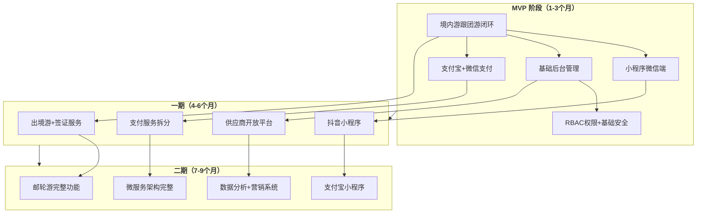

三阶段的划分遵循"风险前置、价值优先、依赖解耦"的原则。MVP 阶段的境内游闭环是验证商业模式和系统架构的最小可行集合；一期的出境游和供应商平台扩展业务覆盖面和供给能力；二期的邮轮和数据分析模块则面向差异化竞争和精细化运营。每个阶段均有独立的上线里程碑和可量化的成功指标，支持在每阶段结束后根据市场反馈调整后续优先级。

