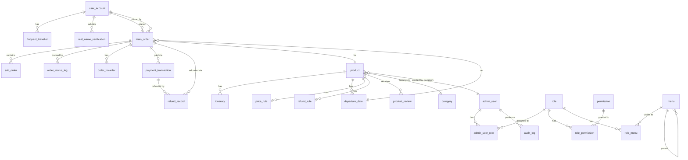
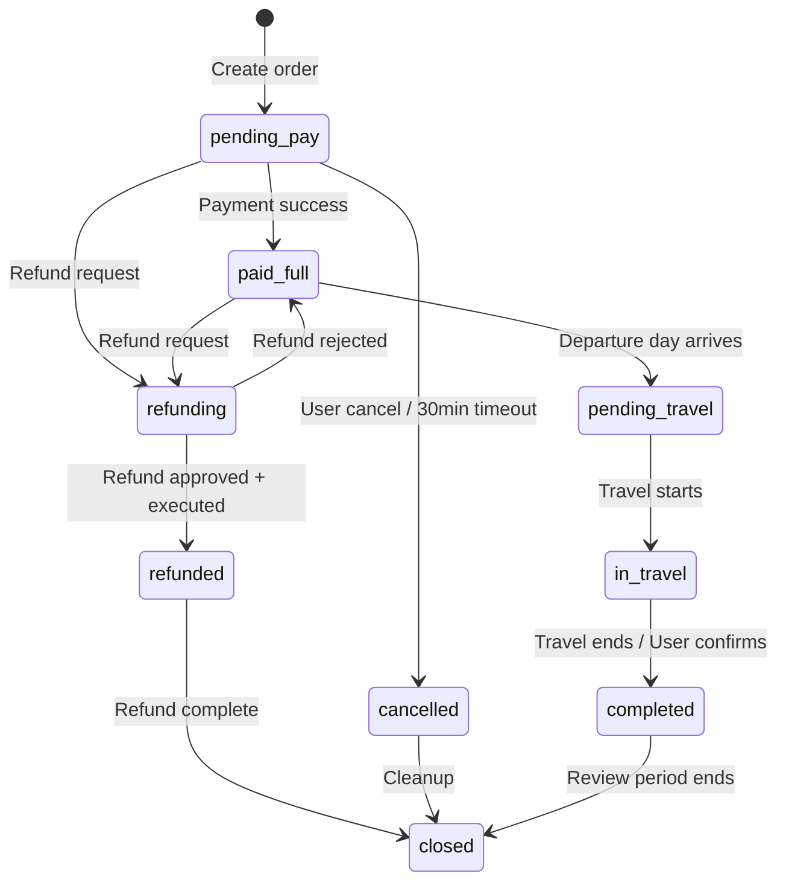
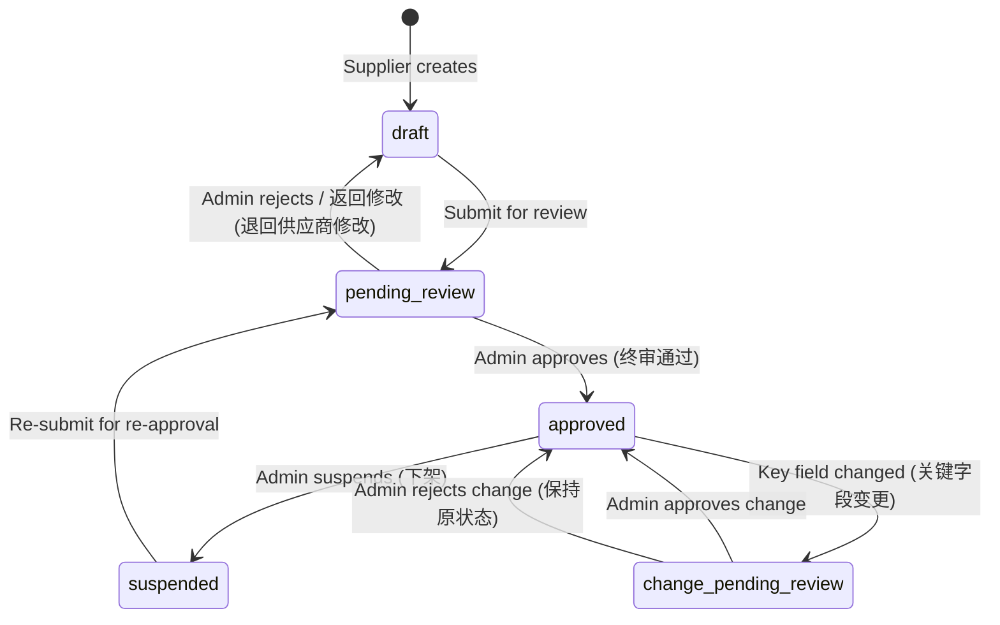

# Data Model: 境内跟团游 MVP

**Date**: 2026-06-19

## Entity Relationship Diagram



## Core Entities

### User Domain

#### user_account

| Field | Type | Constraints | Description |
|-------|------|-------------|-------------|
| id | BIGSERIAL | PK | User ID |
| phone | VARCHAR(20) | UNIQUE, NOT NULL | Phone number (login identifier) |
| password_hash | VARCHAR(255) | | Argon2id hash (nullable for WeChat-only users) |
| nickname | VARCHAR(50) | NOT NULL | Display name |
| avatar_url | VARCHAR(500) | | Profile image URL |
| real_name | TEXT | | Real name (AES-256-GCM encrypted) |
| id_card_no | TEXT | | ID card number (AES-256-GCM encrypted) |
| real_name_status | VARCHAR(20) | NOT NULL DEFAULT 'unverified' | unverified/pending/verified/rejected |
| member_level | INTEGER | NOT NULL DEFAULT 1 | Member level (1-5) |
| status | VARCHAR(20) | NOT NULL DEFAULT 'active' | active/frozen/deleted |
| wechat_openid | VARCHAR(100) | UNIQUE | WeChat OpenID |
| wechat_unionid | VARCHAR(100) | | WeChat UnionID |
| sms_code | VARCHAR(6) | | Current SMS verification code |
| sms_code_expires_at | TIMESTAMP | | SMS code expiration time |
| sms_send_count_today | INTEGER | NOT NULL DEFAULT 0 | SMS send count today (max 10/day) |
| login_fail_count | INTEGER | NOT NULL DEFAULT 0 | Consecutive login failures |
| locked_until | TIMESTAMP | | Account lock expiration |
| created_at | TIMESTAMP | NOT NULL DEFAULT NOW() | Registration time |
| updated_at | TIMESTAMP | NOT NULL DEFAULT NOW() | Last update |

**Indexes**: idx_user_phone (phone), idx_user_wechat (wechat_openid)

#### real_name_verification

| Field | Type | Constraints | Description |
|-------|------|-------------|-------------|
| id | BIGSERIAL | PK | Verification ID |
| user_id | BIGINT | FK -> user_account.id, NOT NULL | User reference |
| real_name | TEXT | NOT NULL | Submitted name (AES-256-GCM encrypted) |
| id_card_no | TEXT | NOT NULL | Submitted ID card (AES-256-GCM encrypted) |
| status | VARCHAR(20) | NOT NULL DEFAULT 'pending' | pending/verified/rejected |
| reject_reason | VARCHAR(500) | | Rejection reason |
| verified_at | TIMESTAMP | | Verification time |
| created_at | TIMESTAMP | NOT NULL DEFAULT NOW() | Submission time |

**Indexes**: idx_rnv_user (user_id)

#### frequent_traveller

| Field | Type | Constraints | Description |
|-------|------|-------------|-------------|
| id | BIGSERIAL | PK | Traveller ID |
| user_id | BIGINT | FK -> user_account.id, NOT NULL | Owner user |
| real_name | TEXT | NOT NULL | Name (AES-256-GCM encrypted) |
| id_card_no | TEXT | NOT NULL | ID card (AES-256-GCM encrypted) |
| phone | VARCHAR(20) | | Phone number |
| birth_date | DATE | | Birth date |
| gender | VARCHAR(10) | | male/female |
| is_default | BOOLEAN | NOT NULL DEFAULT false | Default traveller flag |
| created_at | TIMESTAMP | NOT NULL DEFAULT NOW() | Created time |
| updated_at | TIMESTAMP | NOT NULL DEFAULT NOW() | Updated time |

**Indexes**: idx_ft_user (user_id)

**Constraint**: Max 20 travellers per user (enforced at application layer).

### Product Domain

#### category

| Field | Type | Constraints | Description |
|-------|------|-------------|-------------|
| id | BIGSERIAL | PK | Category ID |
| name | VARCHAR(100) | NOT NULL | Category name |
| parent_id | BIGINT | FK -> category.id | Parent category (null for root) |
| icon_url | VARCHAR(500) | | Icon image URL |
| sort_order | INTEGER | NOT NULL DEFAULT 0 | Display order |
| status | VARCHAR(20) | NOT NULL DEFAULT 'active' | active/hidden |
| created_at | TIMESTAMP | NOT NULL DEFAULT NOW() | Created time |

#### product

| Field | Type | Constraints | Description |
|-------|------|-------------|-------------|
| id | BIGSERIAL | PK | Product ID |
| product_no | VARCHAR(30) | UNIQUE, NOT NULL | Product number (DOM-{cat}-{YYYYMMDD}-{seq}) |
| product_name | VARCHAR(200) | NOT NULL | Product name |
| category_id | BIGINT | FK -> category.id, NOT NULL | Category |
| product_type | VARCHAR(30) | NOT NULL DEFAULT 'group_tour' | Product type |
| origin_city | VARCHAR(50) | NOT NULL | Departure city |
| destination_cities | JSONB | NOT NULL | Destination city list |
| destination_tags | JSONB | | Destination tags for search |
| days | INTEGER | NOT NULL | Total days |
| nights | INTEGER | NOT NULL | Total nights |
| transport_mode | VARCHAR(50) | | Transport mode (flight/train/bus) |
| min_group_size | INTEGER | NOT NULL DEFAULT 2 | Minimum group size |
| max_group_size | INTEGER | NOT NULL DEFAULT 50 | Maximum group size |
| product_grade | VARCHAR(20) | | Product grade (standard/comfort/luxury) |
| cover_image | VARCHAR(500) | | Cover image URL |
| images | JSONB | | Image URL list |
| summary | VARCHAR(500) | | Short description |
| description | TEXT | | Full description |
| fee_included | TEXT | | Included fees description |
| fee_excluded | TEXT | | Excluded fees description |
| booking_notes | TEXT | | Booking notes/precautions |
| status | VARCHAR(30) | NOT NULL DEFAULT 'draft' | draft/pending_review/approved/suspended/change_pending_review |
| reject_reason | VARCHAR(500) | | Review rejection reason |
| supplier_id | BIGINT | FK -> admin_user.id | Supplier who created the product |
| commission_rate | DECIMAL(5,4) | DEFAULT 0 | Platform commission rate |
| view_count | INTEGER | NOT NULL DEFAULT 0 | View counter |
| order_count | INTEGER | NOT NULL DEFAULT 0 | Order counter |
| satisfaction_rate | DECIMAL(5,2) | | Average satisfaction score |
| created_at | TIMESTAMP | NOT NULL DEFAULT NOW() | Created time |
| updated_at | TIMESTAMP | NOT NULL DEFAULT NOW() | Updated time |

**Indexes**: idx_product_status_created (status, created_at DESC), idx_product_category (category_id), idx_product_supplier (supplier_id), idx_product_destination (destination_cities GIN)

#### itinerary

| Field | Type | Constraints | Description |
|-------|------|-------------|-------------|
| id | BIGSERIAL | PK | Itinerary ID |
| product_id | BIGINT | FK -> product.id, NOT NULL | Product reference |
| day_no | INTEGER | NOT NULL | Day number (1-based) |
| title | VARCHAR(200) | NOT NULL | Day title |
| description | TEXT | | Day description |
| meals | JSONB | | Meal plan {breakfast, lunch, dinner} booleans |
| hotel | VARCHAR(200) | | Hotel name/type |
| transport | VARCHAR(100) | | Transport details |
| spots | JSONB | | Spot list [{name, description, duration, image}] |
| images | JSONB | | Day images |
| created_at | TIMESTAMP | NOT NULL DEFAULT NOW() | Created time |

**Indexes**: idx_itinerary_product_day (product_id, day_no UNIQUE)

#### departure_date

| Field | Type | Constraints | Description |
|-------|------|-------------|-------------|
| id | BIGSERIAL | PK | Departure ID |
| product_id | BIGINT | FK -> product.id, NOT NULL | Product reference |
| departure_date | DATE | NOT NULL | Departure date |
| return_date | DATE | NOT NULL | Return date |
| adult_price | INTEGER | NOT NULL | Adult price in cents |
| child_price | INTEGER | NOT NULL | Child price in cents |
| infant_price | INTEGER | NOT NULL DEFAULT 0 | Infant price in cents |
| single_supplement | INTEGER | NOT NULL DEFAULT 0 | Single room supplement in cents |
| total_stock | INTEGER | NOT NULL | Total available seats |
| sold_count | INTEGER | NOT NULL DEFAULT 0 | Confirmed sold seats |
| locked_count | INTEGER | NOT NULL DEFAULT 0 | Locked (pending payment) seats |
| cutoff_days | INTEGER | NOT NULL DEFAULT 1 | Booking cutoff (days before departure) |
| status | VARCHAR(20) | NOT NULL DEFAULT 'open' | open/full/closed/cancelled |
| created_at | TIMESTAMP | NOT NULL DEFAULT NOW() | Created time |
| updated_at | TIMESTAMP | NOT NULL DEFAULT NOW() | Updated time |

**Indexes**: idx_departure_product_date (product_id, departure_date)

**Constraint**: UNIQUE(product_id, departure_date) - one departure per product per day.

**Derived field**: `available_stock = total_stock - sold_count - locked_count`

#### price_rule

| Field | Type | Constraints | Description |
|-------|------|-------------|-------------|
| id | BIGSERIAL | PK | Rule ID |
| product_id | BIGINT | FK -> product.id, NOT NULL | Product reference |
| date_from | DATE | NOT NULL | Effective start date |
| date_to | DATE | NOT NULL | Effective end date |
| adult_price | INTEGER | | Adult price in cents (null = use departure default) |
| child_price | INTEGER | | Child price in cents |
| infant_price | INTEGER | | Infant price in cents |
| single_supplement | INTEGER | | Single supplement in cents |
| price_type | VARCHAR(20) | NOT NULL DEFAULT 'standard' | standard/early_bird/promotion |
| priority | INTEGER | NOT NULL DEFAULT 0 | Higher priority overrides lower |
| created_at | TIMESTAMP | NOT NULL DEFAULT NOW() | Created time |

**Indexes**: idx_price_rule_product (product_id, date_from, date_to)

#### refund_rule (Cancellation Rule)

| Field | Type | Constraints | Description |
|-------|------|-------------|-------------|
| id | BIGSERIAL | PK | Rule ID |
| product_id | BIGINT | FK -> product.id | Product reference (null for global template) |
| rule_name | VARCHAR(100) | NOT NULL | Rule name |
| days_before_min | INTEGER | NOT NULL | Minimum days before departure |
| days_before_max | INTEGER | | Maximum days before departure (null = no upper bound) |
| refund_percentage | DECIMAL(5,2) | NOT NULL | Refund percentage (0.00-100.00) |
| description | VARCHAR(500) | | Human-readable description |
| is_template | BOOLEAN | NOT NULL DEFAULT false | Template flag for reuse |
| created_at | TIMESTAMP | NOT NULL DEFAULT NOW() | Created time |

**Indexes**: idx_refund_rule_product (product_id)

#### product_review

| Field | Type | Constraints | Description |
|-------|------|-------------|-------------|
| id | BIGSERIAL | PK | Review ID |
| product_id | BIGINT | FK -> product.id, NOT NULL | Product reference |
| user_id | BIGINT | FK -> user_account.id, NOT NULL | Reviewer |
| order_id | BIGINT | FK -> main_order.id, NOT NULL | Associated order |
| rating | INTEGER | NOT NULL | Overall rating (1-5) |
| content | TEXT | | Review text |
| images | JSONB | | Review images |
| is_anonymous | BOOLEAN | NOT NULL DEFAULT false | Anonymous flag |
| created_at | TIMESTAMP | NOT NULL DEFAULT NOW() | Created time |

**Indexes**: idx_review_product (product_id, created_at DESC), uk_review_order (order_id) UNIQUE

### Order Domain

#### main_order

| Field | Type | Constraints | Description |
|-------|------|-------------|-------------|
| id | BIGSERIAL | PK | Order ID |
| order_no | VARCHAR(30) | UNIQUE, NOT NULL | Order number (ORD-YYYYMMDD-HHMMSS-XXXX) |
| user_id | BIGINT | FK -> user_account.id, NOT NULL | Buyer |
| product_id | BIGINT | FK -> product.id, NOT NULL | Product |
| departure_id | BIGINT | FK -> departure_date.id, NOT NULL | Departure date |
| order_status | VARCHAR(30) | NOT NULL DEFAULT 'pending_pay' | Order status (see state machine) |
| payment_status | VARCHAR(30) | NOT NULL DEFAULT 'unpaid' | unpaid/partial/paid/refunded |
| total_amount | INTEGER | NOT NULL | Total amount in cents |
| discount_amount | INTEGER | NOT NULL DEFAULT 0 | Discount amount in cents |
| payable_amount | INTEGER | NOT NULL | Payable amount in cents |
| adult_count | INTEGER | NOT NULL | Adult passenger count |
| child_count | INTEGER | NOT NULL DEFAULT 0 | Child passenger count |
| infant_count | INTEGER | NOT NULL DEFAULT 0 | Infant passenger count |
| single_supplement_amount | INTEGER | NOT NULL DEFAULT 0 | Single supplement total in cents |
| addon_amount | INTEGER | NOT NULL DEFAULT 0 | Addon service total in cents |
| contact_name | VARCHAR(100) | NOT NULL | Contact person name |
| contact_phone | VARCHAR(20) | NOT NULL | Contact phone |
| channel | VARCHAR(20) | NOT NULL DEFAULT 'web' | Order channel (web/miniapp/admin) |
| remark | VARCHAR(500) | | User remark |
| paid_at | TIMESTAMP | | Payment completion time |
| departed_at | TIMESTAMP | | Departure time |
| completed_at | TIMESTAMP | | Completion time |
| cancelled_at | TIMESTAMP | | Cancellation time |
| cancel_reason | VARCHAR(500) | | Cancellation reason |
| created_at | TIMESTAMP | NOT NULL DEFAULT NOW() | Order creation time |
| updated_at | TIMESTAMP | NOT NULL DEFAULT NOW() | Last update |

**Indexes**: uk_order_no (order_no), idx_order_user_status (user_id, order_status, created_at DESC), idx_order_product (product_id), idx_order_departure (departure_id), idx_order_created (created_at DESC)

**Order status values**: pending_pay, paid_full, pending_travel, in_travel, completed, cancelled, refunding, refunded, closed

**状态映射表（内部状态 → 用户可见状态）**：

| 内部状态（snake_case） | 用户可见状态 | 说明 |
|:---|:---|:---|
| pending_pay | 待付款 | 订单已创建，等待支付，30分钟倒计时中 |
| paid_full | 待出行 | 全额支付完成，等待出发日期 |
| pending_travel | 待出行 | 出发日期前的准备阶段（与 paid_full 合并展示给用户） |
| in_travel | 出行中 | 行程进行中 |
| completed | 已完成 | 行程结束 |
| cancelled | 已取消 | 超时未付或用户主动取消 |
| refunding | 退款中 | 退款申请审核中或退款执行中 |
| refunded | 已退款 | 退款已完成，款项已退回 |
| closed | 已关闭 | 订单关闭（退款后或特殊处理） |

**用户可见状态 Tab**（C端订单列表）：全部 / 待付款 / 待出行(paid_full+pending_travel) / 退款中(refunding) / 已完成(completed) / 已取消(cancelled)

**内部状态常量命名规范**：所有状态值统一使用 snake_case 小写格式，Go 代码中定义为常量：
```go
const (
    OrderStatusPendingPay     = "pending_pay"
    OrderStatusPaidFull       = "paid_full"
    OrderStatusPendingTravel  = "pending_travel"
    OrderStatusInTravel       = "in_travel"
    OrderStatusCompleted      = "completed"
    OrderStatusCancelled      = "cancelled"
    OrderStatusRefunding      = "refunding"
    OrderStatusRefunded       = "refunded"
    OrderStatusClosed         = "closed"
)
```

#### sub_order

| Field | Type | Constraints | Description |
|-------|------|-------------|-------------|
| id | BIGSERIAL | PK | Sub-order ID |
| main_order_id | BIGINT | FK -> main_order.id, NOT NULL | Parent order |
| sub_order_no | VARCHAR(30) | UNIQUE, NOT NULL | Sub-order number |
| resource_type | VARCHAR(30) | NOT NULL | Resource type (insurance/transfer) |
| resource_id | BIGINT | | Resource reference ID |
| resource_name | VARCHAR(200) | NOT NULL | Resource name |
| supplier_id | BIGINT | FK -> admin_user.id | Supplier |
| status | VARCHAR(20) | NOT NULL DEFAULT 'pending' | pending/confirmed/cancelled |
| amount | INTEGER | NOT NULL | Amount in cents |
| commission_rate | DECIMAL(5,4) | DEFAULT 0 | Commission rate |
| created_at | TIMESTAMP | NOT NULL DEFAULT NOW() | Created time |

**Indexes**: idx_sub_order_main (main_order_id)

#### order_status_log

| Field | Type | Constraints | Description |
|-------|------|-------------|-------------|
| id | BIGSERIAL | PK | Log ID |
| order_id | BIGINT | FK -> main_order.id, NOT NULL | Order reference |
| from_status | VARCHAR(30) | NOT NULL | Previous status |
| to_status | VARCHAR(30) | NOT NULL | New status |
| operator_type | VARCHAR(20) | NOT NULL | system/user/admin |
| operator_id | BIGINT | | Operator ID (null for system) |
| reason | VARCHAR(500) | | Change reason |
| created_at | TIMESTAMP | NOT NULL DEFAULT NOW() | Log time |

**Indexes**: idx_osl_order (order_id, created_at DESC)

#### order_traveller

| Field | Type | Constraints | Description |
|-------|------|-------------|-------------|
| id | BIGSERIAL | PK | Traveller record ID |
| order_id | BIGINT | FK -> main_order.id, NOT NULL | Order reference |
| real_name | TEXT | NOT NULL | Name (AES-256-GCM encrypted) |
| id_card_no | TEXT | NOT NULL | ID card (AES-256-GCM encrypted) |
| phone | VARCHAR(20) | | Phone number |
| birth_date | DATE | | Birth date |
| gender | VARCHAR(10) | | male/female |
| is_child | BOOLEAN | NOT NULL DEFAULT false | Child flag |
| is_infant | BOOLEAN | NOT NULL DEFAULT false | Infant flag |
| linked_adult_id | BIGINT | FK -> order_traveller.id | Linked adult (for children/infants) |
| created_at | TIMESTAMP | NOT NULL DEFAULT NOW() | Created time |

**Indexes**: idx_ot_order (order_id)

### Payment Domain

#### payment_transaction

| Field | Type | Constraints | Description |
|-------|------|-------------|-------------|
| id | BIGSERIAL | PK | Transaction ID |
| order_id | BIGINT | FK -> main_order.id, NOT NULL | Order reference |
| payment_no | VARCHAR(30) | UNIQUE, NOT NULL | Internal payment number |
| channel | VARCHAR(20) | NOT NULL | Payment channel (alipay/wechat/unionpay) |
| method | VARCHAR(30) | NOT NULL | Payment method (native/jsapi/h5/wap) |
| amount | INTEGER | NOT NULL | Amount in cents |
| status | VARCHAR(20) | NOT NULL DEFAULT 'created' | created/paying/paid/failed/closed/refunded |
| channel_trade_no | VARCHAR(100) | | Channel transaction number |
| paid_at | TIMESTAMP | | Payment time |
| expire_at | TIMESTAMP | NOT NULL | Payment expiration (created_at + 30min) |
| notify_url | VARCHAR(500) | NOT NULL | Callback URL |
| extra_params | JSONB | | Channel-specific parameters |
| created_at | TIMESTAMP | NOT NULL DEFAULT NOW() | Created time |
| updated_at | TIMESTAMP | NOT NULL DEFAULT NOW() | Updated time |

**Indexes**: uk_payment_no (payment_no), idx_payment_order (order_id, channel)

**Constraint**: UNIQUE(order_id, channel, attempt_no) for idempotency.

#### refund_record

| Field | Type | Constraints | Description |
|-------|------|-------------|-------------|
| id | BIGSERIAL | PK | Refund ID |
| order_id | BIGINT | FK -> main_order.id, NOT NULL | Order reference |
| payment_id | BIGINT | FK -> payment_transaction.id, NOT NULL | Original payment |
| refund_no | VARCHAR(30) | UNIQUE, NOT NULL | Internal refund number |
| refund_amount | INTEGER | NOT NULL | Refund amount in cents |
| refund_reason | VARCHAR(500) | NOT NULL | Refund reason |
| refund_type | VARCHAR(20) | NOT NULL | full/partial |
| status | VARCHAR(20) | NOT NULL DEFAULT 'pending' | pending/approved/processing/success/failed |
| approval_level | VARCHAR(30) | NOT NULL | operator/finance_director/director |
| approved_by | BIGINT | FK -> admin_user.id | Approver |
| approved_at | TIMESTAMP | | Approval time |
| channel_refund_no | VARCHAR(100) | | Channel refund number |
| completed_at | TIMESTAMP | | Refund completion time |
| created_at | TIMESTAMP | NOT NULL DEFAULT NOW() | Created time |
| updated_at | TIMESTAMP | NOT NULL DEFAULT NOW() | Updated time |

**Indexes**: uk_refund_no (refund_no), idx_refund_order (order_id), idx_refund_status (status)

### Admin Domain

#### admin_user

| Field | Type | Constraints | Description |
|-------|------|-------------|-------------|
| id | BIGSERIAL | PK | Admin user ID |
| username | VARCHAR(50) | UNIQUE, NOT NULL | Login username |
| password_hash | VARCHAR(255) | NOT NULL | Argon2id hash |
| real_name | VARCHAR(100) | NOT NULL | Real name |
| phone | VARCHAR(20) | | Phone number |
| email | VARCHAR(200) | | Email address |
| supplier_id | BIGINT | | Associated supplier (null for platform users) |
| status | VARCHAR(20) | NOT NULL DEFAULT 'active' | active/locked/disabled |
| must_change_password | BOOLEAN | NOT NULL DEFAULT true | Force password change on first login |
| last_login_at | TIMESTAMP | | Last login time |
| created_at | TIMESTAMP | NOT NULL DEFAULT NOW() | Created time |
| updated_at | TIMESTAMP | NOT NULL DEFAULT NOW() | Updated time |

**Indexes**: idx_admin_username (username), idx_admin_supplier (supplier_id)

#### role

| Field | Type | Constraints | Description |
|-------|------|-------------|-------------|
| id | BIGSERIAL | PK | Role ID |
| role_name | VARCHAR(50) | UNIQUE, NOT NULL | Role display name |
| role_code | VARCHAR(50) | UNIQUE, NOT NULL | Role code (e.g., admin, operator, supplier) |
| description | VARCHAR(200) | | Role description |
| is_system | BOOLEAN | NOT NULL DEFAULT false | System role (cannot delete) |
| status | VARCHAR(20) | NOT NULL DEFAULT 'active' | active/disabled |
| created_at | TIMESTAMP | NOT NULL DEFAULT NOW() | Created time |

#### permission

| Field | Type | Constraints | Description |
|-------|------|-------------|-------------|
| id | BIGSERIAL | PK | Permission ID |
| permission_name | VARCHAR(100) | NOT NULL | Permission name |
| permission_code | VARCHAR(100) | UNIQUE, NOT NULL | Permission code (e.g., product:create) |
| permission_type | VARCHAR(20) | NOT NULL | menu/button/api/data |
| parent_id | BIGINT | FK -> permission.id | Parent permission |
| resource_path | VARCHAR(200) | | API path (for api type) |
| http_method | VARCHAR(10) | | HTTP method (for api type) |
| description | VARCHAR(200) | | Description |
| created_at | TIMESTAMP | NOT NULL DEFAULT NOW() | Created time |

#### menu

| Field | Type | Constraints | Description |
|-------|------|-------------|-------------|
| id | BIGSERIAL | PK | Menu ID |
| menu_name | VARCHAR(100) | NOT NULL | Menu display name |
| menu_path | VARCHAR(200) | | Route path |
| component_name | VARCHAR(200) | | Frontend component path |
| icon | VARCHAR(100) | | Menu icon |
| parent_id | BIGINT | FK -> menu.id | Parent menu (null for root) |
| sort_order | INTEGER | NOT NULL DEFAULT 0 | Display order |
| permission_code | VARCHAR(100) | | Associated permission code |
| status | VARCHAR(20) | NOT NULL DEFAULT 'active' | active/hidden |
| created_at | TIMESTAMP | NOT NULL DEFAULT NOW() | Created time |

#### admin_user_role

| Field | Type | Constraints | Description |
|-------|------|-------------|-------------|
| admin_user_id | BIGINT | FK -> admin_user.id, NOT NULL | Admin user |
| role_id | BIGINT | FK -> role.id, NOT NULL | Role |

**PK**: (admin_user_id, role_id)

#### role_permission

| Field | Type | Constraints | Description |
|-------|------|-------------|-------------|
| role_id | BIGINT | FK -> role.id, NOT NULL | Role |
| permission_id | BIGINT | FK -> permission.id, NOT NULL | Permission |

**PK**: (role_id, permission_id)

#### role_menu

| Field | Type | Constraints | Description |
|-------|------|-------------|-------------|
| role_id | BIGINT | FK -> role.id, NOT NULL | Role |
| menu_id | BIGINT | FK -> menu.id, NOT NULL | Menu |

**PK**: (role_id, menu_id)

#### audit_log

| Field | Type | Constraints | Description |
|-------|------|-------------|-------------|
| id | BIGSERIAL | PK | Log ID |
| operator_id | BIGINT | | Admin user ID (null for system) |
| operator_type | VARCHAR(20) | NOT NULL | user/admin/system |
| action | VARCHAR(100) | NOT NULL | Action performed |
| target_type | VARCHAR(50) | NOT NULL | Target entity type |
| target_id | BIGINT | | Target entity ID |
| detail | JSONB | | Action details |
| ip_address | VARCHAR(45) | | Client IP |
| user_agent | VARCHAR(500) | | Client user agent |
| created_at | TIMESTAMP | NOT NULL DEFAULT NOW() | Log time |

**Indexes**: idx_audit_operator (operator_id, created_at DESC), idx_audit_target (target_type, target_id), idx_audit_created (created_at DESC)

## Key Indexes

| Table | Index | Columns | Purpose |
|-------|-------|---------|---------|
| main_order | idx_order_user_status | (user_id, order_status, created_at DESC) | C-side order list with status filter |
| main_order | idx_order_created | (created_at DESC) | Admin order timeline |
| main_order | uk_order_no | (order_no) UNIQUE | Order number lookup |
| departure_date | idx_departure_product_date | (product_id, departure_date) | Departure calendar query |
| product | idx_product_status_created | (status, created_at DESC) | Product listing |
| product | idx_product_destination | (destination_cities) GIN | Destination filter |
| payment_transaction | idx_payment_order | (order_id, channel) | Payment lookup |
| admin_user | idx_admin_supplier | (supplier_id) | Supplier data isolation |
| audit_log | idx_audit_created | (created_at DESC) | Log retention cleanup |

## State Machines

### Order State Machine (PRD Table 6-5)



**Valid transitions**:
| From | To | Trigger |
|------|----|---------|
| pending_pay | paid_full | Payment callback success |
| pending_pay | cancelled | User cancel OR 30min auto-cancel |
| pending_pay | refunding | User submits refund (before payment) |
| paid_full | pending_travel | System: departure date arrives |
| paid_full | refunding | User submits refund |
| pending_travel | in_travel | System/Admin: travel starts |
| in_travel | completed | System/Admin: travel ends OR user confirms |
| refunding | refunded | Admin approves + payment channel refund succeeds |
| refunding | paid_full | Admin rejects refund |
| completed | closed | System: review period ends |
| cancelled | closed | System: cleanup task |

### Product Status Machine



**Product status values**: draft, pending_review, approved, suspended, change_pending_review

**状态说明**：
- draft: 草稿，供应商创建或被驳回后的初始状态
- pending_review: 待审核，供应商提交审核后的状态
- approved: 已上架，审核通过后在C端可见
- suspended: 已下架，运营人员主动下架
- change_pending_review: 变更待审，已上架产品修改关键字段（价格/行程/天数/退改规则）后触发重新审核

## Amount Convention

All monetary amounts are stored as **INTEGER cents** (e.g., 19999 represents 199.99 yuan). This avoids floating-point precision issues in payment calculations. Conversion to display format happens at the API response layer.
