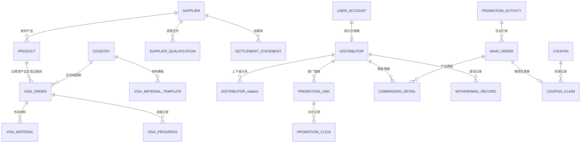

# Data Model: 一期扩展 — 出境游 + 供应商开放平台 + 分销体系

**Date**: 2026-06-30
**Feature**: specs/002-outbound-supplier-distribution/spec.md

## Overview

一期新增 6 个数据域、约 20 张核心表，扩展 MVP 已有的产品/订单/支付表。所有表统一携带 `tenant_id` 字段，主键采用 `BIGSERIAL` 自增，业务编码采用带前缀字符串格式。

---

## 1. 出境游产品域

### 1.1 国家/地区表 (country)

| 字段 | 类型 | 必填 | 说明 |
|------|------|------|------|
| id | BIGSERIAL PK | 是 | 主键 |
| tenant_id | BIGINT | 是 | 租户ID |
| name_cn | VARCHAR(100) | 是 | 中文名称 |
| name_en | VARCHAR(100) | 是 | 英文名称 |
| continent | VARCHAR(20) | 是 | 大洲（asia/europe/north_america/south_america/oceania/africa） |
| visa_type | VARCHAR(20) | 是 | 签证类型（visa_free/visa_on_arrival/e_visa/visa_required） |
| visa_processing_days | INT | 否 | 签证办理周期（工作日） |
| passport_validity_months | INT | 否 | 护照有效期要求（月），默认 6 |
| entry_policy | JSONB | 否 | 入境政策详情 |
| cash_regulation | JSONB | 否 | 现金携带规定 |
| prohibited_items | JSONB | 否 | 违禁品清单 |
| entry_card_guide | JSONB | 否 | 入境卡填写指引 |
| customs_guide | JSONB | 否 | 海关申报指引 |
| emergency_contacts | JSONB | 否 | 紧急联系信息 |
| status | VARCHAR(20) | 是 | active/inactive |
| created_at | TIMESTAMPTZ | 是 | 创建时间 |
| updated_at | TIMESTAMPTZ | 是 | 更新时间 |

**索引**: `idx_country_continent`(tenant_id, continent), `idx_country_visa_type`(tenant_id, visa_type)

### 1.2 产品表扩展 (product 表新增字段)

| 字段 | 类型 | 必填 | 说明 |
|------|------|------|------|
| product_type | VARCHAR(30) | 是 | 新增枚举值：outbound_group |
| destination_country_id | BIGINT | 否 | 目的地国家ID（出境游必填） |
| visa_info | JSONB | 否 | 签证信息（签证类型/办理周期/材料清单/费用/领区） |
| international_flight_info | JSONB | 否 | 国际航班信息 |
| insurance_requirements | JSONB | 否 | 保险要求（如申根保险） |
| pre_trip_services | JSONB | 否 | 行前服务配置 |

### 1.3 签证材料模板表 (visa_material_template)

| 字段 | 类型 | 必填 | 说明 |
|------|------|------|------|
| id | BIGSERIAL PK | 是 | 主键 |
| tenant_id | BIGINT | 是 | 租户ID |
| country_id | BIGINT | 是 | 关联国家 |
| occupation_type | VARCHAR(20) | 是 | 职业类型（employed/freelance/retired/student/child） |
| material_type | VARCHAR(50) | 是 | 材料类型（passport_scan/photo/income_proof/bank_statement等） |
| material_name | VARCHAR(100) | 是 | 材料名称 |
| is_required | BOOLEAN | 是 | 是否必填 |
| description | TEXT | 否 | 材料说明 |
| file_format | VARCHAR(50) | 否 | 允许的文件格式 |
| max_size_mb | INT | 否 | 最大文件大小（MB），默认 10 |
| sort_order | INT | 是 | 排序号 |
| status | VARCHAR(20) | 是 | active/inactive |

**索引**: `idx_visa_template_country`(tenant_id, country_id, occupation_type)

---

## 2. 签证服务域

### 2.1 签证订单表 (visa_order)

| 字段 | 类型 | 必填 | 说明 |
|------|------|------|------|
| id | BIGSERIAL PK | 是 | 主键 |
| tenant_id | BIGINT | 是 | 租户ID |
| visa_order_no | VARCHAR(32) UNIQUE | 是 | 签证订单号（VISA-YYYYMMDD-NNNN） |
| main_order_id | BIGINT | 是 | 关联主订单ID |
| user_id | BIGINT | 是 | 用户ID |
| country_id | BIGINT | 是 | 目的地国家ID |
| visa_type | VARCHAR(50) | 是 | 签证类型 |
| status | VARCHAR(20) | 是 | pending_submit/reviewing/submitted/approved/rejected |
| submitted_at | TIMESTAMPTZ | 否 | 材料提交时间 |
| reviewed_at | TIMESTAMPTZ | 否 | 审核完成时间 |
| approved_at | TIMESTAMPTZ | 否 | 出签时间 |
| rejected_at | TIMESTAMPTZ | 否 | 拒签时间 |
| reject_reason | TEXT | 否 | 拒签原因 |
| estimated_completion_date | DATE | 否 | 预计完成日期 |
| visa_fee | DECIMAL(10,2) | 否 | 签证费用 |
| tracking_company | VARCHAR(50) | 否 | 快递公司 |
| tracking_number | VARCHAR(50) | 否 | 快递单号 |
| visa_expiry_date | DATE | 否 | 签证有效期 |
| created_at | TIMESTAMPTZ | 是 | 创建时间 |
| updated_at | TIMESTAMPTZ | 是 | 更新时间 |

**索引**: `idx_visa_order_main`(main_order_id), `idx_visa_order_user`(user_id, status), `idx_visa_order_status`(tenant_id, status)

### 2.2 签证材料表 (visa_material)

| 字段 | 类型 | 必填 | 说明 |
|------|------|------|------|
| id | BIGSERIAL PK | 是 | 主键 |
| tenant_id | BIGINT | 是 | 租户ID |
| visa_order_id | BIGINT | 是 | 关联签证订单ID |
| material_type | VARCHAR(50) | 是 | 材料类型 |
| material_name | VARCHAR(100) | 是 | 材料名称 |
| file_url | VARCHAR(500) | 否 | 文件URL |
| file_size | BIGINT | 否 | 文件大小（字节） |
| status | VARCHAR(20) | 是 | pending/submitted/approved/rejected/supplement |
| review_comment | TEXT | 否 | 审核意见 |
| reviewed_by | BIGINT | 否 | 审核人ID |
| reviewed_at | TIMESTAMPTZ | 否 | 审核时间 |
| created_at | TIMESTAMPTZ | 是 | 创建时间 |
| updated_at | TIMESTAMPTZ | 是 | 更新时间 |

**索引**: `idx_visa_material_order`(visa_order_id, status)

### 2.3 签证进度表 (visa_progress)

| 字段 | 类型 | 必填 | 说明 |
|------|------|------|------|
| id | BIGSERIAL PK | 是 | 主键 |
| tenant_id | BIGINT | 是 | 租户ID |
| visa_order_id | BIGINT | 是 | 关联签证订单ID |
| from_status | VARCHAR(20) | 否 | 变更前状态 |
| to_status | VARCHAR(20) | 是 | 变更后状态 |
| operator_id | BIGINT | 否 | 操作人ID |
| operator_type | VARCHAR(20) | 是 | system/admin/supplier |
| comment | TEXT | 否 | 备注 |
| created_at | TIMESTAMPTZ | 是 | 创建时间 |

**索引**: `idx_visa_progress_order`(visa_order_id, created_at DESC)

---

## 3. 供应商域

### 3.1 供应商表 (supplier)

| 字段 | 类型 | 必填 | 说明 |
|------|------|------|------|
| id | BIGSERIAL PK | 是 | 主键 |
| tenant_id | BIGINT | 是 | 租户ID |
| supplier_no | VARCHAR(32) UNIQUE | 是 | 供应商编号（SUP-YYYYMMDD-NNNN） |
| company_name | VARCHAR(200) | 是 | 企业全称 |
| unified_social_credit_code | VARCHAR(18) UNIQUE | 是 | 统一社会信用代码 |
| registered_address | VARCHAR(500) | 是 | 注册地址 |
| registered_capital | DECIMAL(15,2) | 否 | 注册资本 |
| establishment_date | DATE | 否 | 成立日期 |
| business_license_url | VARCHAR(500) | 是 | 营业执照扫描件URL |
| legal_person_name | VARCHAR(50) | 是 | 法人姓名 |
| legal_person_id_card | VARCHAR(255) | 是 | 法人身份证号（AES-256-GCM加密） |
| business_scope | VARCHAR(500) | 是 | 经营范围 |
| travel_license_no | VARCHAR(50) | 否 | 旅行社经营许可证号 |
| travel_license_url | VARCHAR(500) | 否 | 许可证扫描件URL |
| contact_name | VARCHAR(50) | 是 | 业务联系人 |
| contact_phone | VARCHAR(20) | 是 | 联系人手机号 |
| contact_email | VARCHAR(100) | 否 | 联系人邮箱 |
| finance_contact_name | VARCHAR(50) | 否 | 财务联系人 |
| finance_contact_phone | VARCHAR(20) | 否 | 财务联系人手机 |
| bank_name | VARCHAR(100) | 否 | 开户行 |
| bank_account_name | VARCHAR(100) | 否 | 账户名 |
| bank_account_number | VARCHAR(255) | 否 | 账号（AES-256-GCM加密） |
| commission_rate | DECIMAL(5,2) | 否 | 默认佣金比例（%） |
| settlement_cycle | VARCHAR(10) | 是 | 结算周期（daily/weekly/monthly），默认 monthly |
| settlement_day | INT | 否 | 结算日（周结=周一，月结=每月N日） |
| rating_score | DECIMAL(3,1) | 否 | 评级得分 |
| status | VARCHAR(20) | 是 | pending/reviewing/active/suspended/terminated |
| application_no | VARCHAR(32) | 是 | 入驻申请编号 |
| applied_at | TIMESTAMPTZ | 是 | 申请时间 |
| approved_at | TIMESTAMPTZ | 否 | 审核通过时间 |
| contract_signed_at | TIMESTAMPTZ | 否 | 合同签署时间 |
| created_at | TIMESTAMPTZ | 是 | 创建时间 |
| updated_at | TIMESTAMPTZ | 是 | 更新时间 |

**索引**: `idx_supplier_status`(tenant_id, status), `idx_supplier_credit_code`(unified_social_credit_code)

### 3.2 供应商资质表 (supplier_qualification)

| 字段 | 类型 | 必填 | 说明 |
|------|------|------|------|
| id | BIGSERIAL PK | 是 | 主键 |
| tenant_id | BIGINT | 是 | 租户ID |
| supplier_id | BIGINT | 是 | 关联供应商ID |
| qualification_type | VARCHAR(30) | 是 | 类型（business_license/travel_license/id_card_front/id_card_back/other） |
| file_url | VARCHAR(500) | 是 | 文件URL |
| file_name | VARCHAR(200) | 是 | 文件名 |
| expiry_date | DATE | 否 | 有效期 |
| status | VARCHAR(20) | 是 | pending/approved/rejected |
| review_comment | TEXT | 否 | 审核意见 |
| created_at | TIMESTAMPTZ | 是 | 创建时间 |

**索引**: `idx_supplier_qual_supplier`(supplier_id)

### 3.3 结算单表 (settlement_statement)

| 字段 | 类型 | 必填 | 说明 |
|------|------|------|------|
| id | BIGSERIAL PK | 是 | 主键 |
| tenant_id | BIGINT | 是 | 租户ID |
| settlement_no | VARCHAR(32) UNIQUE | 是 | 结算单号（SET-{供应商码}-{日期}-{序号}） |
| supplier_id | BIGINT | 是 | 关联供应商ID |
| period_start | DATE | 是 | 结算周期开始 |
| period_end | DATE | 是 | 结算周期结束 |
| order_count | INT | 是 | 订单数量 |
| order_total_amount | DECIMAL(15,2) | 是 | 订单总金额 |
| refund_amount | DECIMAL(15,2) | 是 | 退款金额 |
| platform_commission | DECIMAL(15,2) | 是 | 平台佣金 |
| refund_commission_deduct | DECIMAL(15,2) | 是 | 退款佣金扣回 |
| payable_amount | DECIMAL(15,2) | 是 | 应付供应商金额 |
| status | VARCHAR(20) | 是 | pending/confirmed/disputed/paid |
| supplier_confirmed_at | TIMESTAMPTZ | 否 | 供应商确认时间 |
| dispute_reason | TEXT | 否 | 异议原因 |
| approved_by | BIGINT | 否 | 审批人ID |
| approved_at | TIMESTAMPTZ | 否 | 审批时间 |
| paid_at | TIMESTAMPTZ | 否 | 打款时间 |
| payment_voucher_url | VARCHAR(500) | 否 | 付款凭证URL |
| created_at | TIMESTAMPTZ | 是 | 创建时间 |
| updated_at | TIMESTAMPTZ | 是 | 更新时间 |

**索引**: `idx_settlement_supplier`(tenant_id, supplier_id, period_start DESC), `idx_settlement_status`(tenant_id, status)

### 3.4 佣金规则表 (commission_rule)

| 字段 | 类型 | 必填 | 说明 |
|------|------|------|------|
| id | BIGSERIAL PK | 是 | 主键 |
| tenant_id | BIGINT | 是 | 租户ID |
| rule_name | VARCHAR(100) | 是 | 规则名称 |
| scope_type | VARCHAR(20) | 是 | 适用范围（global/category/supplier/product） |
| scope_id | BIGINT | 否 | 适用范围ID（品类ID/供应商ID/产品ID） |
| commission_rate | DECIMAL(5,2) | 是 | 佣金比例（%） |
| priority | INT | 是 | 优先级（数值越大优先级越高） |
| effective_from | TIMESTAMPTZ | 是 | 生效时间 |
| effective_to | TIMESTAMPTZ | 否 | 失效时间（NULL=永久） |
| status | VARCHAR(20) | 是 | active/inactive |
| created_by | BIGINT | 是 | 创建人ID |
| created_at | TIMESTAMPTZ | 是 | 创建时间 |
| updated_at | TIMESTAMPTZ | 是 | 更新时间 |

**索引**: `idx_commission_rule_scope`(tenant_id, scope_type, scope_id, priority DESC)

---

## 4. 分销域

### 4.1 分销商表 (distributor)

| 字段 | 类型 | 必填 | 说明 |
|------|------|------|------|
| id | BIGSERIAL PK | 是 | 主键 |
| tenant_id | BIGINT | 是 | 租户ID |
| user_id | BIGINT UNIQUE | 是 | 关联用户ID |
| distributor_no | VARCHAR(32) UNIQUE | 是 | 分销编码（8位字母数字） |
| distributor_type | VARCHAR(10) | 是 | 个人/企业（personal/enterprise） |
| level | INT | 是 | 分销层级（1=一级，2=二级） |
| grade | VARCHAR(20) | 是 | 等级（normal/senior） |
| status | VARCHAR(20) | 是 | pending/active/frozen/cancelled/deactivated |
| real_name | VARCHAR(50) | 否 | 真实姓名（个人） |
| id_card_number | VARCHAR(255) | 否 | 身份证号（加密） |
| id_card_front_url | VARCHAR(500) | 否 | 身份证正面URL |
| id_card_back_url | VARCHAR(500) | 否 | 身份证背面URL |
| enterprise_name | VARCHAR(200) | 否 | 企业名称（企业） |
| credit_code | VARCHAR(18) | 否 | 统一社会信用代码（企业） |
| business_license_url | VARCHAR(500) | 否 | 营业执照URL（企业） |
| bank_name | VARCHAR(100) | 否 | 开户行 |
| bank_account_name | VARCHAR(100) | 否 | 账户名 |
| bank_account_number | VARCHAR(255) | 否 | 银行卡号（加密） |
| phone | VARCHAR(20) | 是 | 手机号 |
| email | VARCHAR(100) | 否 | 邮箱 |
| promotion_channel | TEXT | 否 | 推广渠道说明 |
| invite_code | VARCHAR(10) UNIQUE | 否 | 邀请码（6位大写字母） |
| agreement_signed_at | TIMESTAMPTZ | 否 | 协议签署时间 |
| agreement_signed_ip | VARCHAR(45) | 否 | 协议签署IP |
| grade_valid_until | TIMESTAMPTZ | 否 | 等级有效期（高级分销商90天） |
| frozen_reason | TEXT | 否 | 冻结原因 |
| frozen_until | TIMESTAMPTZ | 否 | 冻结截止时间 |
| total_commission | DECIMAL(15,2) | 是 | 累计佣金，默认 0 |
| withdrawable_amount | DECIMAL(15,2) | 是 | 可提现金额，默认 0 |
| frozen_amount | DECIMAL(15,2) | 是 | 冻结中金额，默认 0 |
| created_at | TIMESTAMPTZ | 是 | 创建时间 |
| updated_at | TIMESTAMPTZ | 是 | 更新时间 |

**索引**: `idx_distributor_user`(user_id), `idx_distributor_status`(tenant_id, status), `idx_distributor_invite_code`(invite_code)

### 4.2 分销关系表 (distributor_relation)

| 字段 | 类型 | 必填 | 说明 |
|------|------|------|------|
| id | BIGSERIAL PK | 是 | 主键 |
| tenant_id | BIGINT | 是 | 租户ID |
| distributor_id | BIGINT UNIQUE | 是 | 分销商ID |
| parent_id | BIGINT | 否 | 上级分销商ID（一级分销商为NULL） |
| level | INT | 是 | 层级（1或2） |
| bind_time | TIMESTAMPTZ | 是 | 关系建立时间 |
| status | VARCHAR(20) | 是 | active/dissolved |
| created_at | TIMESTAMPTZ | 是 | 创建时间 |

**索引**: `idx_distributor_rel_parent`(parent_id), `idx_distributor_rel_distributor`(distributor_id)

### 4.3 推广链接表 (promotion_link)

| 字段 | 类型 | 必填 | 说明 |
|------|------|------|------|
| id | BIGSERIAL PK | 是 | 主键 |
| tenant_id | BIGINT | 是 | 租户ID |
| distributor_id | BIGINT | 是 | 分销商ID |
| product_id | BIGINT | 是 | 产品ID |
| short_link | VARCHAR(100) UNIQUE | 是 | 短链接 |
| qr_code_url | VARCHAR(500) | 否 | 二维码图片URL |
| click_pv | BIGINT | 是 | 点击PV，默认 0 |
| click_uv | BIGINT | 是 | 点击UV，默认 0 |
| order_count | BIGINT | 是 | 成交订单数，默认 0 |
| order_amount | DECIMAL(15,2) | 是 | 成交金额，默认 0 |
| status | VARCHAR(20) | 是 | active/inactive |
| created_at | TIMESTAMPTZ | 是 | 创建时间 |
| updated_at | TIMESTAMPTZ | 是 | 更新时间 |

**索引**: `idx_promo_link_distributor`(distributor_id), `idx_promo_link_product`(distributor_id, product_id) UNIQUE, `idx_promo_link_short`(short_link)

### 4.4 佣金明细表 (commission_detail)

| 字段 | 类型 | 必填 | 说明 |
|------|------|------|------|
| id | BIGSERIAL PK | 是 | 主键 |
| tenant_id | BIGINT | 是 | 租户ID |
| order_id | BIGINT | 是 | 关联订单ID |
| distributor_id | BIGINT | 是 | 佣金归属分销商ID |
| commission_level | INT | 是 | 佣金层级（1=一级，2=二级） |
| order_actual_amount | DECIMAL(12,2) | 是 | 订单实付金额 |
| commission_rate | DECIMAL(5,2) | 是 | 佣金比例（%） |
| commission_amount | DECIMAL(12,2) | 是 | 佣金金额 |
| status | VARCHAR(20) | 是 | pending/frozen/withdrawable/withdrawn/recovered |
| frozen_until | TIMESTAMPTZ | 否 | 冻结截止时间 |
| settled_at | TIMESTAMPTZ | 否 | 结算时间（可提现时更新） |
| withdrawn_at | TIMESTAMPTZ | 否 | 提现时间 |
| recovered_amount | DECIMAL(12,2) | 否 | 已追回金额 |
| created_at | TIMESTAMPTZ | 是 | 创建时间 |
| updated_at | TIMESTAMPTZ | 是 | 更新时间 |

**索引**: `idx_commission_distributor`(distributor_id, status), `idx_commission_order`(order_id), `idx_commission_frozen`(status, frozen_until)

### 4.5 提现记录表 (withdrawal_record)

| 字段 | 类型 | 必填 | 说明 |
|------|------|------|------|
| id | BIGSERIAL PK | 是 | 主键 |
| tenant_id | BIGINT | 是 | 租户ID |
| withdrawal_no | VARCHAR(32) UNIQUE | 是 | 提现单号 |
| distributor_id | BIGINT | 是 | 分销商ID |
| amount | DECIMAL(12,2) | 是 | 提现金额 |
| bank_name | VARCHAR(100) | 是 | 收款银行 |
| bank_account_name | VARCHAR(100) | 是 | 账户名 |
| bank_account_number | VARCHAR(255) | 是 | 银行卡号（加密） |
| status | VARCHAR(20) | 是 | pending/approved/rejected/paid |
| reviewed_by | BIGINT | 否 | 审核人ID |
| reviewed_at | TIMESTAMPTZ | 否 | 审核时间 |
| reject_reason | TEXT | 否 | 拒绝原因 |
| paid_at | TIMESTAMPTZ | 否 | 打款时间 |
| payment_voucher_url | VARCHAR(500) | 否 | 付款凭证URL |
| created_at | TIMESTAMPTZ | 是 | 创建时间 |
| updated_at | TIMESTAMPTZ | 是 | 更新时间 |

**索引**: `idx_withdrawal_distributor`(distributor_id, status), `idx_withdrawal_status`(tenant_id, status)

### 4.6 推广点击记录表 (promotion_click)

| 字段 | 类型 | 必填 | 说明 |
|------|------|------|------|
| id | BIGSERIAL PK | 是 | 主键 |
| tenant_id | BIGINT | 是 | 租户ID |
| promotion_link_id | BIGINT | 是 | 推广链接ID |
| distributor_id | BIGINT | 是 | 分销商ID |
| visitor_id | VARCHAR(64) | 否 | 访客标识（Cookie/设备指纹） |
| ip_address | VARCHAR(45) | 是 | IP地址 |
| user_agent | VARCHAR(500) | 否 | User-Agent |
| device_fingerprint | VARCHAR(64) | 否 | 设备指纹 |
| source | VARCHAR(20) | 是 | 来源（link/qrcode） |
| created_at | TIMESTAMPTZ | 是 | 点击时间 |

**索引**: `idx_click_link`(promotion_link_id, created_at DESC), `idx_click_ip`(ip_address, created_at DESC)

---

## 5. 营销域

### 5.1 优惠券表 (coupon)

| 字段 | 类型 | 必填 | 说明 |
|------|------|------|------|
| id | BIGSERIAL PK | 是 | 主键 |
| tenant_id | BIGINT | 是 | 租户ID |
| coupon_name | VARCHAR(100) | 是 | 优惠券名称 |
| coupon_type | VARCHAR(20) | 是 | 类型（full_reduction/discount/cash/exchange） |
| discount_amount | DECIMAL(10,2) | 否 | 满减/现金券面额 |
| discount_rate | DECIMAL(5,2) | 否 | 折扣比例（%） |
| discount_cap | DECIMAL(10,2) | 否 | 折扣上限（折扣券必填） |
| min_consumption | DECIMAL(10,2) | 否 | 最低消费门槛 |
| total_stock | INT | 是 | 总库存 |
| claimed_count | INT | 是 | 已领取数，默认 0 |
| used_count | INT | 是 | 已使用数，默认 0 |
| per_user_limit | INT | 是 | 每人限领数 |
| per_device_limit | INT | 否 | 每设备限领数 |
| validity_type | VARCHAR(20) | 是 | 有效期类型（fixed/relative） |
| valid_from | TIMESTAMPTZ | 否 | 固定有效期开始 |
| valid_to | TIMESTAMPTZ | 否 | 固定有效期结束 |
| valid_days | INT | 否 | 领取后N天有效 |
| applicable_scope | VARCHAR(20) | 是 | 适用范围（all/category/product） |
| applicable_ids | BIGINT[] | 否 | 适用的品类/产品ID列表 |
| applicable_channels | VARCHAR(50)[] | 否 | 适用渠道 |
| stackable | BOOLEAN | 是 | 是否可叠加，默认 false |
| stackable_types | VARCHAR(20)[] | 否 | 可叠加的券类型 |
| exchange_product_id | BIGINT | 否 | 兑换券关联产品ID |
| status | VARCHAR(20) | 是 | not_started/active/expired/exhausted |
| created_by | BIGINT | 是 | 创建人ID |
| created_at | TIMESTAMPTZ | 是 | 创建时间 |
| updated_at | TIMESTAMPTZ | 是 | 更新时间 |

**索引**: `idx_coupon_status`(tenant_id, status), `idx_coupon_type`(tenant_id, coupon_type)

### 5.2 优惠券领取记录表 (coupon_claim)

| 字段 | 类型 | 必填 | 说明 |
|------|------|------|------|
| id | BIGSERIAL PK | 是 | 主键 |
| tenant_id | BIGINT | 是 | 租户ID |
| coupon_id | BIGINT | 是 | 优惠券ID |
| user_id | BIGINT | 是 | 用户ID |
| device_id | VARCHAR(64) | 否 | 设备ID |
| status | VARCHAR(20) | 是 | available/occupied/used/expired/returned/voided |
| order_id | BIGINT | 否 | 使用的订单ID |
| claimed_at | TIMESTAMPTZ | 是 | 领取时间 |
| used_at | TIMESTAMPTZ | 否 | 使用时间 |
| expired_at | TIMESTAMPTZ | 否 | 过期时间 |
| returned_at | TIMESTAMPTZ | 否 | 退回时间 |
| created_at | TIMESTAMPTZ | 是 | 创建时间 |

**索引**: `idx_coupon_claim_user`(user_id, status), `idx_coupon_claim_coupon`(coupon_id, user_id) UNIQUE

### 5.3 促销活动表 (promotion_activity)

| 字段 | 类型 | 必填 | 说明 |
|------|------|------|------|
| id | BIGSERIAL PK | 是 | 主键 |
| tenant_id | BIGINT | 是 | 租户ID |
| activity_name | VARCHAR(200) | 是 | 活动名称 |
| activity_type | VARCHAR(20) | 是 | 类型（flash_sale/full_reduction/early_bird） |
| start_time | TIMESTAMPTZ | 是 | 活动开始时间 |
| end_time | TIMESTAMPTZ | 是 | 活动结束时间 |
| applicable_products | BIGINT[] | 否 | 参与产品ID列表 |
| applicable_categories | BIGINT[] | 否 | 参与品类ID列表 |
| rules | JSONB | 是 | 活动规则（JSON格式） |
| activity_stock | INT | 否 | 活动库存（限时特惠） |
| per_user_limit | INT | 否 | 每人限购数（限时特惠） |
| stackable_with_coupon | BOOLEAN | 是 | 是否可与优惠券叠加，默认 false |
| status | VARCHAR(20) | 是 | draft/active/ended/cancelled |
| created_by | BIGINT | 是 | 创建人ID |
| created_at | TIMESTAMPTZ | 是 | 创建时间 |
| updated_at | TIMESTAMPTZ | 是 | 更新时间 |

**索引**: `idx_promotion_activity_status`(tenant_id, status), `idx_promotion_activity_time`(start_time, end_time)

---

## 6. 支付扩展

### 6.1 订单表扩展 (main_order 表新增字段)

| 字段 | 类型 | 必填 | 说明 |
|------|------|------|------|
| payment_mode | VARCHAR(20) | 是 | 支付模式（full/deposit），默认 full |
| deposit_amount | DECIMAL(12,2) | 否 | 定金金额 |
| balance_amount | DECIMAL(12,2) | 否 | 尾款金额 |
| balance_deadline | TIMESTAMPTZ | 否 | 尾款支付截止时间 |
| deposit_paid_at | TIMESTAMPTZ | 否 | 定金支付时间 |
| balance_paid_at | TIMESTAMPTZ | 否 | 尾款支付时间 |
| distributor_id_l1 | BIGINT | 否 | 一级分销商ID |
| distributor_id_l2 | BIGINT | 否 | 二级分销商ID |
| promotion_code | VARCHAR(20) | 否 | 推广编码 |
| coupon_claim_id | BIGINT | 否 | 使用的优惠券领取记录ID |
| coupon_discount | DECIMAL(10,2) | 否 | 优惠券抵扣金额 |
| activity_id | BIGINT | 否 | 参与的促销活动ID |
| activity_discount | DECIMAL(10,2) | 否 | 活动优惠金额 |

### 6.2 支付流水表扩展 (payment_transaction 表新增字段)

| 字段 | 类型 | 必填 | 说明 |
|------|------|------|------|
| payment_type | VARCHAR(20) | 否 | 款项类型（deposit/balance/full/refund） |
| unionpay_trade_no | VARCHAR(64) | 否 | 银联交易号 |
| unionpay_query_id | VARCHAR(64) | 否 | 银联查询ID |

---

## Entity Relationship Summary

